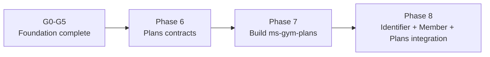
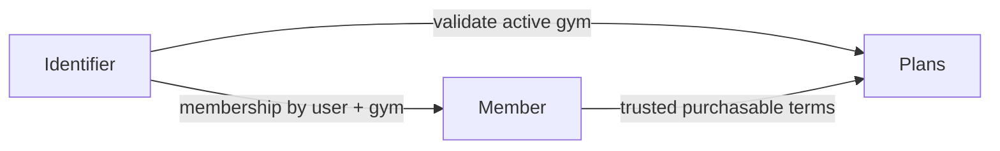

# Service Catalog and Roadmap Pointer

## Authoritative execution plan

Use [`plans/foundation-first/README.md`](plans/foundation-first/README.md). G0–G5 are completed foundation history. Current actionable work is limited to Identifier, Member, and Plans through Phases 6–8.

## Active services

| Service | Stack | Database | Ownership |
|---|---|---|---|
| `ms-gym-identifier` | Go + Gin | PostgreSQL `identity_db` | Identity, credentials, tokens, selected-gym token flow |
| `ms-gym-member` | Java 26 + Spring Boot 4 | PostgreSQL `member_db` | Profiles, subscriptions, membership lifecycle and validation |
| `ms-gym-plans` | Java 26 + Spring Boot 4 | PostgreSQL `plans_db` | Gym locations, gym-specific plans, VND pricing |

## Deferred catalog

These services remain documented for architecture continuity but have no actionable implementation phase yet:

| Service | Intended stack | Intended database | Future role |
|---|---|---|---|
| `ms-gym-payment` | Java 26 + Spring Boot 4 | PostgreSQL | Provider payments, refunds, transaction history |
| `ms-gym-checkin` | Go + Gin | YugabyteDB | QR validation and check-in records |
| `ms-gym-workout` | Go + Gin | Cassandra | Workout logging |
| `ms-gym-trainer` | Java 26 + Spring Boot 4 | PostgreSQL | Trainer schedules and bookings |
| `ms-gym-promotion` | Java 26 + Spring Boot 4 | PostgreSQL | Discount campaigns and coupon reservations |
| `ms-gym-notification` | Go + Gin | Cassandra | Notification fan-out and delivery history |
| `ms-gym-analytics` | Java 26 + Spring Boot 4 | YugabyteDB | Materialized reports and trends |

Do not treat deferred service documents as implementation instructions until roadmap adds a gate for them.

## Current dependency order

## Target service interaction

Member keeps `PurchaseMembership`, but Payment implementation remains deferred. Phase 8 verifies Member’s outbound Payment port with a mock or fake.

## Change index

| Change | Update together |
|---|---|
| Plans API or fields | Phase 6, `gym-proto`, Plans service spec, Member purchase boundary |
| Gym ownership | Architecture overview, Identifier, Member, Plans, Check-in boundary, infrastructure routes |
| Subscription terms | Member spec, Plans spec, purchase flow, future Payment boundary |
| External route | HTTP mapping source, Kong route documentation, NetworkPolicy documentation |
| Kafka event | Kafka catalog, canonical Protobuf event, producer/consumer ownership |
