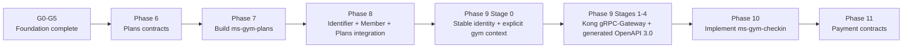
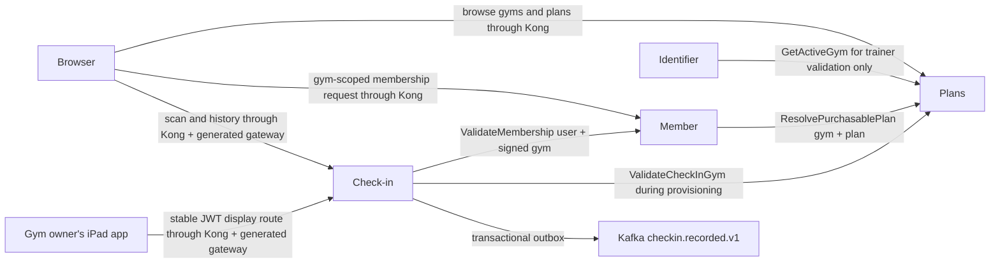

# Service Catalog and Roadmap Pointer

## Authoritative execution plan

Use [`plans/foundation-first/README.md`](plans/foundation-first/README.md). G0–G9 foundation for Identifier, Member, and Plans is technically complete; owner approval remains separate. G9 uses Kong in front of generated Go `grpc-gateway` for Member and Plans browser APIs. Final immutable-release, locked clean-source, protected-CI, and sanitized-evidence proof is recorded in [`evidence/foundation-first/p9-final/README.md`](evidence/foundation-first/p9-final/README.md). G10 Check-in is complete: locked clean-source E2E, protected CI, sanitized evidence, and owner acceptance are recorded in [`evidence/foundation-first/g10-final/README.md`](evidence/foundation-first/g10-final/README.md). G11 opens Payment contracts only; `ms-gym-payment` implementation remains deferred.

## Active planned services

| Service | Status | Stack | Database | Ownership |
|---|---|---|---|---|
| `ms-gym-identifier` | Implemented | Go + Gin | PostgreSQL `identity_db` | Identity, credentials, stable identity tokens |
| `ms-gym-member` | Implemented | Java 26 + Spring Boot 4 | PostgreSQL `member_db` | Profiles, subscriptions, membership lifecycle validation |
| `ms-gym-plans` | Implemented | Java 26 + Spring Boot 4 | PostgreSQL `plans_db` | Gym locations, gym-specific plans, VND pricing |
| `ms-gym-checkin` | G10 complete | Go gRPC + `net/http` health | YugabyteDB `checkin_db` | AWS KMS-protected QR keys, logged-in iPad display payloads, scan validation, check-in records, and `checkin.recorded.v1` |
| `ms-gym-payment` | G11 contracts only | Java 26 + Spring Boot 4 | PostgreSQL | SePay-first Payment contracts; implementation deferred |

## Deferred catalog

These services remain architecture entries without an actionable implementation phase. Payment has a contracts-only G11 gate; its implementation remains deferred.

| Service | Intended stack | Intended database | Future role |
|---|---|---|---|
| `ms-gym-workout` | Go + Gin | Cassandra | Workout logging |
| `ms-gym-trainer` | Java 26 + Spring Boot 4 | PostgreSQL | Trainer schedules and bookings |
| `ms-gym-promotion` | Java 26 + Spring Boot 4 | PostgreSQL | Discount campaigns and coupon reservations |
| `ms-gym-notification` | Go + Gin | Cassandra | Notification fan-out and delivery history |
| `ms-gym-analytics` | Java 26 + Spring Boot 4 | YugabyteDB | Materialized reports and trends |

Do not treat deferred service documents as implementation instructions until the roadmap adds a gate.

## Current dependency order

## Target service interaction

Member keeps `PurchaseMembership`; production Payment remains deferred. G8 proved the outbound Payment port with `gym-infra/kong/fixtures/fake-payment`. Check-in G10 is complete; no downstream Notification or Analytics consumer is opened.

## Change index

| Change | Update together |
|---|---|
| Plans API or fields | Phase 6, `gym-proto`, Plans service spec, Member purchase boundary |
| Gym ownership | Architecture overview, Identifier, Member, Plans, Check-in boundary, infrastructure routes |
| Subscription terms | Member spec, Plans spec, purchase flow, future Payment boundary |
| External route | Protobuf `google.api.http` annotation, generated OpenAPI 3.0, Kong route documentation, NetworkPolicy documentation |
| Kafka event | Kafka catalog, canonical Protobuf event, producer/consumer ownership |
| Check-in trust or storage | Phase 10, Check-in service spec, Member/Plans workload boundaries, QR/no-device-lifecycle/key rules, Yugabyte/AWS KMS/Kafka infrastructure |
