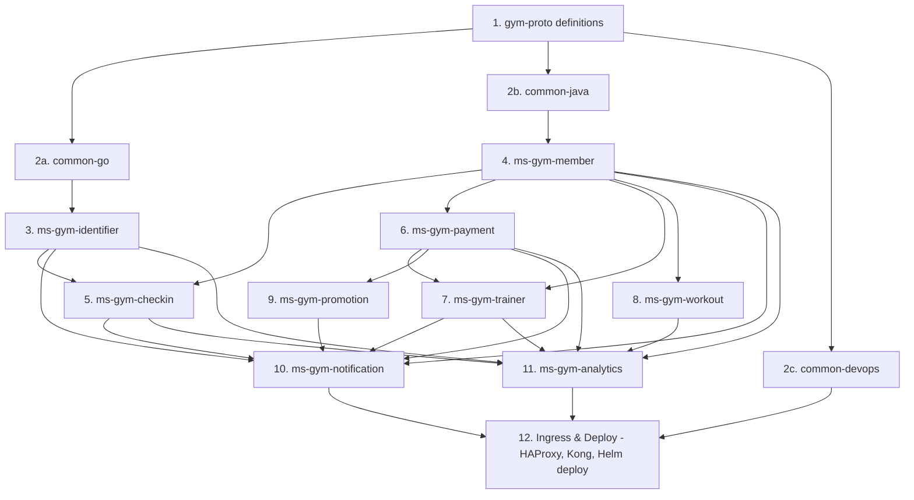

# Implementation Order Plan

This document outlines the step-by-step roadmap to implement the microservices system, detailing the logical dependencies, tools, and configurations.

---

## Service & Utility Catalog

| Component | Stack | Database | Purpose / Dependency Role |
|-----------|-------|----------|---------------------------|
| **`gym-proto`** | Protobuf + Buf | N/A | Source of truth for API contracts, events, and code-gen |
| **`common-go`** | Go Module | N/A | Auth interceptors, Kafka wrapper, loggers, trace propagation |
| **`common-java`** | Gradle Library | N/A | Role guards, Kafka DLQ retry consumer, base Jpa entities |
| **`common-devops`**| Helm / GHA | N/A | Generic Helm charts, reusable Docker build & K8s deploy workflows |
| **`ms-gym-identifier`** | Go + Gin | PostgreSQL | Identity management, Bcrypt hashing, JWT issuance |
| **`ms-gym-member`** | Java 26 + Spring Boot | PostgreSQL | Gym locations, subscription plans, member profile lifecycle |
| **`ms-gym-checkin`** | Go + Gin | YugabyteDB | Member scanners, GPS validation, WebSocket/IoT door locks |
| **`ms-gym-payment`** | Java 26 + Spring Boot | PostgreSQL | Momo/ZaloPay/VNPay REST webhooks, refund processing |
| **`ms-gym-workout`** | Go + Gin | Cassandra | Time-series workout logging, PR tracking |
| **`ms-gym-trainer`** | Java 26 + Spring Boot | PostgreSQL | Trainer profiles, slot allocation, calendar bookings |
| **`ms-gym-promotion`** | Java 26 + Spring Boot | PostgreSQL | Percentage discounts, coupon validation & atomic locks |
| **`ms-gym-notification`**| Go + Gin | Cassandra | Pure consumer. SMS (eSMS), Email (SendGrid), Push (FCM) |
| **`ms-gym-analytics`** | Java 26 + Spring Boot | YugabyteDB | Materialized reports, inactive check-in detection |

---

## Recommended Implementation Roadmap

### Phase 1: Shared Foundation (API contracts & shared utils)
1. **`gym-proto/` folder**:
   - Write Protobuf messages and service descriptors (`.proto` files) under `proto/`.
   - Configure `buf.yaml` and `buf.gen.yaml` to compile stubs for both Java and Go.
2. **`common-go`**:
   - Build gRPC middleware (JWT claims decoder, metrics tracker).
   - Set up Kafka producer/consumer wrappers (Protobuf schema verification).
3. **`common-java`**:
   - Build Spring Boot starter autoconfigurations.
   - Implement `RetryableConsumer` (automatic retry + DLQ publisher).
   - Implement `@RequireRole` security interceptor.
4. **`common-devops`**:
   - Author the generic Helm chart (`gym-service`) containing customizable deployment, HPA, service, and ingress templates.
   - Set up reusable GitHub Actions CI/CD workflows for Go compile/test, Java Gradle compile/test, Docker build & push (GHCR), and Helm deployments.

### Phase 2: Core Domain & Membership Lifecycle
4. **`ms-gym-identifier`**:
   - Implement registration, Bcrypt hashing, local/Google OAuth login.
   - Set up Redis refresh token storage and access token blacklisting.
   - Publish `identity.user.registered`.
5. **`ms-gym-member`**:
   - Implement Member Profile shell creation (consumes `identity.user.registered`).
   - Implement `gym_locations` and plans CRUD APIs.
   - Implement subscription state machine and scheduler warning jobs.

### Phase 3: Access Control & Financials
6. **`ms-gym-checkin`**:
   - Implement GPS distance scan verification (validates device distance < 100 meters).
   - Integrate with WebSocket/IoT gateway for pushing `TICK` or `X` door unlock commands.
   - Consume daily secrets via Member Service `GetGymDailySecret`.
7. **`ms-gym-payment`**:
   - Build Spring `@RestController` endpoints for Momo, ZaloPay, and VNPay webhooks.
   - Implement raw parameter sorting, HMAC string concatenation, and signature checking.
   - Integrate with local virtual-account/transfer check routines.
   - Publish `payment.completed`.

### Phase 4: Customer Services & Bookings
8. **`ms-gym-workout`**:
   - Configure Cassandra drivers (enable Virtual-Threads-safe drivers).
   - Implement workout logs time-series schema (partitioned by `(user_id, month)`).
   - Add Personal Record detection logic.
9. **`ms-gym-trainer`**:
   - Build calendar scheduler with slots lookup.
   - Use DB unique indexes `(trainer_id, scheduled_at)` to prevent concurrent booking overlaps.
   - Implement scheduled timeout cleanup routines (30-min payment expiry, 4-hour trainer auto-reject).
   - Implement refund-cascade logic on booking cancellation or trainer suspension.

### Phase 5: Engagement & Reporting
10. **`ms-gym-promotion`**:
    - Implement atomic reservation flow (`ValidateAndReserve`, `ConfirmReservation`, `ReleaseReservation`) using `SELECT FOR UPDATE` on coupon codes.
11. **`ms-gym-notification`**:
    - Build Go worker pool (bounded goroutines) for rate-limited fan-out.
    - Wire integration clients for SendGrid, Firebase, and local eSMS APIs.
12. **`ms-gym-analytics`**:
    - Implement materialized database tables for attendance, stats, revenue.
    - Build nightly aggregation schedulers for dashboard APIs.

---

## File Modification Index (For Reference)

If modifying or updating the system design, the following files must be updated together:

| Change | Core Service | Affected Files |
|--------|--------------|----------------|
| **JWT Claims** | `ms-gym-identifier` | `docs/services/01-ms-gym-identifier.md` `docs/architecture/02-shared-libraries.md` (claims extraction) `docs/services/04-ms-gym-workout.md` (gates) |
| **QR Scan Method** | `ms-gym-checkin` | `docs/services/06-ms-gym-checkin.md` `docs/services/02-ms-gym-member.md` (generates secret) `docs/flows/01-business-flows.md` (QR checkin flow) |
| **New Event** | None (Kafka) | `docs/architecture/03-kafka-events.md` (add schema) Consumer & Producer service files |
| **Ingress/Path** | `infra/` | `docs/infrastructure/01-infrastructure.md` (Kong routing, NetworkPolicies) |
