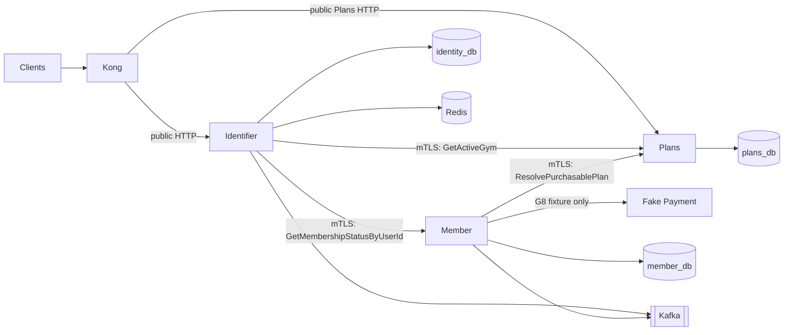

# Gym Chain Management System — Architecture Overview

> **Roadmap status:** G6 contracts published (`v3.0.0`). G7 `ms-gym-plans` implements Spring HTTP + gRPC catalog ownership, pins `common-java:2.0.2`, and reuses `gym-infra` Java CI/Docker; Helm/G8 still open. G0–G5 remain historical evidence of the pre-split Member boundary. See [Phase 6 contracts](../plans/foundation-first/06-plans-contracts.md), [Phase 7 Plans](../plans/foundation-first/07-ms-gym-plans.md), and [Phase 8 integration](../plans/foundation-first/08-three-service-integration.md).

## System Context

The platform is a microservices backend for a multi-location gym chain operating in Vietnam. Four frontend clients are anticipated but remain outside this repository scope:

| Client | Users | Purpose |
|---|---|---|
| Web Admin Dashboard | Gym admins | Manage locations, plans, members, trainers, promotions, and reports |
| Customer Mobile App | Gym members | Register, select a gym, purchase membership, log workouts, and book trainers |
| Trainer Mobile App | Trainers | Manage availability, bookings, and coaching history |
| Admin Ops Dashboard | Chain owners | Cross-location administration and analytics |

## Active Roadmap Scope and Service Catalog

The catalog contains ten services. G6–G8 actively cover Identifier, Member, and Plans. The other seven entries describe future service boundaries and must not be read as deployed components.

| # | Service | Technology | Database | Ownership | Status through G8 |
|---|---|---|---|---|---|
| 1 | Identifier | Go + PostgreSQL | `identity_db` | Users, credentials, refresh tokens, JWTs, selected-gym token issuance | Active |
| 2 | Member | Java 26 + Spring Boot 4 | `member_db` | Profiles, subscriptions, purchase orchestration, pending purchases, lifecycle, validation, membership events | Active |
| 3 | Plans | Java 26 + Spring Boot 4 | `plans_db` | Gym locations, gym-specific membership plans, availability, duration, VND list price | G7 in progress (HTTP/gRPC + CI/image live; Helm/G8 still open) |
| 4 | Payment | Java + PostgreSQL | `payment_db` | Payments, provider webhooks, refunds | Deferred; G8 uses a fake fixture only |
| 5 | Workout | Go + Cassandra | `workout_ks` | Workout logs, templates, personal records | Deferred |
| 6 | Trainer | Java + PostgreSQL | `trainer_db` | Trainer profiles, availability, bookings | Deferred |
| 7 | Check-in | Go + YugabyteDB | `checkin_db` | Kiosks, QR keys, scan validation, check-in records | Deferred |
| 8 | Notification | Go + Cassandra | `notification_ks` | Notification fan-out and history | Deferred |
| 9 | Analytics | Java + YugabyteDB | `analytics_db` | Attendance, revenue, and trend projections | Deferred |
| 10 | Promotion | Java + PostgreSQL | `promotion_db` | Promotion codes and reservations | Deferred |

## Pending G8 Topology



Plans V1 has no Kafka producer, consumer, topic, outbox, cache, scheduler, Schema Registry dependency, or Payment integration. The Phase-8 fake Payment component exists only to prove purchase correlation and event replay; it is not the production Payment service.

## Ownership and Database Isolation

Each service owns its database exclusively. Cross-service identifiers are opaque strings. They are never cross-service database foreign keys.

```text
identity_db
  users
  refresh_tokens
  email_verification_tokens

member_db
  members
  subscriptions
  pending_purchases
  outbox_events
  processed_events

plans_db
  gym_locations
  membership_plans
```

Only Plans may enforce a local foreign key from `membership_plans.gym_id` to `gym_locations.id`. Member stores opaque `user_id`, `gym_id`, and `plan_id` values. A subscription also stores `plan_type_snapshot`, `duration_days_snapshot`, and `price_vnd_snapshot`; later catalog changes do not alter purchased terms.

Identifier owns no Member or Plans table and stores no cross-service gym foreign key. Normal login and refresh tokens are gym-neutral. A selected-gym token carries an explicitly selected `gym_id` and the membership status returned by Member.

## Plans Domain Rules

- Gym status is `ACTIVE` or `CLOSED`.
- Plan type is `MONTHLY`, `YEARLY`, or `LIFETIME`.
- `price_vnd` is a non-negative `int64`; V1 supports VND only.
- Monthly and yearly plans require a positive duration.
- Lifetime plans have no duration.
- A plan is purchasable only when it is active, belongs to the requested gym, and that gym is active.

## Communication Patterns

| Pattern | Pending G6–G8 use |
|---|---|
| Public HTTP/JSON | Client to Kong to service-local Spring HTTP on `8080` (Java) or Go HTTP gateway (Identifier) |
| Native gRPC with mTLS | Identifier to Plans, Identifier to Member, and Member to Plans on `50051` |
| Kafka | Identifier identity events and Member membership/payment handling only |

The active workload allowlist is exact:

- Identifier may call Plans `GetActiveGym`.
- Identifier may call Member `GetMembershipStatusByUserId`.
- Member may call Plans `ResolvePurchasablePlan`.

A workload certificate establishes service identity, not an end-user role. Internal callers never forge or forward `x-user-id`, `x-user-role`, `x-gym-id`, or `x-membership-status` as workload credentials.

Check-in remains deferred. Plans is the canonical location owner and Member is the membership-decision owner, but Plans V1 does not authorize a Check-in method. Kiosk provisioning requires a separately frozen Check-in-to-Plans contract before implementation.

## API-First Boundary

Protobuf definitions and per-service HTTP configuration are the contract source of truth. Public methods receive HTTP mappings and route through Kong to service-local HTTP listeners. Workload-only methods have no HTTP mapping and are reachable only through authorized mTLS gRPC channels.

The Member-to-Plans relocation is a source-breaking contract change planned for the G6 release. Until that release and G7–G8 implementation are complete, current repositories may still contain pre-split Member RPCs and persistence. Current-facing documentation describes the target; historical G0–G5 handoffs record the implementation that was previously proved.

## Key Decisions

| Decision | Target choice | Reason |
|---|---|---|
| Catalog owner | Plans | One canonical source for locations and purchasable terms |
| Membership owner | Member | Keeps lifecycle, validation, and events with subscription state |
| Purchase terms | Frozen in Member before Payment initiation | Completion remains deterministic if Plans later changes or is unavailable |
| Payment correlation | Member-owned `purchase_id` | Avoids treating a reusable plan ID as a purchase instance |
| Database isolation | DB per service, opaque cross-service IDs | Prevents schema coupling and cross-service joins |
| Internal trust | Caller-specific mTLS and method allowlists | Prevents user-header spoofing and workload privilege confusion |
| Plans messaging | None in V1 | No current workflow requires it |
