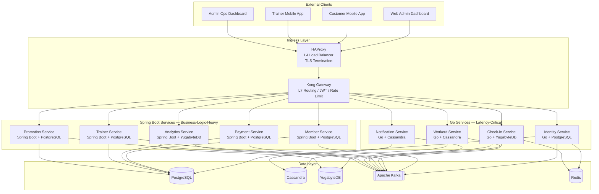

# Gym Chain Management System — Architecture Overview

## System Context

A microservices-based backend for a **multi-location gym chain** operating in Vietnam.  
Supports 4 frontend clients (out of scope for this doc):

| Client | Users | Purpose |
|--------|-------|---------|
| **Web Admin Dashboard** | Gym admins | Manage members, trainers, invoices, promotions, analytics |
| **Customer Mobile App** | Gym members | Register, buy membership, log workouts, book trainers |
| **Trainer Mobile App** | Trainers | Manage availability, accept/reject bookings, view coaching history |
| **Admin Ops Dashboard** | Chain owners | Cross-location analytics, revenue, trends |

---

## Tech Stack

| Layer | Technology | Role |
|-------|-----------|------|
| **Backend (logic-heavy)** | Java 26 + Spring Boot 4 | Complex business domains (membership, payment, trainer, analytics, promotion) |
| **Backend (latency-critical)** | Go 1.22 + Gin | High-throughput / low-latency services (auth, workout logging, check-in, notifications) |
| **Relational DB** | PostgreSQL 16 | ACID transactions, relational queries |
| **Wide-column DB** | Apache Cassandra 4 | Write-heavy, time-series, append-only workloads |
| **Distributed SQL DB** | YugabyteDB | Strong consistency + horizontal scale, heavy aggregation |
| **Event Streaming** | Apache Kafka | Async inter-service communication, event sourcing |
| **API Protocol** | gRPC + Protobuf | Internal service-to-service communication |
| **API Gateway** | Kong Gateway | L7 routing, JWT validation, rate limiting |
| **Load Balancer** | HAProxy | L4 TCP load balancing, TLS termination |
| **Containerization** | Kubernetes | Orchestration, scaling, service discovery |
| **CI/CD** | GitHub Actions | Build, test, deploy pipelines |
| **Cache** | Redis | JWT blacklist, short-lived derived QR payload cache, session data |
| **API-First** | Protobuf (gRPC) + gRPC-Gateway (REST) | Contract-first API spec, Buf-based OpenAPI/Swagger generation |

---

## Service Map (9 Services)



---

## Service Assignment Rationale

| # | Service | Tech | DB | Why This Stack |
|---|---------|------|----|----------------|
| 1 | **Identity** | Go Gin | PostgreSQL | Auth = latency-critical path. Go = fast cold start, low memory. Simple user CRUD + JWT. |
| 2 | **Member** | Spring Boot | PostgreSQL | Rich domain: membership state machine (ACTIVE/PAUSED/EXPIRED), multi-tenant plan management. Spring excels at complex domain models. |
| 3 | **Payment** | Spring Boot | PostgreSQL | Momo/ZaloPay integration needs robust `@Transactional`, retry, idempotency. Spring's ecosystem is mature for payment flows. |
| 4 | **Workout** | Go Gin | Cassandra | Highest write throughput: every set/rep logged. Cassandra partitioned by `(user_id, date)` handles write volume. Go handles concurrent writes efficiently. |
| 5 | **Trainer** | Spring Boot | PostgreSQL | Calendar scheduling, booking state machine, complex relational queries with joins across availability + bookings. |
| 6 | **Check-in** | Go Gin | YugabyteDB | QR validation must be <100ms. YugabyteDB provides strong consistency (can't let expired members in) + distributed for multi-gym. |
| 7 | **Notification** | Go Gin | Cassandra | High fan-out (SMS/email to thousands). Go handles concurrent I/O to external APIs. Cassandra stores append-only notification history. |
| 8 | **Analytics** | Spring Boot | YugabyteDB | Heavy aggregation (SUM, COUNT, GROUP BY, window functions). YugabyteDB handles distributed SQL. Spring Batch for scheduled ETL jobs. |
| 9 | **Promotion** | Spring Boot | PostgreSQL | Discount code CRUD, coupon validation, campaign management. Relational model fits rule-based logic. |

---

## Database Assignment

```
PostgreSQL (OLTP, strong ACID, relational joins):
  ├── identity_db      — users, refresh_tokens, roles
  ├── member_db        — members, plans, subscriptions, gym_locations
  ├── payment_db       — payments, refunds, payment_methods, dead_letter_webhooks
  ├── trainer_db       — trainers, availability, bookings
  └── promotion_db     — promotions, coupon_reservations, coupon_redemptions

Cassandra (write-heavy, time-series, append-only):
  ├── workout_ks       — workout_logs, templates, personal_records
  └── notification_ks  — notification history by user

YugabyteDB (distributed SQL, strong consistency + aggregation):
  ├── checkin_db       — check-ins, kiosk devices, encrypted versioned QR root keys
  └── analytics_db     — materialized attendance, revenue, trends
```

Each service owns its database exclusively — **no shared databases**.

---

## Multi-Tenancy Model

Every entity includes `gym_id` (location identifier).  
Chain-level operations aggregate across `gym_id` values. The **Member Service** acts as the owner of the `gym_locations` dataset. All other services fetch gym details via gRPC or cache location meta.

```
gym_locations(
  id UUID PRIMARY KEY,
  chain_id UUID,        -- parent chain/brand
  name VARCHAR,         -- "FitZone Quan 1", "FitZone Thu Duc"
  address TEXT,
  city VARCHAR,
  status VARCHAR,       -- ACTIVE, CLOSED
  created_at TIMESTAMP
)
```

Members belong to a specific `gym_id`. Cross-gym access is a future feature flag.

---

## Communication Patterns

| Pattern | When | Example |
|---------|------|---------|
| **gRPC (sync)** | Request-response, needs immediate answer | Check-in Service → Member Service: "Is member X active?" |
| **Kafka (async)** | At-least-once domain events, idempotent handling required | Payment Service → `payment.completed.v1` → Member Service activates membership |
| **gRPC-Gateway** | External clients need REST/JSON | Mobile app → Kong → gRPC-Gateway → gRPC service |

---

## API-First and OpenAPI Generation

We use **Buf (buf.build)** for our API-first proto workflow.

1. **Specs to Code:** Protobuf definitions (`.proto`) are compiled into versioned Java and Go artifacts; generated stubs are not copied into service repositories.
2. **HTTP mapping source of truth:** Existing `proto/*/v1/*_http.yaml` Google API service configurations are wired into `buf.gen.yaml` through `grpc_api_configuration`. Only intentionally external RPCs are mapped; unbound methods are not generated.
3. **Listeners:** Each externally exposed service runs native internal gRPC on `50051` and a service-local gRPC-Gateway HTTP/JSON listener on `8080`.
4. **Kong:** External path routes target HTTP `8080`. Routing an HTTP path to raw `grpc://...:50051` does not perform REST transcoding. Any future native gRPC exposure uses a separate explicit route.
5. **OpenAPI Docs:** OpenAPI is generated from the same Protobuf and external HTTP mapping source, then aggregated by Swagger UI.

---

## Key Architecture Decisions

| Decision | Choice | Alternative Considered | Reason |
|----------|--------|----------------------|--------|
| Auth validation | Kong validates JWT signature; services read claims | Each service validates JWT | Centralized = no duplicated logic, faster |
| QR mechanism | 60-second signed gym-display QR scanned by phone | Phone QR scanned by wall device | A display kiosk is cheaper and more reliable than a camera scanner; short-lived HMAC payloads limit screenshot replay. |
| Trainer payment | Gym pays trainer (salary) | Customer pays trainer directly | Simplifies payment flow; no split/escrow needed |
| Event schema | Protobuf (reuse gRPC protos) | Avro + Schema Registry | One schema language for everything; less tooling overhead |
| DB-per-service | Yes, strict isolation | Shared DB with schema separation | True microservice boundary; independent scaling and migration |
| Multi-tenant | `gym_id` column per entity | Schema-per-tenant | Column-based = simpler ops, sufficient for gym chain scale |
| Webhook Handling | Native REST controllers | gRPC-Gateway | Providers send proprietary form-data or JSON. Gateway is too strict. |
| DLQ Recovery | Manual replay from DB logs | Auto-retry infinitely | Auto-retry can block consumer partitions. DLQ preserves ordering while isolating errors. |

