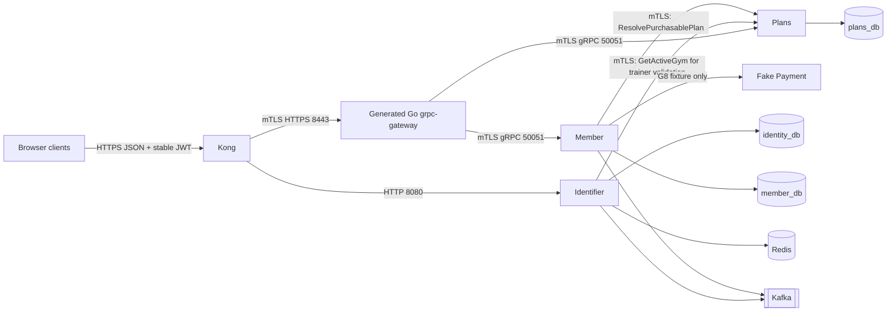
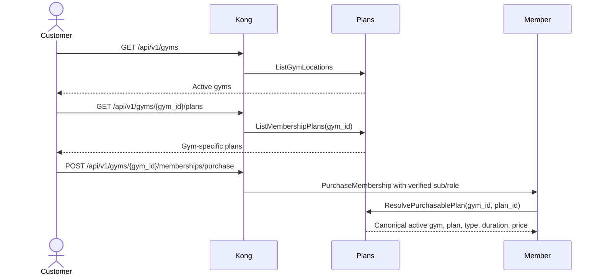

# Gym Chain Management System — Architecture Overview

> **Roadmap status:** G6–G8 are complete historical gates for Identifier, Member, and Plans. Phase 9 is in progress. Generated Go `grpc-gateway` is selected after Kong 3.8 source-Protobuf parsing failed; final completion still requires immutable v6.0.1 artifacts, locked clean-source G9, protected CI, sanitized evidence, and clean committed trees. See [Phase 9](../plans/foundation-first/09-kong-grpc-gateway-openapi.md).

## System Context

The platform is a microservices backend for a multi-location gym chain operating in Vietnam. Four frontend clients are anticipated but remain outside this repository scope:

| Client | Users | Purpose |
|---|---|---|
| Web Admin Dashboard | Gym admins | Manage locations, plans, members, trainers, promotions, and reports |
| Customer Mobile App | Gym members | Register, select a gym, purchase membership, log workouts, and book trainers |
| Trainer Mobile App | Trainers | Manage availability, bookings, and coaching history |
| Admin Ops Dashboard | Chain owners | Cross-location administration and analytics |

Selecting a gym is frontend URL/request state. It does not issue another token and does not prove administrative authorization.

## Active Roadmap Scope and Service Catalog

Only Identifier, Member, and Plans are active. Other entries are future boundaries, not deployed components.

| # | Service | Technology | Database | Ownership | Status |
|---|---|---|---|---|---|
| 1 | Identifier | Go + PostgreSQL | `identity_db` | Users, credentials, refresh tokens, stable identity JWTs | Active |
| 2 | Member | Java 26 + Spring Boot 4 | `member_db` | Profiles, subscriptions, purchase orchestration, lifecycle, validation, membership events | Active |
| 3 | Plans | Java 26 + Spring Boot 4 | `plans_db` | Gym locations, gym-specific plans, availability, duration, VND list price | Active |
| 4 | Payment | Java + PostgreSQL | `payment_db` | Payments, provider webhooks, refunds | Deferred; G8 uses a fake fixture only |
| 5 | Workout | Go + Cassandra | `workout_ks` | Workout logs, templates, personal records | Deferred |
| 6 | Trainer | Java + PostgreSQL | `trainer_db` | Trainer profiles, availability, bookings | Deferred |
| 7 | Check-in | Go + YugabyteDB | `checkin_db` | Kiosks, QR keys, scan validation, check-in records | Deferred |
| 8 | Notification | Go + Cassandra | `notification_ks` | Notification fan-out and history | Deferred |
| 9 | Analytics | Java + YugabyteDB | `analytics_db` | Attendance, revenue, and trend projections | Deferred |
| 10 | Promotion | Java + PostgreSQL | `promotion_db` | Promotion codes and reservations | Deferred |

## Phase 9 Target Topology



There is no Identifier-to-Member customer-flow call. Plans `8080` remains available only for Actuator, probes, and metrics after Kong cutover; Plans business traffic uses `50051`.

Plans V1 has no Kafka producer, consumer, topic, outbox, cache, scheduler, Schema Registry dependency, or Payment integration. G8 fake Payment exists only to prove purchase correlation and event replay.

## Ownership and Database Isolation

Each service owns its database exclusively. Cross-service identifiers are opaque strings and never cross-service database foreign keys.

```text
identity_db
  users
  refresh_tokens
  email_verification_tokens

member_db
  members
  subscriptions
  pending_purchases
  outbox_events
  processed_events

plans_db
  gym_locations
  membership_plans
```

Only Plans may enforce a local foreign key from `membership_plans.gym_id` to `gym_locations.id`. Member stores opaque `user_id`, `gym_id`, and `plan_id` values plus frozen purchased terms.

Identifier owns no Member or Plans table and stores no gym assignment. All access tokens contain stable identity and token-control claims only:

```text
sub, role, iss, aud, iat, exp, jti, kid
```

They contain no `gym_id` and no `membership_status`. Live membership state remains Member-owned.

## Customer Gym Selection and Purchase



Client `gym_id` is intent and resource context. Plans is authoritative for gym activity, plan activity, plan ownership, type, duration, and price. Member is authoritative for ownership, membership state, lifecycle, and purchased-term snapshots.

## Authorization

Customer self-service combines verified identity with Member-owned records. Request `gym_id` alone grants nothing.

No authoritative `ADMIN`-to-gym assignment model exists. Until one is implemented and evidenced:

- Plans gym and plan mutations are `SUPER_ADMIN`-only;
- Member gym-wide administration is `SUPER_ADMIN`-only;
- Identifier trainer-account creation with a gym argument is `SUPER_ADMIN`-only;
- authenticated users may browse gyms and plans.

Never infer admin gym scope from UI state, request paths, or obsolete selected-gym claims.

## Communication and Trust

| Pattern | Phase 9 target |
|---|---|
| Identifier public HTTP/JSON | Client to Kong to Identifier HTTP gateway on `8080` |
| Member and Plans public HTTP/JSON | Client to Kong, then mTLS generated gateway `8443`, then service mTLS gRPC `50051` |
| Native workload gRPC | Exact caller SAN to exact method on `50051` |
| Kafka | Identifier identity events and Member membership/payment handling only |

Public Member and Plans metadata is trusted only when the peer certificate SAN is `ms-gym-api-gateway`. Kong strips forged trusted headers and injects verified identity/role metadata only; gateway accepts that metadata only from Kong SAN, strips arbitrary inbound metadata, and forwards vetted values. Path binding populates explicit `gym_id`; it is not a JWT claim.

Exact internal allowlist:

- Identifier may call Plans `GetActiveGym` for current trainer validation.
- Member may call Plans `ResolvePurchasablePlan`.
- Check-in may call Member `ValidateMembership` when that deferred service is implemented.
- Notification may call Member `ListMembersByStatus` when that deferred service is implemented.

Internal methods have no HTTP annotation, Kong route, or OpenAPI operation. Workload certificates establish service identity, not end-user roles.

## API-First Boundary

Protobuf owns messages, validation, and public `google.api.http` annotations. Generated artifacts are:

- Java and Go service/native-client types from Protobuf;
- canonical OpenAPI 3.0 containing exactly 12 Identity, seven Member, and eight Plans browser operations, generated from Gnostic `protoc-gen-openapi@v0.7.1` service outputs and deterministic collision-rejecting merge;
- released Protobuf source bundle for contract verification, not Kong runtime transcoding.

Browser REST clients generate from released OpenAPI 3.0. Backend and native gRPC clients generate from Protobuf. Do not handwrite parallel Swagger schemas or backend DTOs from OpenAPI.

## Key Decisions

| Decision | Target choice | Reason |
|---|---|---|
| Customer gym selection | Explicit URL/request state | Keeps mutable resource context out of identity sessions |
| JWT state | Stable identity only | Avoids stale membership and gym authorization claims |
| Catalog owner | Plans | One canonical source for locations and purchasable terms |
| Membership owner | Member | Keeps lifecycle, validation, and events with subscription state |
| Purchase terms | Frozen in Member before Payment | Completion remains deterministic after catalog changes |
| Database isolation | DB per service, opaque cross-service IDs | Prevents schema coupling and cross-service joins |
| Public trust | Generated gateway SAN plus vetted identity metadata | Prevents direct-header spoofing |
| Internal trust | Caller-specific mTLS and exact method allowlists | Prevents workload privilege confusion |
| Admin gym scope | `SUPER_ADMIN` until staff assignment exists | Request gym context is not authorization |
| Browser contract | Generated OpenAPI 3.0 | Describes HTTP paths, security, schemas, and errors |
