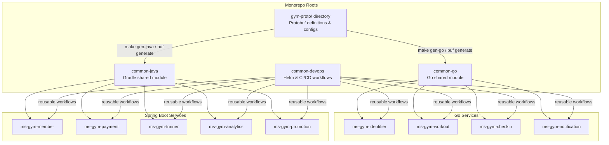

# Shared Libraries

Three shared library repositories: two for language-specific backend utilities, and one for shared DevOps charts and CI/CD pipelines.

---

## 1. `common-go` — Shared Go Module

**Repository:** `github.com/gym-chain/common-go`  
**Import:** `go get github.com/gym-chain/common-go`

### Structure

```
common-go/
├── go.mod
├── grpc/
│   ├── interceptor/
│   │   ├── auth.go              # JWT claims extraction from metadata
│   │   ├── logging.go           # Structured request/response logging
│   │   ├── recovery.go          # Panic recovery → gRPC INTERNAL error
│   │   ├── metrics.go           # Prometheus gRPC metrics
│   │   └── tracing.go           # OpenTelemetry trace propagation
│   └── middleware/
│       └── membership_guard.go  # Rejects if membership_status != ACTIVE
├── kafka/
│   ├── producer.go              # Kafka producer wrapper (idempotent, retries)
│   ├── consumer.go              # Consumer group wrapper (manual commit)
│   ├── message.go               # Message envelope: {event_type, key, payload, timestamp, trace_id}
│   └── serializer.go            # Protobuf serializer/deserializer
├── config/
│   ├── loader.go                # Env-based config loading (Viper)
│   └── defaults.go              # Default ports, timeouts, retry counts
├── errors/
│   ├── domain.go                # Domain error types → gRPC status code mapping
│   └── codes.go                 # Custom error codes (GYM_001, GYM_002, ...)
├── logging/
│   └── logger.go                # Structured logger (zerolog / zap) with trace_id
├── health/
│   └── checker.go               # gRPC health check server implementation
├── pagination/
│   └── cursor.go                # Cursor-based pagination helpers
├── crypto/
│   ├── hash.go                  # SHA256 helper (QR token generation)
│   └── jwt.go                   # JWT parse/validate (for services that need it)
├── testutil/
│   ├── containers.go            # Testcontainers helpers (Cassandra, YugabyteDB, Kafka)
│   ├── fixtures.go              # Test data builders
│   └── grpc_mock.go             # Mock gRPC server for integration tests
└── proto/
    └── common/v1/
        └── common.pb.go          # Generated from shared proto (pagination, money, etc.)
```

### Key Components

#### Auth Interceptor
```go
// grpc/interceptor/auth.go
// Extracts JWT claims from gRPC metadata (set by Kong)
// Makes claims available via context: usecase.GetUserID(ctx), usecase.GetRole(ctx)

func AuthUnaryInterceptor() grpc.UnaryServerInterceptor {
    return func(ctx context.Context, req any, info *grpc.UnaryServerInfo,
        handler grpc.UnaryHandler) (any, error) {
        // Extract claims from metadata (Kong already validated JWT)
        md, _ := metadata.FromIncomingContext(ctx)
        claims := extractClaims(md)
        ctx = context.WithValue(ctx, claimsKey, claims)
        return handler(ctx, req)
    }
}
```

#### Kafka Message Envelope
```go
// kafka/message.go
type Message struct {
    EventType string          `json:"event_type"`
    Key       string          `json:"key"`
    Payload   proto.Message   `json:"-"`        // Protobuf-encoded
    Timestamp time.Time       `json:"timestamp"`
    TraceID   string          `json:"trace_id"` // OpenTelemetry propagation
    Source    string          `json:"source"`    // service name
}
```

#### Domain Error Mapping
```go
// errors/domain.go
// Maps domain errors to gRPC status codes consistently across all Go services

var domainToGRPC = map[error]codes.Code{
    ErrNotFound:          codes.NotFound,
    ErrAlreadyExists:     codes.AlreadyExists,
    ErrPermissionDenied:  codes.PermissionDenied,
    ErrInvalidInput:      codes.InvalidArgument,
    ErrMembershipExpired: codes.PermissionDenied,
}
```

---

## 2. `common-java` — Shared Gradle Module

**Repository:** `github.com/gym-chain/common-java`  
**Import:** Gradle dependency

```groovy
implementation 'com.gym:common-java:1.0.0'
```

### Structure

```
common-java/
├── build.gradle
├── gradlew
├── src/main/java/com/gym/common/
│   ├── grpc/
│   │   ├── interceptor/
│   │   │   ├── AuthServerInterceptor.java      # JWT claims extraction
│   │   │   ├── LoggingInterceptor.java          # Structured logging
│   │   │   ├── MetricsInterceptor.java          # Micrometer gRPC metrics
│   │   │   ├── TracingInterceptor.java          # OpenTelemetry propagation
│   │   │   └── ExceptionInterceptor.java        # Domain exception → gRPC status
│   │   ├── security/
│   │   │   ├── GrpcSecurityContext.java         # Thread-local security context
│   │   │   ├── UserClaims.java                  # Extracted JWT claims POJO
│   │   │   └── RequireRole.java                 # @RequireRole("ADMIN") annotation
│   │   └── config/
│   │       └── GrpcServerAutoConfig.java        # Spring Boot auto-configuration
│   ├── kafka/
│   │   ├── producer/
│   │   │   ├── EventPublisher.java              # Generic event publisher
│   │   │   └── EventPublisherImpl.java          # Protobuf-encoded Kafka producer
│   │   ├── consumer/
│   │   │   ├── EventConsumer.java               # Base consumer with error handling
│   │   │   └── RetryableConsumer.java           # DLQ on repeated failures
│   │   ├── message/
│   │   │   └── EventEnvelope.java               # Message envelope (matches Go)
│   │   └── config/
│   │       └── KafkaAutoConfig.java             # Spring Kafka auto-configuration
│   ├── error/
│   │   ├── DomainException.java                 # Base domain exception
│   │   ├── NotFoundException.java
│   │   ├── ConflictException.java
│   │   ├── ForbiddenException.java
│   │   └── ErrorCode.java                       # Enum: GYM_001, GYM_002, ...
│   ├── persistence/
│   │   ├── BaseEntity.java                      # id, createdAt, updatedAt
│   │   └── AuditListener.java                   # JPA entity listener
│   ├── pagination/
│   │   ├── CursorPage.java                      # Cursor-based pagination
│   │   └── PageMapper.java                      # Entity page → proto page
│   ├── config/
│   │   └── CommonAutoConfiguration.java         # Spring Boot starter entry point
│   └── proto/
│       └── common/v1/
│           └── CommonProto.java                 # Generated shared proto types
└── src/test/java/com/gym/common/
    ├── testutil/
    │   ├── TestContainersConfig.java            # Testcontainers: PG, Kafka
    │   ├── GrpcTestHelper.java                  # In-process gRPC test server
    │   └── TestDataBuilder.java                 # Fluent test data builders
    └── kafka/
        └── EmbeddedKafkaTestConfig.java
```

### Key Components

#### Role Guard Annotation
```java
// grpc/security/RequireRole.java
@Target(ElementType.METHOD)
@Retention(RetentionPolicy.RUNTIME)
public @interface RequireRole {
    String[] value();  // e.g., @RequireRole({"ADMIN", "TRAINER"})
}

// Enforced by AuthServerInterceptor — checks JWT role claim
// Returns PERMISSION_DENIED if role not in allowed list
```

#### Event Publisher
```java
// kafka/producer/EventPublisher.java
public interface EventPublisher {
    void publish(String topic, String key, Message payload);
    void publish(String topic, String key, Message payload, Map<String, String> headers);
}

// Implementation adds:
//   - trace_id from current OpenTelemetry context
//   - source = spring.application.name
//   - timestamp = now
//   - Protobuf serialization
```

#### Retryable Consumer with DLQ
```java
// kafka/consumer/RetryableConsumer.java
// Retries 3x with exponential backoff
// On 4th failure → sends to Dead Letter Queue (topic.DLQ)
// DLQ messages can be replayed manually or by admin tool
```

### DLQ Replay & Recovery Mechanism

To maintain eventual consistency without locking partitions or losing messages:

1. **Dead Letter Queue Routing:**
   - Every consumer in `common-java` and `common-go` wraps its message handler in a try-catch/retry block.
   - Transient errors (e.g., database connection timeout) trigger up to 3 retries with exponential backoff (e.g., 2s, 4s, 8s).
   - If the error persists after 3 retries (or on a non-retryable constraint error), the consumer publishes the message to the corresponding Dead Letter topic (e.g., `payment.completed.DLQ`) and commits the offset on the original topic.

2. **DLQ Message Structure:**
   - The DLQ message preserves the original message envelope plus metadata headers:
     - `x-original-topic`: Topic name where failure occurred
     - `x-exception-message`: Error message details
     - `x-failed-at`: Timestamp of failure
     - `x-retry-count`: Number of retries executed

3. **Ops Dashboard & Replay Flow:**
   - An Admin Ops Tool connects to the DLQ topics.
   - Operators can view failed messages, search by user_id/transaction_id, and see the stack trace.
   - **Replay Actions:**
     - **Manual Replay:** Operator clicks "Replay" in the Ops Dashboard, which sends the message back to the primary topic to be processed again (after fixing the downstream system).
     - **Auto-Discard:** For known non-recoverable messages, operator dismisses the DLQ item.
     - **Bulk Replay CLI:** A script inside `common-java` can run a K8s job to drain a DLQ topic back into the main topic.

---

## Version Strategy

```
Both libraries use semantic versioning: MAJOR.MINOR.PATCH

common-go:   tagged in git → Go modules resolve by tag
common-java: published to GitHub Packages (Maven/Gradle registry)

Breaking change in common-* → MAJOR bump
  → Services upgrade at their own pace (no forced lockstep)
  → CI runs tests against latest common-* before merge

Proto stubs are generated locally inside the services or shared libraries using `buf generate` or central Makefile commands during development, but can also be resolved via the published Maven dependency (`com.gym.proto:gym-proto-java`) from GitHub Packages inside Gradle configurations.
  → `make proto` runs generation for both Go and Java
  → Local `gym-proto/` directory at the root of `gym-chain` serves as the single source of truth
```

---

## Dependency Graph


