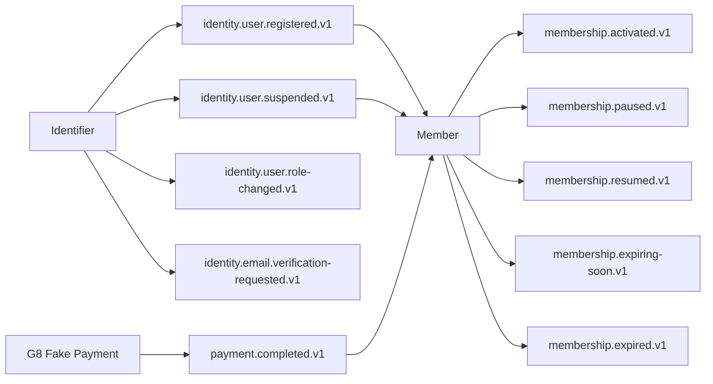

# Kafka Event Catalog

> **Roadmap status:** The nine-topic v1 wire-format inventory below is the released freeze. `identity.email.verification-requested.v1` exists on the current development branch but is not in that released inventory. G8 uses a fake Payment fixture for integration proof. Other event messages may have Protobuf definitions while their producers, consumers, and deployment remain deferred. Plans V1 has no Kafka participation.

Kafka values use concrete Protobuf messages with Schema Registry framing. Kafka is greenfield: no JSON topics, envelopes, or deployed offsets require compatibility adapters.

## Frozen v1 Topics

| Event | Topic | Subject | Producer through G8 |
|---|---|---|---|
| `UserRegisteredEvent` | `identity.user.registered.v1` | `identity.user.registered.v1-value` | Identifier |
| `UserSuspendedEvent` | `identity.user.suspended.v1` | `identity.user.suspended.v1-value` | Identifier |
| `UserRoleChangedEvent` | `identity.user.role-changed.v1` | `identity.user.role-changed.v1-value` | Identifier |
| `PaymentCompletedEvent` | `payment.completed.v1` | `payment.completed.v1-value` | G8 fake Payment fixture; production Payment deferred |
| `MembershipActivatedEvent` | `membership.activated.v1` | `membership.activated.v1-value` | Member |
| `MembershipPausedEvent` | `membership.paused.v1` | `membership.paused.v1-value` | Member |
| `MembershipResumedEvent` | `membership.resumed.v1` | `membership.resumed.v1-value` | Member |
| `MembershipExpiringSoonEvent` | `membership.expiring-soon.v1` | `membership.expiring-soon.v1-value` | Member |
| `MembershipExpiredEvent` | `membership.expired.v1` | `membership.expired.v1-value` | Member |

The current branch also defines `EmailVerificationRequestedEvent` for `identity.email.verification-requested.v1`; it remains outside the released nine-topic wire-format inventory until a later contract release includes it. Other Protobuf event messages in this catalog are versioned schema definitions, but their topics, producers, consumers, and deployments remain deferred.

Topic names follow `{domain}.{entity}.{action}.v1`. Subjects use `TopicNameStrategy` (`<topic>-value`) with `BACKWARD` compatibility. Production uses `auto.register.schemas=false`. Member's consumer group is `ms-gym-member-v1`; DLQ topics use `{topic}.DLQ`.

## G8 Event Flow

Plans is intentionally absent. Plans V1 has no producer, consumer, topic, outbox, retry consumer, DLQ, or Schema Registry dependency.

## Cross-Service Identifier Rule

Fields such as `user_id`, `member_id`, `gym_id`, `plan_id`, `purchase_id`, and `payment_id` are opaque strings at service boundaries. A service may use UUIDs for its own IDs, but consumers must not infer database type or create cross-service FKs.

## Identity Events

Identity events are gym-neutral. `gym_id` is reserved in the current Protobuf contracts and must not be published.

### `identity.user.registered.v1`

| Field | Type | Description |
|---|---|---|
| `user_id` | string | Opaque Identifier ID |
| `email` | string | User email |
| `full_name` | string | Display name |
| `role` | string | `CUSTOMER`, `TRAINER`, or `ADMIN` |
| `auth_provider` | string | `LOCAL` or `GOOGLE` |
| `timestamp` | int64 | Unix epoch timestamp |

**Key:** `user_id`  
**Consumer through G8:** Member creates an idempotent gym-neutral profile shell.

### `identity.user.suspended.v1`

| Field | Type | Description |
|---|---|---|
| `user_id` | string | Suspended Identifier ID |
| `role` | string | Identity role |
| `timestamp` | int64 | Unix epoch timestamp |

**Key:** `user_id`  
**Consumer through G8:** Member applies suspension policy idempotently. Trainer consumption is deferred.

### `identity.user.role-changed.v1`

| Field | Type |
|---|---|
| `user_id` | string |
| `old_role` | string |
| `new_role` | string |
| `timestamp` | int64 |

`gym_id` is not part of any identity event payload above.

### `identity.email.verification-requested.v1`

| Field | Type | Description |
|---|---|---|
| `user_id` | string | Opaque Identifier ID |
| `email` | string | Verification recipient |
| `full_name` | string | Display name |
| `verification_url` | string | Secret frontend deep link containing the raw token |
| `expires_at` | int64 | Unix epoch seconds |
| `timestamp` | int64 | Unix epoch seconds |

**Key:** `user_id`  
**Consumer:** Future Notification integration. Topic ACLs must be restricted, and consumers must never log `verification_url`.

## Membership Events

Member publishes lifecycle events from subscription state and purchased snapshots. It never reads live Plans data while creating these events.

### `membership.activated.v1`

| Field | Type | Source |
|---|---|---|
| `member_id` | string | Member profile |
| `user_id` | string | Opaque Identifier reference |
| `plan_type` | string | Subscription snapshot |
| `start_date` | string | Activated subscription |
| `end_date` | string | Activated subscription; empty for lifetime |
| `gym_id` | string | Subscription snapshot |
| `is_renewal` | bool | Lifecycle decision |
| `timestamp` | int64 | Event time |

### Other membership lifecycle events

| Topic | Key fields | Source |
|---|---|---|
| `membership.paused.v1` | `member_id`, `paused_at`, `remaining_days`, `gym_id` | Subscription state |
| `membership.resumed.v1` | `member_id`, `new_end_date`, `gym_id` | Subscription state |
| `membership.expiring-soon.v1` | `member_id`, `end_date`, `plan_type`, `gym_id` | Subscription snapshot |
| `membership.expired.v1` | `member_id`, `expired_at`, `gym_id` | Subscription state |

Notification and Analytics consumers remain deferred service-catalog behavior.

## `payment.completed.v1`

| Field | Type | Membership meaning |
|---|---|---|
| `payment_id` | string | Must match pending purchase |
| `user_id` | string | Must match frozen purchase owner |
| `type` | string | Must equal `MEMBERSHIP` |
| `reference_id` | string | Member-owned `purchase_id`, never `plan_id` |
| `amount_vnd` | int64 | Must equal frozen `price_vnd` |
| `provider` | string | Must match initiated provider policy |
| `gym_id` | string | Must match frozen purchase gym |
| `discount_applied` | bool | False in G8 membership fixture |
| `discount_percentage` | int32 | Zero in G8 membership fixture |
| `timestamp` | int64 | Event time |

**Key:** `user_id`

For membership completion, Member:

1. resolves `reference_id` as a pending `purchase_id`;
2. loads and locks that record;
3. validates purchase state, payment ID, type, user, gym, provider expectations, and amount;
4. activates or renews using frozen type, duration, and price;
5. marks the purchase completed and records event processing atomically;
6. publishes lifecycle events through its outbox.

Member never calls Plans while handling completion. Replays do not create duplicate subscriptions or events.

Trainer-booking correlation by `booking_id` remains a future Payment/Trainer design and is not part of G8.

## Future Event Catalog

These topic families remain deferred:

| Domain | Future topics |
|---|---|
| Payment | `payment.failed`, `payment.refunded` |
| Workout | `workout.logged` |
| Trainer booking | `booking.requested`, `booking.accepted`, `booking.rejected`, `booking.completed`, `booking.cancelled`, `booking.expired`, `booking.auto-rejected` |
| Check-in | `checkin.recorded.v1` |
| Promotion | `promotion.published` |
| Trainer lifecycle | `trainer.created`, `trainer.suspended` |
| Analytics | `analytics.member-at-risk` |

### Deferred Check-in boundary

A future `checkin.recorded.v1` may carry opaque `member_id`, `gym_id`, `device_id`, and `checked_in_at`. Location, kiosk, and QR-key lifecycle remain synchronous/admin concerns, not Kafka events.

Plans owns canonical locations, but Plans V1 authorizes no Check-in caller. A later workload contract must be frozen before kiosk provisioning. Check-in must not call Member for location lookup. Future scan processing may still call Member `ValidateMembership` under a separate verified workload policy.

## Delivery Semantics

Consumers use at-least-once processing:

1. initial attempt;
2. retries after 2, 4, and 8 seconds;
3. publish original key, framed value, and headers to `{topic}.DLQ` after the third retry fails;
4. commit only after handler success or confirmed DLQ publication.

Required UTF-8 headers are `event-type`, `source`, `timestamp`, `event-id`, and `traceparent`; `tracestate` is optional. `x-trace-id` is a read-only compatibility fallback. New producers emit no legacy `x-event-*` headers.

Schema compatibility rules:

- new fields may be added compatibly;
- existing fields cannot be removed or renamed within a released version;
- field numbers cannot be reused;
- Buf breaking checks run against the configured released baseline.
