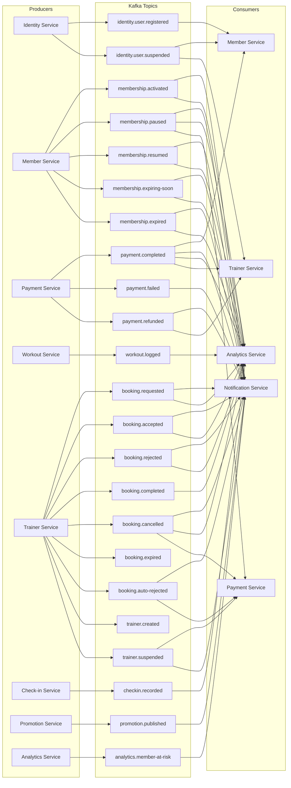

# Kafka Event Catalog

All async events flowing through Kafka. Schema format: **Protobuf** (reuses gRPC message definitions).

---

## Topic Naming Convention

```
{domain}.{entity}.{action}

Examples:
  identity.user.registered
  membership.activated
  payment.completed
  checkin.recorded
```

---

## Event Flow Map



---

## Event Definitions

### identity.user.registered

| Field | Type | Description |
|-------|------|-------------|
| `user_id` | string (UUID) | New user ID |
| `email` | string | User email |
| `full_name` | string | Display name |
| `role` | string | CUSTOMER, TRAINER, ADMIN |
| `gym_id` | string (UUID) | Home gym location |
| `auth_provider` | string | LOCAL, GOOGLE |
| `timestamp` | int64 | Unix millis |

**Key:** `user_id`  
**Consumers:** Member Service (create member profile)

---

### identity.user.suspended

| Field | Type | Description |
|-------|------|-------------|
| `user_id` | string (UUID) | Suspended user ID |
| `role` | string | CUSTOMER, TRAINER, ADMIN |
| `gym_id` | string (UUID) | Gym location |
| `timestamp` | int64 | Unix millis |

**Key:** `user_id`  
**Consumers:** Member Service (freeze profile), Trainer Service (cancel pending classes)

---

### membership.activated

| Field | Type | Description |
|-------|------|-------------|
| `member_id` | string (UUID) | Member ID |
| `user_id` | string (UUID) | User ID |
| `plan_type` | string | MONTHLY, YEARLY, LIFETIME |
| `start_date` | string | ISO date |
| `end_date` | string | ISO date, null for LIFETIME |
| `gym_id` | string (UUID) | Gym location |
| `is_renewal` | bool | True if renewing |
| `timestamp` | int64 | Unix millis |

**Key:** `member_id`  
**Consumers:** Notification Service, Analytics Service

---

### membership.paused

| Field | Type | Description |
|-------|------|-------------|
| `member_id` | string (UUID) | |
| `paused_at` | int64 | Unix millis |
| `remaining_days` | int32 | Days remaining |
| `gym_id` | string (UUID) | |

**Key:** `member_id`  
**Consumers:** Notification Service, Analytics Service, Payment Service (prorated refund)

---

### membership.resumed

| Field | Type | Description |
|-------|------|-------------|
| `member_id` | string (UUID) | |
| `new_end_date` | string | ISO date |
| `gym_id` | string (UUID) | |

**Key:** `member_id`  
**Consumers:** Notification Service, Analytics Service

---

### membership.expiring-soon

| Field | Type | Description |
|-------|------|-------------|
| `member_id` | string (UUID) | |
| `end_date` | string | ISO date |
| `plan_type` | string | MONTHLY, YEARLY |
| `gym_id` | string (UUID) | |

**Key:** `member_id`  
**Consumers:** Notification Service (send SMS + push reminder)

---

### membership.expired

| Field | Type | Description |
|-------|------|-------------|
| `member_id` | string (UUID) | |
| `expired_at` | int64 | Unix millis |
| `gym_id` | string (UUID) | |

**Key:** `member_id`  
**Consumers:** Notification Service, Analytics Service

---

### payment.completed

| Field | Type | Description |
|-------|------|-------------|
| `payment_id` | string (UUID) | |
| `user_id` | string (UUID) | |
| `type` | string | MEMBERSHIP, TRAINER_BOOKING |
| `reference_id` | string (UUID) | plan_id or booking_id |
| `amount_vnd` | int64 | Amount in VND |
| `provider` | string | MOMO, ZALOPAY, VNPAY |
| `gym_id` | string (UUID) | |
| `discount_applied` | bool | |
| `discount_percentage` | int32 | 0 if none |
| `timestamp` | int64 | Unix millis |

**Key:** `user_id`  
**Consumers:** Member Service (activate membership), Trainer Service (confirm booking), Notification Service (receipt), Analytics Service (revenue)

---

### payment.failed

| Field | Type | Description |
|-------|------|-------------|
| `payment_id` | string (UUID) | |
| `user_id` | string (UUID) | |
| `type` | string | MEMBERSHIP, TRAINER_BOOKING |
| `reference_id` | string (UUID) | plan_id or booking_id |
| `gym_id` | string (UUID) | Gym location |
| `reason` | string | Failure reason |
| `timestamp` | int64 | Unix millis |

**Key:** `user_id`  
**Consumers:** Notification Service

---

### payment.refunded

| Field | Type | Description |
|-------|------|-------------|
| `payment_id` | string (UUID) | |
| `user_id` | string (UUID) | |
| `type` | string | MEMBERSHIP, TRAINER_BOOKING |
| `reference_id` | string (UUID) | plan_id or booking_id |
| `gym_id` | string (UUID) | Gym location |
| `refund_amount_vnd` | int64 | |
| `reason` | string | |
| `timestamp` | int64 | Unix millis |

**Key:** `user_id`  
**Consumers:** Notification Service, Trainer Service (marks booking cancelled if booking_id)

---

### workout.logged

| Field | Type | Description |
|-------|------|-------------|
| `user_id` | string (UUID) | |
| `workout_id` | string (UUID) | |
| `gym_id` | string (UUID) | |
| `exercise_count` | int32 | Number of exercises |
| `duration_minutes` | int32 | |
| `logged_at` | int64 | Unix millis |

**Key:** `user_id`  
**Consumers:** Analytics Service

---

### booking.requested

| Field | Type | Description |
|-------|------|-------------|
| `booking_id` | string (UUID) | |
| `customer_id` | string (UUID) | |
| `trainer_id` | string (UUID) | |
| `scheduled_at` | int64 | Unix millis |
| `duration_minutes` | int32 | |
| `gym_id` | string (UUID) | |

**Key:** `booking_id`  
**Consumers:** Notification Service (notify trainer)

---

### booking.accepted / booking.rejected

| Field | Type | Description |
|-------|------|-------------|
| `booking_id` | string (UUID) | |
| `customer_id` | string (UUID) | |
| `trainer_id` | string (UUID) | |
| `gym_id` | string (UUID) | |
| `reason` | string | Only for rejected |

**Key:** `booking_id`  
**Consumers:** Notification Service (notify customer), Analytics Service (acceptance/rejection stats)

---

### booking.completed

| Field | Type | Description |
|-------|------|-------------|
| `booking_id` | string (UUID) | |
| `trainer_id` | string (UUID) | |
| `customer_id` | string (UUID) | |
| `duration_minutes` | int32 | |
| `gym_id` | string (UUID) | |

**Key:** `booking_id`  
**Consumers:** Analytics Service (trainer utilization)

---

### booking.cancelled

| Field | Type | Description |
|-------|------|-------------|
| `booking_id` | string (UUID) | |
| `customer_id` | string (UUID) | |
| `trainer_id` | string (UUID) | |
| `cancelled_by` | string | CUSTOMER, TRAINER, SYSTEM |
| `reason` | string | Reason description |
| `refund_percentage` | int32 | 0, 50, or 100 |
| `gym_id` | string (UUID) | |

**Key:** `booking_id`  
**Consumers:** Notification Service (notify parties), Payment Service (trigger refund), Analytics Service (track cancellation metrics)

---

### booking.expired

| Field | Type | Description |
|-------|------|-------------|
| `booking_id` | string (UUID) | |
| `trainer_id` | string (UUID) | |
| `slot` | string | Scheduled date time |

**Key:** `booking_id`  
**Consumers:** None (internally processed, logged for audits)

---

### booking.auto-rejected

| Field | Type | Description |
|-------|------|-------------|
| `booking_id` | string (UUID) | |
| `customer_id` | string (UUID) | |
| `trainer_id` | string (UUID) | |
| `gym_id` | string (UUID) | |

**Key:** `booking_id`  
**Consumers:** Notification Service (alert customer), Payment Service (triggers auto-refund)

---

### checkin.recorded

| Field | Type | Description |
|-------|------|-------------|
| `member_id` | string (UUID) | |
| `gym_id` | string (UUID) | |
| `device_id` | string (UUID) | Hardware scanner ID |
| `checked_in_at` | int64 | Unix millis |

**Key:** `member_id`  
**Consumers:** Analytics Service (attendance stats, member_activity)

---

### promotion.published

| Field | Type | Description |
|-------|------|-------------|
| `promotion_id` | string (UUID) | |
| `code` | string | Discount code |
| `percentage` | int32 | Discount percentage |
| `target_gym_ids` | repeated string | Gym IDs, empty = all |
| `start_date` | string | ISO date |
| `end_date` | string | ISO date |

**Key:** `promotion_id`  
**Consumers:** Notification Service (fan-out SMS/email)

---

### trainer.created

| Field | Type | Description |
|-------|------|-------------|
| `trainer_id` | string (UUID) | |
| `user_id` | string (UUID) | |
| `gym_id` | string (UUID) | |
| `display_name` | string | |

**Key:** `trainer_id`  
**Consumers:** None (internal lookup auditing)

---

### trainer.suspended

| Field | Type | Description |
|-------|------|-------------|
| `trainer_id` | string (UUID) | |
| `gym_id` | string (UUID) | |
| `affected_booking_count` | int32 | Number of bookings cancelled |

**Key:** `trainer_id`  
**Consumers:** Notification Service, Payment Service

---

### analytics.member-at-risk

| Field | Type | Description |
|-------|------|-------------|
| `member_id` | string (UUID) | |
| `gym_id` | string (UUID) | |
| `inactive_days` | int32 | Number of days inactive |
| `risk_level` | string | AT_RISK, INACTIVE, GHOST |

**Key:** `member_id`  
**Consumers:** Notification Service (sends incentive discount / check-in prompt)

---

## Kafka Configuration

```yaml
# Topic defaults
num.partitions: 6
replication.factor: 3
min.insync.replicas: 2
retention.ms: 604800000     # 7 days

# Consumer groups
consumer_groups:
  - ms-gym-member-group        # consumes: user.registered, payment.completed, user.suspended
  - ms-gym-notification-group  # consumes: all notification-triggering events (including risk warning and suspensions)
  - ms-gym-analytics-group     # consumes: all analytics-relevant events (including checkins, bookings, workouts)
  - ms-gym-trainer-group       # consumes: payment.completed (TRAINER_BOOKING), payment.refunded, user.suspended
  - ms-gym-payment-group       # consumes: membership.paused, booking.cancelled, booking.auto-rejected, trainer.suspended
```

---

## Schema Management

```
Schema Registry: Confluent Schema Registry (Protobuf mode)
Proto files: `github.com/pploc/gym-proto`
Generated Go stubs: tagged `github.com/pploc/proto-go`

Kafka records use a domain ordering key and a Schema Registry-framed concrete
Protobuf value. Subjects use TopicNameStrategy (`<topic>-value`). Canonical
UTF-8 headers are `event-type`, `source`, `timestamp` (decimal Unix epoch
milliseconds), `event-id`, `traceparent`, and optional `tracestate`.
`x-trace-id` is a compatibility fallback only; new producers do not emit the
legacy `x-event-*` headers.

Compatibility mode: BACKWARD
  - New fields can be added (consumers ignore unknown fields)
  - Existing fields cannot be removed or renamed
  - Field numbers cannot be reused

Consumers use at-least-once processing: initial attempt, then 2s, 4s, and 8s
retries. After the third retry fails, the original key, framed value, and
headers are published to `{topic}.DLQ` with diagnostic headers. Commit occurs
only after handler success or confirmed DLQ publication.

Buf CLI enforces breaking change detection in CI:
  buf breaking --against 'develop'
```
