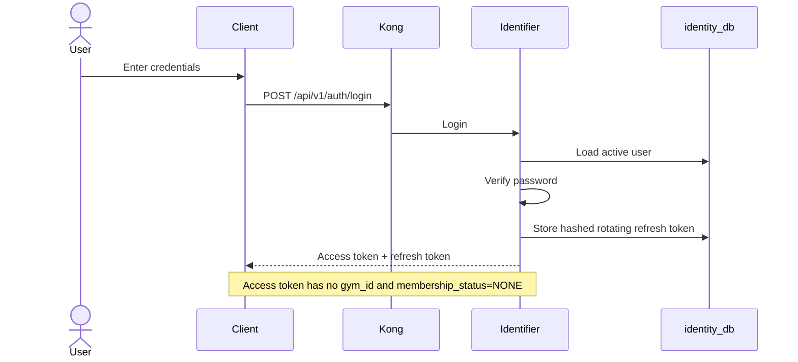
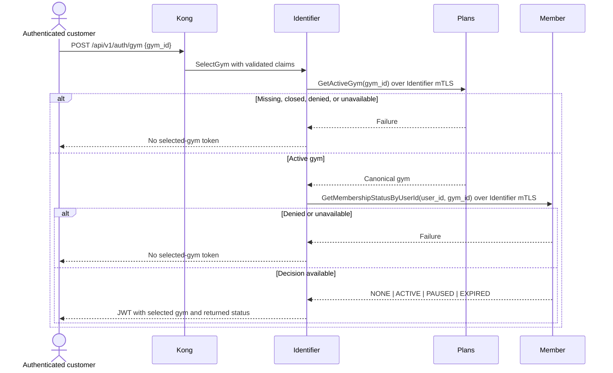
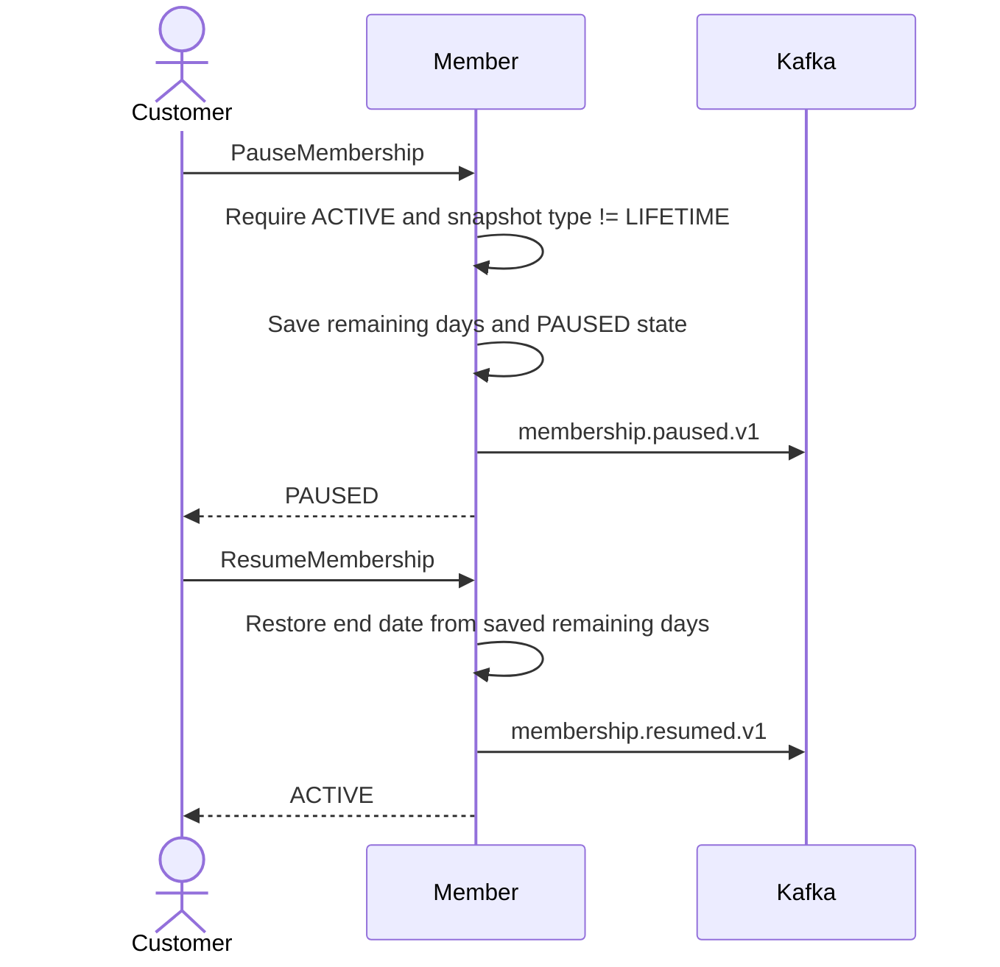
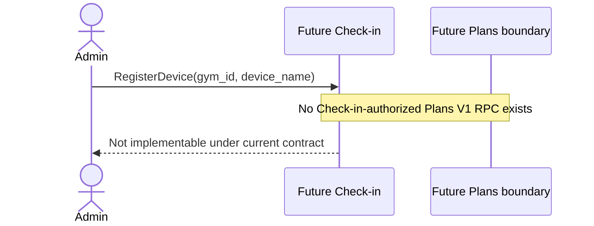
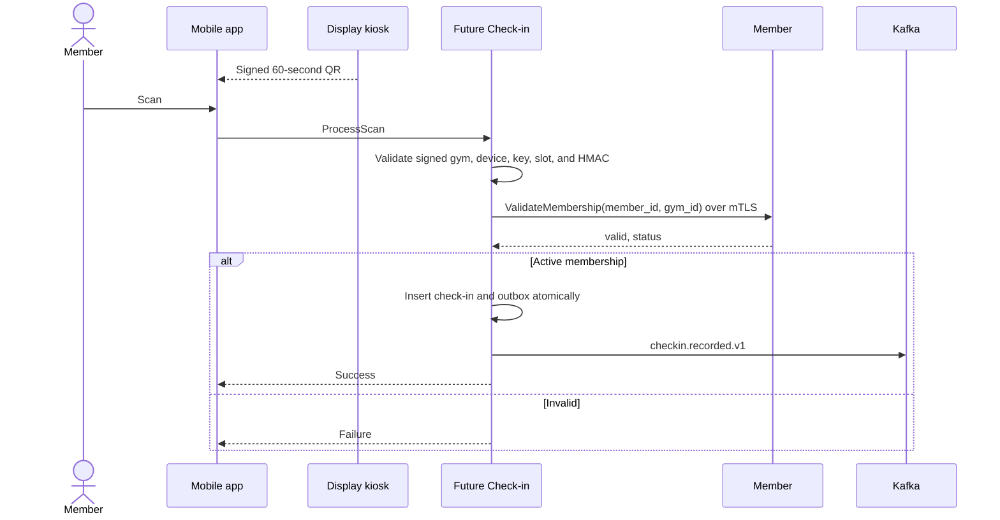
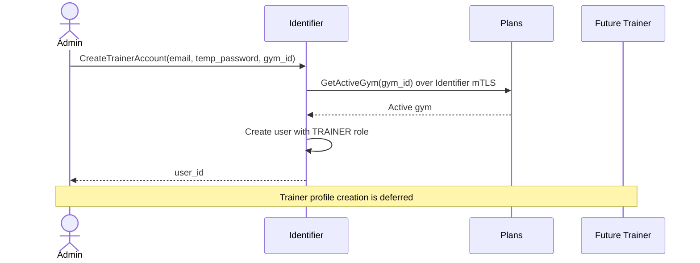

# Business Flows

> **Scope:** Authentication and G8 Identifier/Member/Plans flows are implemented and proven by `run-g8.sh`. Payment in G8 is a fake integration fixture only. Check-in, Workout, Trainer, Notification, Analytics, Promotion, and production Payment remain deferred catalog designs.

## 1. Gym-Neutral Authentication



Registration and email verification also remain gym-neutral. `identity.user.registered.v1` contains no `gym_id`; Member consumes it to create a profile shell with `NONE` status.

Refresh validates a hashed refresh token, rotates it, revokes the old record, and issues another gym-neutral access token.

## 2. Selected-Gym Token



Plans and Member are independent workload clients with separate targets, deadlines, certificates, and trust decisions. Identifier never uses end-user headers as workload credentials.

## 3. Registration and Membership Purchase

```mermaid
sequenceDiagram
    actor C as Customer
    participant APP as Client
    participant K as Kong
    participant ID as Identifier
    participant PL as Plans
    participant MB as Member
    participant DB as member_db
    participant FP as G8 Fake Payment
    participant KF as Kafka

    rect rgb(230,245,255)
        C->>APP: Register
        APP->>K: POST /api/v1/auth/register
        K->>ID: Register
        ID->>KF: identity.user.registered.v1
        KF-->>MB: Create gym-neutral member shell
        ID-->>APP: Pending verification
    end

    rect rgb(245,240,255)
        Note over C,ID: Customer verifies email, logs in, then selects a gym
        APP->>K: POST /api/v1/auth/gym {gym_id}
        K->>ID: SelectGym
        ID->>PL: GetActiveGym
        ID->>MB: GetMembershipStatusByUserId
        ID-->>APP: Selected-gym JWT
    end

    rect rgb(255,245,230)
        C->>APP: Choose plan and provider
        APP->>MB: PurchaseMembership(plan_id, provider, idempotency_key, discount_code?)
        MB->>MB: Reject nonblank discount_code
        MB->>PL: ResolvePurchasablePlan(plan_id, selected_gym_id)
        PL-->>MB: Canonical plan_id, gym_id, type, duration, price_vnd
        MB->>DB: Create/load PENDING purchase by (user_id, idempotency_key)
        Note over MB,DB: Commit before Payment; stable purchase_id
        MB->>FP: InitiatePayment(reference_id=purchase_id)
        FP-->>MB: payment_id, payment_url (same intent on retry)
        MB->>DB: Attach payment_id
        MB-->>APP: payment_id, payment_url
    end

    rect rgb(230,255,230)
        Note over FP,KF: Fixture simulates successful provider completion
        FP->>KF: payment.completed.v1 reference_id=purchase_id
        KF-->>MB: Completion event
        MB->>DB: Claim event + lock purchase in one TX
        MB->>DB: Activate from frozen terms and mark completed
        MB->>KF: membership.activated.v1 via outbox
    end
```

Critical rules:

- Client never supplies trusted gym, plan type, duration, or price.
- Client supplies a required `idempotency_key`; retries reuse the same purchase/reference.
- Plans must return an active plan belonging to the selected active gym.
- Member persists frozen terms and commits before Payment initiation.
- Membership Payment `reference_id` is `purchase_id`, not `plan_id`.
- Catalog edits or deactivation after initiation do not alter activation terms.
- Completion never rereads Plans.
- Mismatched amount, payment ID, user, gym, type, or purchase state prevents activation.
- Replaying completion is idempotent; failed claim rolls back with domain work.
- G8 rejects nonblank discount codes; Promotion is not part of this flow.
- Fake Payment is test infrastructure, not a production provider service.
- End-user Member RPCs reach Member only through Kong mTLS identity.

## 4. Membership Pause and Resume



Lifecycle uses subscription snapshots and does not call Plans.

## 5. Deferred QR Check-in

Check-in remains outside G6–G8. Plans owns canonical locations, but Plans V1 authorizes no Check-in workload method. Kiosk provisioning therefore remains blocked until a later Check-in-to-Plans contract is frozen.



After a later provisioning contract verifies a gym and binds a kiosk, scan processing may use Member for membership decisions:



Check-in never calls Member for location data. Raw QR keys never cross service boundaries.

## 6. Deferred Catalog Flows

These remain designs, not G8 implementation commitments:

- Workout logging and `workout.logged` analytics consumption
- Trainer search, availability, booking, payment, and approval
- Promotion publication and notification fan-out
- Membership expiry notifications
- Production Payment provider webhooks, refunds, and spending history
- Analytics projections and dashboards

## 7. Admin Creates Trainer Account

Only Identifier credential creation is active roadmap scope. Trainer profile creation remains deferred.



Identifier validates the active gym through Plans, not Member. Identity events remain gym-neutral; the selected gym is passed explicitly to future Trainer profile creation rather than embedded in `identity.user.registered.v1`.
