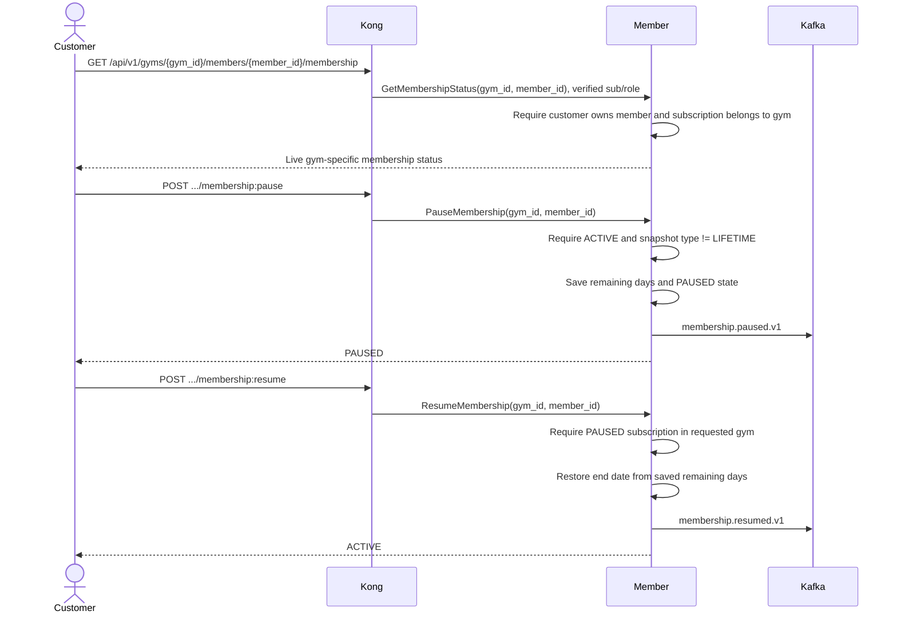
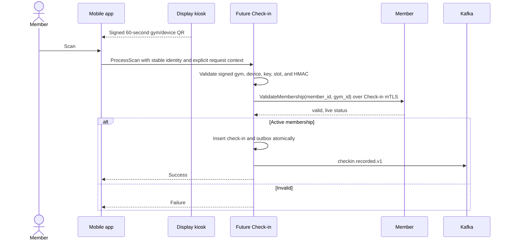
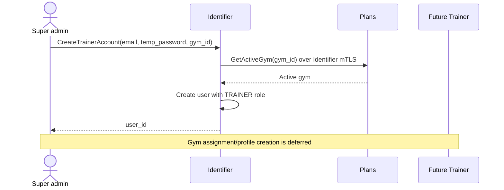

# Business Flows

> **Scope:** G8 evidence remains historical. Phase 9 Stage 0 replaces selected-gym JWTs with stable identity and explicit gym resource context before Kong/OpenAPI generation. Production Payment, Check-in, Workout, Trainer, Notification, Analytics, and Promotion remain deferred.

## 1. Stable Identity Authentication

```mermaid
sequenceDiagram
    actor U as User
    participant C as Client
    participant K as Kong
    participant ID as Identifier
    participant DB as identity_db

    U->>C: Enter credentials
    C->>K: POST /api/v1/auth/login
    K->>ID: Login
    ID->>DB: Load active user
    ID->>ID: Verify password
    ID->>DB: Store hashed rotating refresh token
    ID-->>C: Access token + refresh token
    Note over ID,C: JWT contains identity/role; no gym_id or membership_status
```

Registration, email verification, Google login, and refresh use the same stable access-token shape. `identity.user.registered.v1` remains gym-neutral. Member consumes it to create a profile shell with `NONE` aggregate status.

The client does not call Identifier when choosing a gym. `POST /api/v1/auth/gym`, selected-gym token issuance, and Identifier-to-Member `GetMembershipStatusByUserId` are removed in Phase 9 Stage 0.

## 2. Browse, Select Gym, and Purchase

```mermaid
sequenceDiagram
    actor C as Customer
    participant APP as Client
    participant K as Kong
    participant ID as Identifier
    participant PL as Plans
    participant MB as Member
    participant DB as member_db
    participant FP as G8 Fake Payment
    participant KF as Kafka

    rect rgb(230,245,255)
        C->>APP: Register and verify email
        APP->>K: POST /api/v1/auth/login
        K->>ID: Login
        ID-->>APP: Stable identity JWT
    end

    rect rgb(245,240,255)
        APP->>K: GET /api/v1/gyms
        K->>PL: ListGymLocations
        PL-->>APP: Authenticated gym catalog
        C->>APP: Select gym
        Note over C,APP: gym_id stays in URL/UI state
        APP->>K: GET /api/v1/gyms/{gym_id}/plans
        K->>PL: ListMembershipPlans(gym_id)
        PL-->>APP: Plans for selected gym
    end

    rect rgb(255,245,230)
        C->>APP: Choose plan and provider
        APP->>K: POST /api/v1/gyms/{gym_id}/memberships/purchase
        K->>MB: PurchaseMembership(gym_id, purchase body) with verified sub/role
        MB->>MB: Resolve member from sub; reject nonblank discount_code
        MB->>PL: ResolvePurchasablePlan(gym_id, plan_id) over mTLS
        PL-->>MB: Canonical active gym, plan, type, duration, price_vnd
        MB->>DB: Create/load PENDING purchase by (user_id, idempotency_key)
        Note over MB,DB: Commit before Payment; stable purchase_id
        MB->>FP: InitiatePayment(reference_id=purchase_id)
        FP-->>MB: payment_id, payment_url
        MB->>DB: Attach payment_id
        MB-->>APP: payment_id, payment_url
    end

    rect rgb(230,255,230)
        FP->>KF: payment.completed.v1 reference_id=purchase_id
        KF-->>MB: Completion event
        MB->>DB: Claim event + lock purchase in one transaction
        MB->>DB: Activate from frozen terms and mark completed
        MB->>KF: membership.activated.v1 via outbox
    end
```

Rules:

- Client-selected `gym_id` is intent, not authority.
- Client never supplies authoritative plan type, duration, price, or membership state.
- Plans proves the plan belongs to the selected active gym and is active.
- Member derives user identity from Kong-verified metadata and checks ownership.
- Required `idempotency_key` reuses one purchase and Payment reference.
- Optional `discount_code` remains in the contract; nonblank values fail until Promotion exists.
- Completion validates purchase, payment, user, gym, type, provider, amount, and state.
- Completion uses frozen terms and never rereads Plans.
- Public traffic is HTTPS/JSON through Kong; Kong uses mTLS gRPC to Member and Plans.

## 3. Membership Status, Pause, and Resume

Gym-specific lifecycle operations use explicit resource paths and Member-owned subscription state:



Lifecycle uses subscription snapshots and does not call Plans. JWT membership state is never consulted. Aggregate member status remains derived across subscriptions; gym-specific reads use the selected subscription.

## 4. Administrative Gym Scope

No authoritative `ADMIN`-to-gym assignment model exists. Request `gym_id` cannot replace that model.

During G9:

- Plans mutations are `SUPER_ADMIN`-only;
- Member gym-wide listing and administration are `SUPER_ADMIN`-only;
- Identifier trainer-account creation with gym context is `SUPER_ADMIN`-only;
- authenticated users may browse gyms and plans;
- customer membership operations remain self/ownership scoped.

A future staff-assignment boundary must define ownership, persistence, revocation, lookup, and tests before gym-scoped `ADMIN` access returns.

## 5. Deferred QR Check-in

Check-in remains deferred. Plans owns locations and Member owns membership decisions. Kiosk provisioning stays blocked until a Check-in-authorized Plans contract is frozen.



Check-in never trusts JWT `membership_status`, never calls Member for location data, and never treats request `gym_id` alone as authority.

## 6. Deferred Catalog Flows

These remain designs, not G9 implementation commitments:

- Workout logging and explicit Member membership validation
- Trainer search, availability, booking, payment, and approval
- Promotion publication and notification fan-out
- Membership expiry notifications
- Production Payment provider webhooks, refunds, and history
- Analytics projections and dashboards

## 7. Admin Creates Trainer Account

Only Identifier credential creation is active. Trainer profile and staff-to-gym assignment remain deferred.



Identifier retains Plans `GetActiveGym` for this validation, so Identifier-to-Plans is not removed with the selected-gym customer flow. The requested gym is not stored in the stable JWT or identity event.
