# Business Flows

Detailed sequence diagrams for all major business flows in the system.

---

## 1. User Authentication (Normal Login & Token Refresh)

### Normal Login Flow (Email/Password)

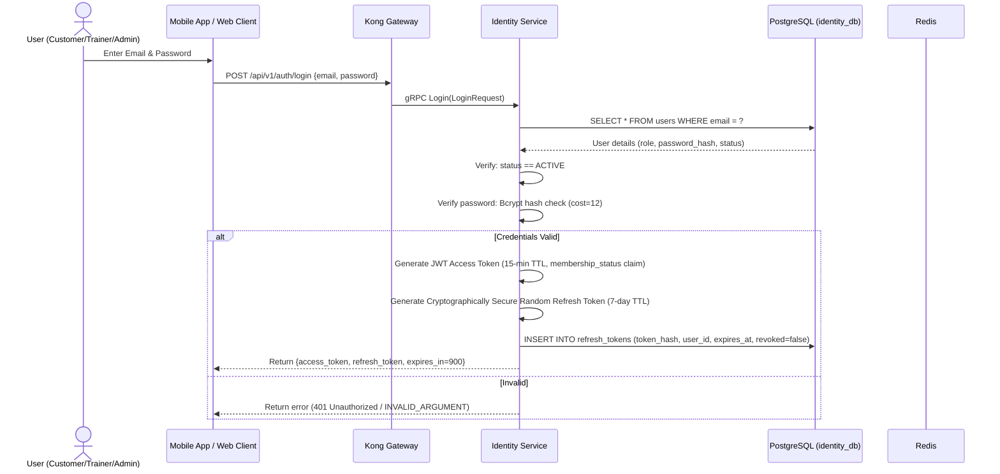

### Stateless JWT Verification & Stateful Blacklist Check

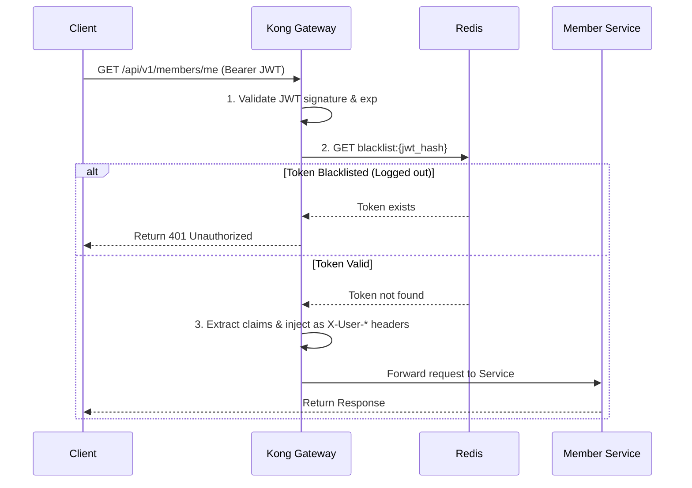

### Token Refresh Flow (with Sync Status Check)

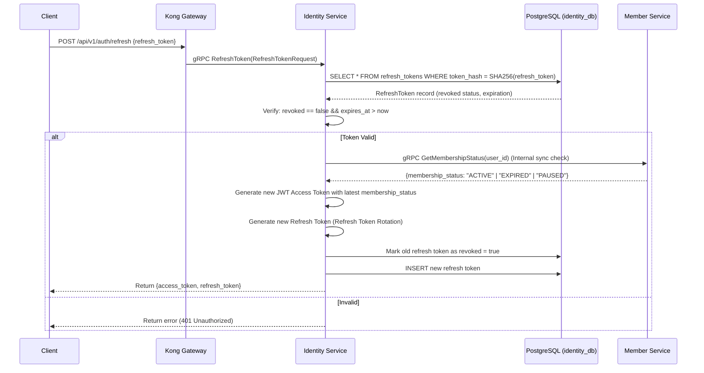

---

## 2. Customer Registration & Membership Purchase

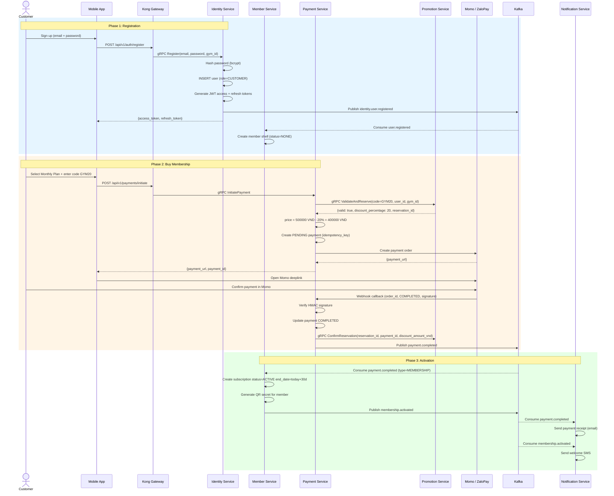

---

## 3. Google OAuth Registration

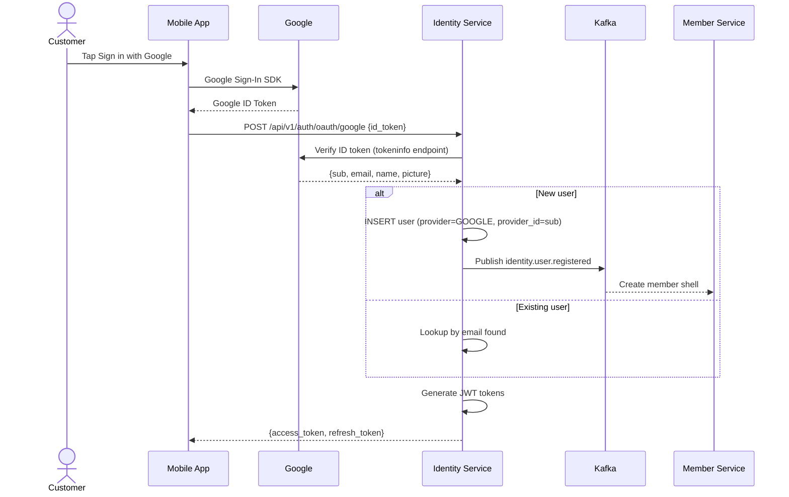

---

## 4. QR Check-in at Gym

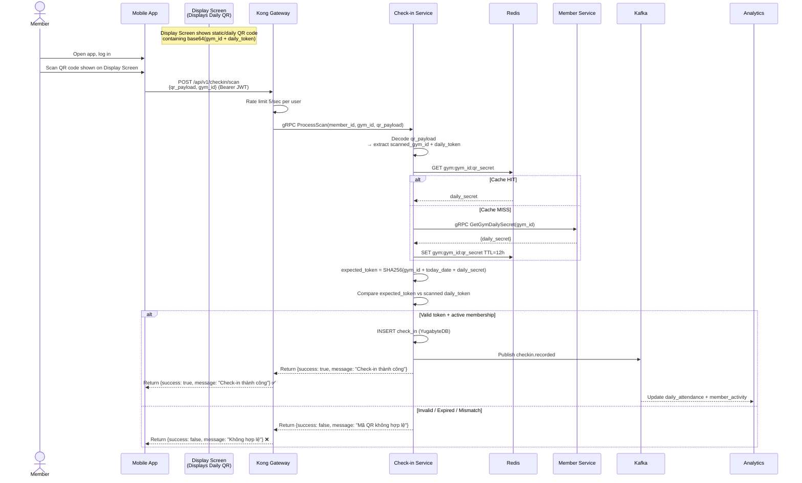

---

## 5. Workout Logging

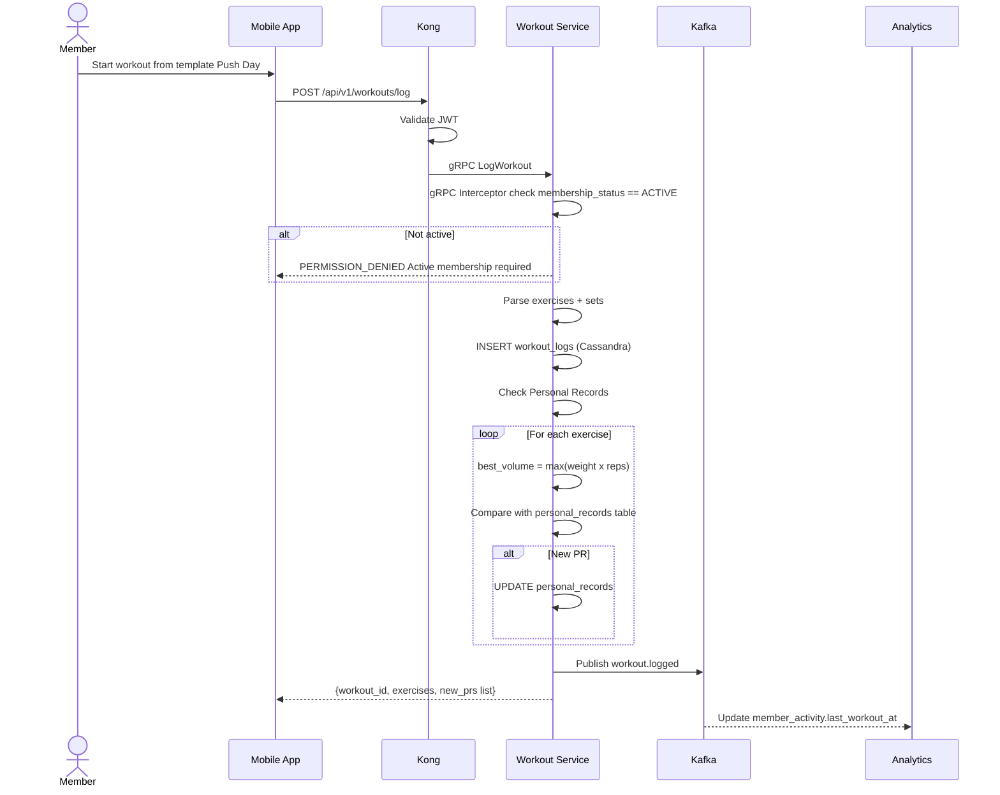

---

## 6. Trainer Booking Full Flow

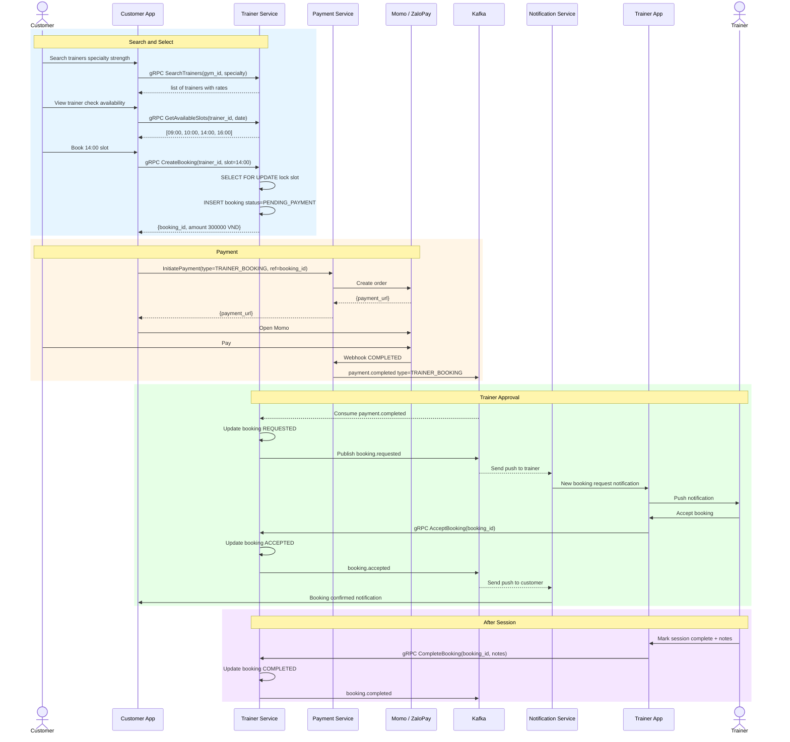

---

## 7. Membership Pause and Resume

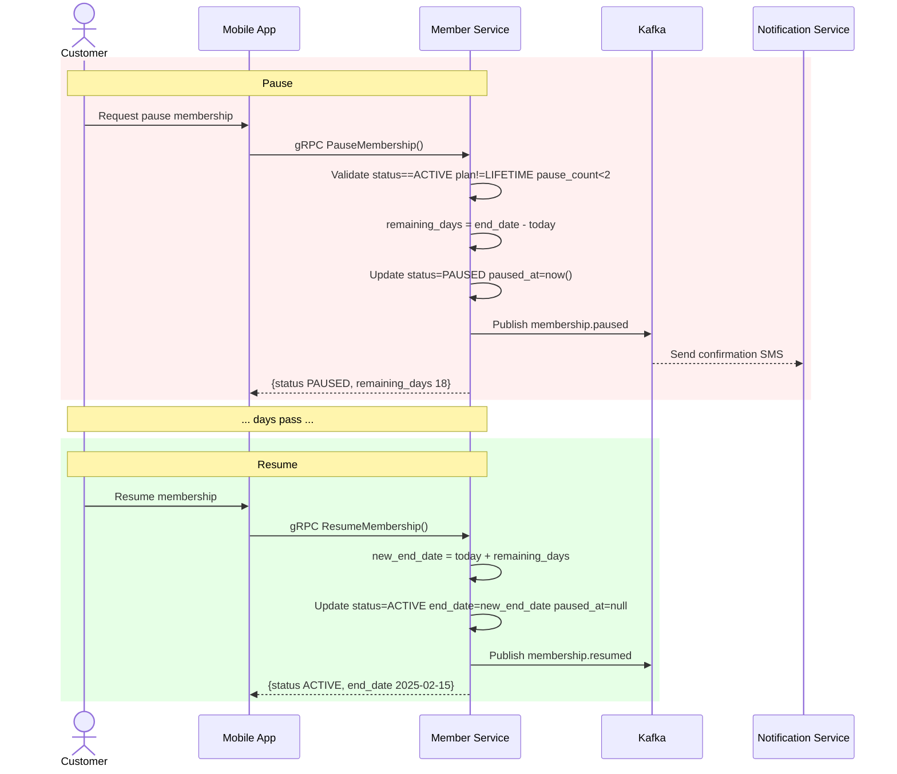

---

## 8. Promotion and Notification Fan-Out

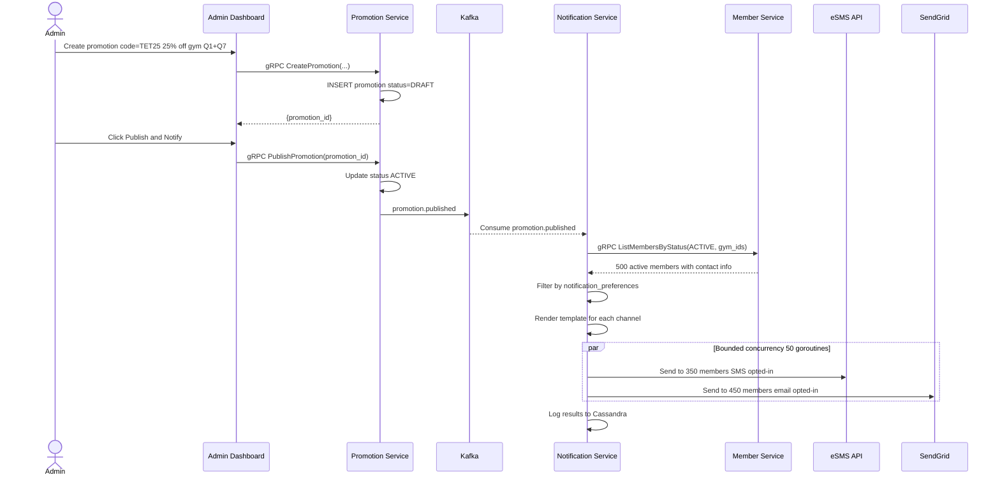

---

## 9. Membership Expiry Warning

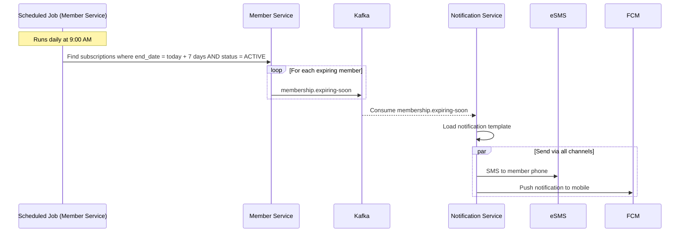

---

## 10. Admin Creates Trainer Account

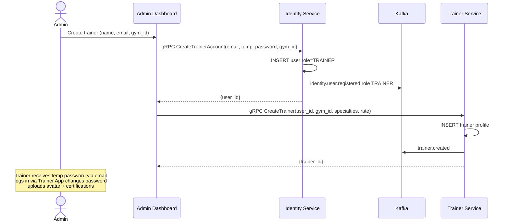

---

## 11. Spending and Coaching History

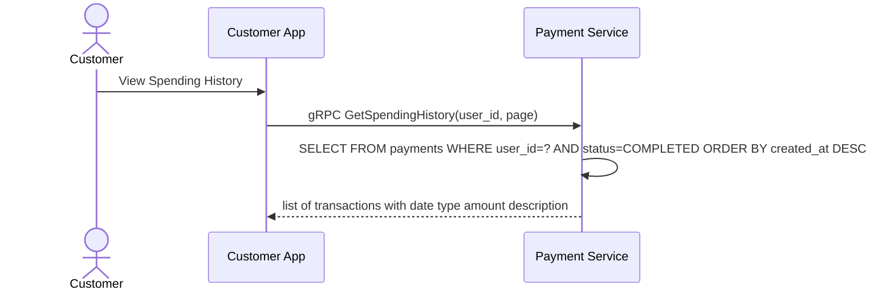

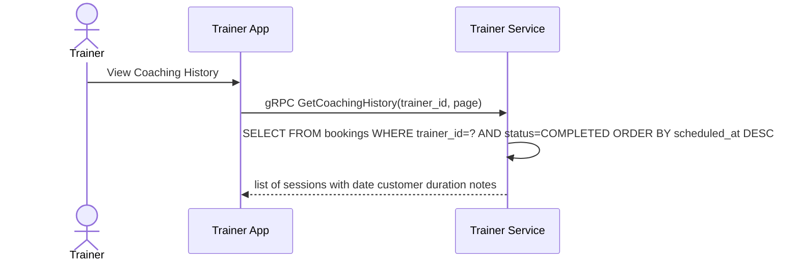
