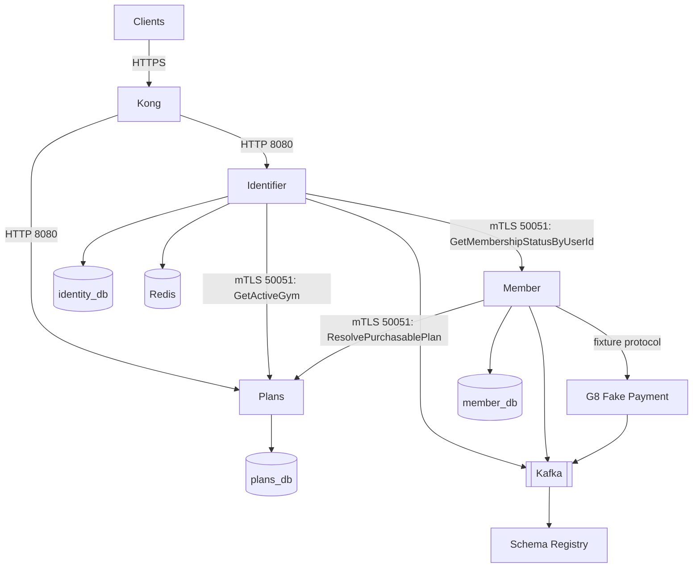

# Infrastructure Architecture

> **Roadmap status:** G8 additive topology implemented and proven by `gym-infra/kong/run-g8.sh` (`RUN_EXIT:0`). Evidence: `docs/evidence/foundation-first/g8/local-2026-08-09/`. G5 compose files and evidence remain historical pre-split artifacts.

## G8 Topology



G8 scope includes Identifier, Member, Plans, Kong, three isolated PostgreSQL databases, Redis, Kafka/Schema Registry for Identifier and Member contracts, and a fake Payment fixture. Payment fixture publishes test completion events only; it is not a production Payment deployment.

Plans V1 has no Kafka, Schema Registry, Redis, outbox, scheduler, or Payment dependency.

## Database Isolation

| Database | Owner | Target tables |
|---|---|---|
| `identity_db` | Identifier | users, refresh tokens, verification tokens |
| `member_db` | Member | members, subscriptions, pending purchases, outbox, processed events |
| `plans_db` | Plans | gym locations, membership plans |

Only Plans owns catalog tables. Member stores opaque `gym_id` and `plan_id` plus plan type, duration, and VND price snapshots. Identifier owns no Member or Plans table. No cross-service database FK or join is allowed.

Local G5 and G8 compose both use PostgreSQL database name `gym_member` for Member (ownership rules match target `member_db` naming in architecture docs). Catalog tables live only in `plans_db`.

## Kong Routes

External REST/JSON routes target service-local HTTP listeners on `8080`. Native workload gRPC on `50051` is not exposed by path routing.

```yaml
services:
  - name: ms-gym-identifier-http
    url: http://ms-gym-identifier.gym-system.svc.cluster.local:8080
    routes:
      - name: identifier-auth
        paths: ["/api/v1/auth"]

  - name: ms-gym-plans-http
    url: http://ms-gym-plans.gym-system.svc.cluster.local:8080
    routes:
      - name: plans-public
        paths: ["/api/v1/gyms", "/api/v1/plans"]
```

Plans management and read routes use the authentication/authorization matrix frozen in [Phase 6](../plans/foundation-first/06-plans-contracts.md). `GetActiveGym` and `ResolvePurchasablePlan` have no HTTP mapping and no Kong route.

Member must not be given an external route until a real service-local HTTP adapter exists (Spring MVC for Java services, matching Plans). G8 may prove Member purchase behavior over an internal/test path without routing HTTP to raw native gRPC.

Kong must strip client-provided copies of `x-user-id`, `x-user-role`, `x-gym-id`, `x-membership-status`, and tracing trust headers before injecting validated claims. Workload calls never forward those headers as credentials.

## Workload mTLS Matrix

| Caller certificate | Destination | Allowed method | Public HTTP |
|---|---|---|---|
| `ms-gym-identifier` | Plans | `GetActiveGym` | No |
| `ms-gym-identifier` | Member | `GetMembershipStatusByUserId` | No |
| `ms-gym-member` | Plans | `ResolvePurchasablePlan` | No |

Plans must reject swapped identities: Identifier cannot resolve purchasable plans and Member cannot call active-gym lookup. Missing, invalid, untrusted, or wrong-server certificates fail closed.

Workload identity proves the calling service. It is not an end-user `CUSTOMER`, `TRAINER`, `ADMIN`, or `SUPER_ADMIN` role.

## NetworkPolicy Targets

Member gRPC ingress permits Identifier for membership lookup. Future Check-in ingress is deferred and not needed by G8.

```yaml
apiVersion: networking.k8s.io/v1
kind: NetworkPolicy
metadata:
  name: ms-gym-member-grpc
  namespace: gym-system
spec:
  podSelector:
    matchLabels:
      app: ms-gym-member
  policyTypes: [Ingress]
  ingress:
    - from:
        - podSelector:
            matchLabels:
              app: ms-gym-identifier
      ports:
        - protocol: TCP
          port: 50051
```

Plans separates public HTTP ingress from native gRPC ingress:

```yaml
apiVersion: networking.k8s.io/v1
kind: NetworkPolicy
metadata:
  name: ms-gym-plans-ingress
  namespace: gym-system
spec:
  podSelector:
    matchLabels:
      app: ms-gym-plans
  policyTypes: [Ingress]
  ingress:
    - from:
        - podSelector:
            matchLabels:
              app: kong
      ports:
        - protocol: TCP
          port: 8080
    - from:
        - podSelector:
            matchLabels:
              app: ms-gym-identifier
        - podSelector:
            matchLabels:
              app: ms-gym-member
      ports:
        - protocol: TCP
          port: 50051
```

NetworkPolicy narrows network reachability; method authorization still comes from verified mTLS identity inside Plans.

No Check-in-to-Plans ingress is allowed. Plans V1 has no Check-in-authorized method. Future kiosk provisioning requires a later contract and policy update. Future Check-in-to-Member `ValidateMembership` is likewise deferred outside G8.

## Plans Deployment Target

```yaml
apiVersion: apps/v1
kind: Deployment
metadata:
  name: ms-gym-plans
  namespace: gym-system
spec:
  selector:
    matchLabels:
      app: ms-gym-plans
  template:
    metadata:
      labels:
        app: ms-gym-plans
    spec:
      containers:
        - name: plans
          image: ghcr.io/pploc/ms-gym-plans:${IMAGE_TAG}
          ports:
            - name: grpc
              containerPort: 50051
            - name: http
              containerPort: 8080
            - name: metrics
              containerPort: 9090
          env:
            - name: SPRING_DATASOURCE_URL
              value: jdbc:postgresql://postgres:5432/plans_db
            - name: GRPC_TLS_ENABLED
              value: "true"
```

Plans configuration deliberately contains no Kafka brokers, Schema Registry URL, Redis host, Payment target, or scheduler setting.

Identifier and Member require independent downstream configuration:

```text
Identifier:
  PLANS_GRPC_TARGET
  PLANS_GRPC_DEADLINE
  PLANS_GRPC_CA
  PLANS_GRPC_CERT
  PLANS_GRPC_KEY
  MEMBER_GRPC_TARGET
  MEMBER_GRPC_DEADLINE
  MEMBER_GRPC_CA
  MEMBER_GRPC_CERT
  MEMBER_GRPC_KEY

Member:
  PLANS_GRPC_TARGET
  PLANS_GRPC_DEADLINE
  PLANS_GRPC_CA
  PLANS_GRPC_CERT
  PLANS_GRPC_KEY
```

Secret values belong in Kubernetes Secrets or a secret manager, never committed environment files.

## G8 Compose and Evidence

G8 infrastructure is additive under `gym-infra`; it must not overwrite G5 fixtures. Planned components:

- clean PostgreSQL instances/databases for Identifier, Member, and Plans;
- Redis;
- Kafka and Schema Registry;
- Identifier, Member, and Plans;
- Kong;
- a minimal fake Payment fixture;
- separate Plans server, Identifier client, Member client, and negative-test certificates.

Gym locations and plans are created through Plans public API, not SQL inserted into Member. Evidence inspects all three databases to prove ownership and verifies that Plans starts without messaging/cache configuration.

## Deferred Check-in Infrastructure

Check-in route, deployment, QR-key KMS, Redis payload cache, and YugabyteDB remain future catalog infrastructure. No G8 topology should imply that Check-in calls Member for location data or that Check-in can call Plans. See the [deferred Check-in specification](../services/06-ms-gym-checkin.md).

## CI/CD Repository Model

Repositories run their own CI or reuse workflows from `gym-infra`:

- `gym-proto`: Buf format/lint/breaking, generation, route checks, artifact publication after approval;
- `ms-gym-identifier`: Go race tests and image build;
- `ms-gym-member`: Gradle checks and image build;
- `ms-gym-plans`: reuses `gym-infra` `java-ci` (`./gradlew build`) and `docker-build`; empty-DB Flyway, Helm values/render, and no-messaging static checks remain G7 closeout items;
- `gym-infra`: Compose/Kong validation and Helm rendering.

Deferred catalog services are not part of the G8 build matrix.

## Security Verification Targets

- Public Plans routes require the expected user/admin authorization.
- Internal Plans methods are absent from generated HTTP and Kong.
- Wrong or missing workload certificates are rejected.
- Identifier and Member certificates cannot exchange method privileges.
- Kong strips spoofed trusted headers.
- Member purchase fails closed when Plans is unavailable before initiation.
- Selected-gym issuance fails closed when Plans or Member is unavailable.
- No broad ingress permits arbitrary workloads to call Plans native gRPC.
