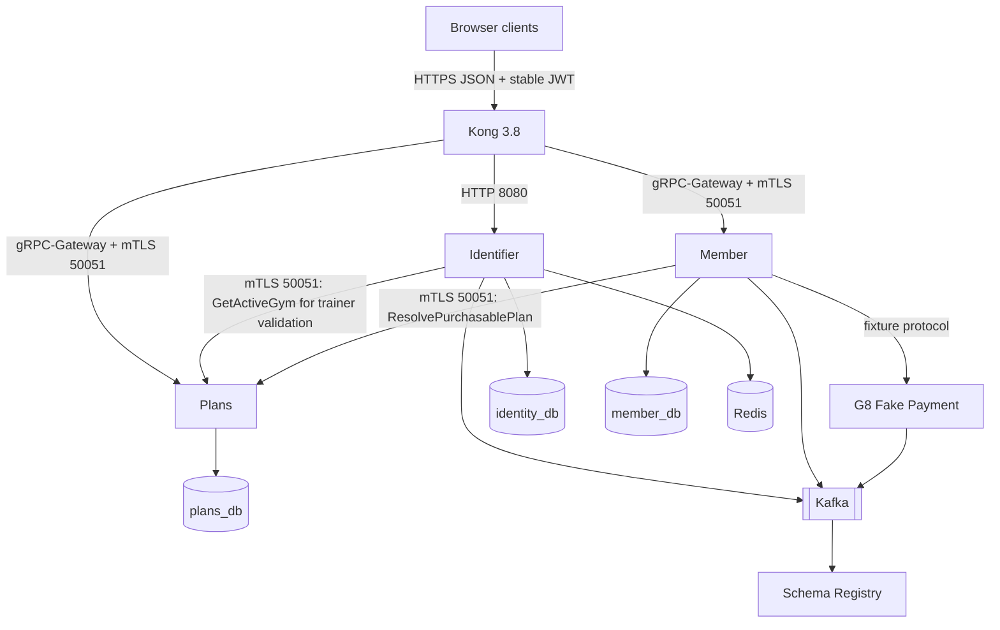

# Infrastructure Architecture

> **Roadmap status:** G8 topology and evidence remain historical. Phase 9 Stage 0 removes selected-gym JWT state and Identifier-to-Member customer lookup before Kong gRPC-Gateway/OpenAPI 3.0 cutover.

## Phase 9 Target Topology



There is no Identifier-to-Member runtime edge after Stage 0. Fake Payment remains test infrastructure, not production Payment.

## Database Isolation

| Database | Owner | Target tables |
|---|---|---|
| `identity_db` | Identifier | users, refresh tokens, verification tokens |
| `member_db` | Member | members, subscriptions, pending purchases, outbox, processed events |
| `plans_db` | Plans | gym locations, membership plans |

Only Plans owns catalog tables. Member stores opaque IDs and frozen purchased terms. Identifier stores no gym assignment. No cross-service DB FK or join is allowed.

## Kong Routes

Identifier retains its existing HTTP gateway on `8080`. Member and Plans public unary APIs use Kong's bundled `grpc-gateway` plugin against `grpcs` upstreams.

```yaml
services:
  - name: ms-gym-identifier-http
    url: http://ms-gym-identifier.gym-system.svc.cluster.local:8080
    routes:
      # Generate exact method + regex entries for the 12 Identity operations.
      # Never proxy the broad /api/v1/auth or /api/v1 paths.
      - name: identifier-register
        methods: [POST]
        paths: ["~/api/v1/auth/register$"]

  - name: ms-gym-member-grpc-json
    protocol: grpcs
    host: ms-gym-member.gym-system.svc.cluster.local
    port: 50051
    client_certificate:
      id: ${KONG_CLIENT_CERTIFICATE_ID}
    tls_verify: true
    ca_certificates: [${UPSTREAM_CA_ID}]
    routes:
      - name: member-public-json
        protocols: [https]
        # Generated exact method + regex allowlist for seven Member operations.
        # Never claim the broad /api/v1/gyms prefix.
        plugins:
          - name: grpc-gateway
            config:
              proto: /usr/local/kong/proto/member/v1/member.proto

  - name: ms-gym-plans-grpc-json
    protocol: grpcs
    host: ms-gym-plans.gym-system.svc.cluster.local
    port: 50051
    client_certificate:
      id: ${KONG_CLIENT_CERTIFICATE_ID}
    tls_verify: true
    ca_certificates: [${UPSTREAM_CA_ID}]
    routes:
      - name: plans-public-json
        protocols: [https]
        # Generated exact method + regex allowlist for eight Plans operations.
        # Member membership paths below /api/v1/gyms must never match.
        plugins:
          - name: grpc-gateway
            config:
              proto: /usr/local/kong/proto/plans/v1/plans.proto
```

Generate exact method-plus-regex entries for all 12 Identity, seven Member, and eight Plans operations from the frozen contract. Broad `/api/v1/auth`, `/api/v1`, and `/api/v1/gyms` prefix routes are forbidden. Member and Plans share `/api/v1/gyms`, so membership and catalog paths must select only their owning backend. Unknown paths, wrong methods, and cross-backend matches return route-level `404`. Public proxy routes are HTTPS-only; any port-80 route redirects and never proxies Bearer traffic. Internal RPCs and reflection have no Kong route.

Kong 3.8 reads annotated `.proto` source from local filesystem. It does not consume external HTTP YAML, descriptor sets, reflection, Swagger, or OpenAPI. Mount the released runtime Protobuf bundle read-only.

## Stable JWT and Trusted Metadata

Identifier JWT contains token-control fields plus `sub` and `role`; no `gym_id` or `membership_status`.

Kong must:

1. validate signature, issuer, audience, time, JTI, key ID, and revocation;
2. strip client copies of trusted headers on every route;
3. inject only verified user identity and role metadata;
4. stop requiring or injecting `x-gym-id` and `x-membership-status`;
5. let HTTP path binding populate Protobuf `gym_id`.

Member and Plans accept public metadata only when peer certificate SAN is Kong. A caller-selected path gym is request context, not a trusted claim or authorization proof.

## Workload mTLS Matrix

| Caller certificate | Destination | Allowed method | Public HTTP/OpenAPI |
|---|---|---|---|
| `ms-gym-identifier` | Plans | `GetActiveGym` | No |
| `ms-gym-member` | Plans | `ResolvePurchasablePlan` | No |
| `ms-gym-checkin` | Member | `ValidateMembership` | No; deferred caller |
| `ms-gym-notification` | Member | `ListMembersByStatus` | No; deferred caller |
| `kong` | Member | declared public methods only | Yes |
| `kong` | Plans | declared public methods only | Yes |

`GetMembershipStatusByUserId` and Identifier-to-Member mTLS are removed in Stage 0. Workload identity proves calling service, never an end-user role.

## NetworkPolicy Targets

Policies must separate peers by destination port. Do not union all callers into one broad rule.

Member `50051` permits Kong and exact deferred workload callers. Identifier is absent:

```yaml
spec:
  podSelector:
    matchLabels:
      app: ms-gym-member
  policyTypes: [Ingress]
  ingress:
    - from:
        - podSelector:
            matchLabels:
              app: kong
      ports:
        - protocol: TCP
          port: 50051
    - from:
        - podSelector:
            matchLabels:
              app: ms-gym-checkin
        - podSelector:
            matchLabels:
              app: ms-gym-notification
      ports:
        - protocol: TCP
          port: 50051
```

Plans `50051` permits Kong, Identifier, and Member. Kong has no business access to `8080`:

```yaml
spec:
  podSelector:
    matchLabels:
      app: ms-gym-plans
  policyTypes: [Ingress]
  ingress:
    - from:
        - podSelector:
            matchLabels:
              app: kong
        - podSelector:
            matchLabels:
              app: ms-gym-identifier
        - podSelector:
            matchLabels:
              app: ms-gym-member
      ports:
        - protocol: TCP
          port: 50051
    - from:
        - podSelector:
            matchLabels:
              access: health-observer
      ports:
        - protocol: TCP
          port: 8080
        - protocol: TCP
          port: 9090
```

Method authorization remains exact SAN enforcement inside each gRPC server. NetworkPolicy alone is insufficient.

## Service Configuration

Identifier retains only Plans downstream settings:

```text
Identifier:
  PLANS_GRPC_TARGET
  PLANS_GRPC_DEADLINE
  PLANS_GRPC_CA
  PLANS_GRPC_CERT
  PLANS_GRPC_KEY

Member:
  PLANS_GRPC_TARGET
  PLANS_GRPC_DEADLINE
  PLANS_GRPC_CA
  PLANS_GRPC_CERT
  PLANS_GRPC_KEY
```

Remove Identifier `MEMBER_GRPC_*` settings, Member-client certificate permission, and dependency ordering after Stage 0. Retain Identifier client certificate because it still calls Plans.

Secrets and production private keys belong in Kubernetes Secrets or secret manager, never committed configuration.

## Plans Deployment

Plans keeps:

- `50051` for business gRPC;
- `8080` for Actuator health/readiness only;
- `9090` for metrics if configured;
- no Kafka, Schema Registry, Redis, Payment, or scheduler settings.

Required negative proof:

```text
Direct Plans :8080/api/v1/gyms returns 404.
Kong HTTPS /api/v1/gyms reaches Plans gRPC :50051.
Actuator health on :8080 remains available to approved observers.
```

## Generated Contract Deployment

Version-lock:

```text
Kong image and declarative config
Kong runtime proto bundle + SHA-256
Member and Plans gym-proto artifact versions
Canonical OpenAPI 3.0 + SHA-256
```

`gym-proto` generates canonical OpenAPI 3.0 directly from annotated Protobuf with `protoc-gen-openapiv3` pinned to a reviewed tag and commit. Its exact operation allowlist contains 12 Identity, seven Member, and eight Plans browser operations; deferred and workload RPCs remain absent. Frontend consumes released OpenAPI 3.0. Kong consumes only released Protobuf source bundle for Member/Plans transcoding; Identifier remains a native HTTP upstream.

Reject deployment when contract generations differ.

## G9 Evidence

Create new G9 fixtures and evidence instead of rewriting G8 proof. Record:

- repository SHAs and artifact versions;
- stable JWT claim fixture;
- removed `/api/v1/auth/gym` and dead-RPC proof;
- route and OpenAPI operation matrices;
- Kong client certificate subject/SAN and upstream verification;
- positive and negative SAN/method tests;
- port-specific rendered NetworkPolicies;
- real HTTPS/JSON purchase flow through Kong;
- direct Plans `8080 /api/**` negative and Actuator positive checks;
- error status/header/body compatibility including browser-visible `x-error-code`.

## Deferred Check-in Infrastructure

Check-in remains catalog-only. Future scan processing uses stable end-user identity and exact Check-in SAN to Member `ValidateMembership(member_id, gym_id)`. Kiosk provisioning still requires a separately frozen Check-in-to-Plans contract. No selected-gym JWT or JWT membership state is used.

## CI/CD Repository Model

- `gym-proto`: Buf checks, direct OpenAPI 3.0 generation, route checks, and artifact publication;
- `ms-gym-identifier`: Go race tests and image build;
- `ms-gym-member`: Gradle checks and image build;
- `ms-gym-plans`: Gradle checks, Flyway, Specification tests, image and Helm checks;
- `gym-infra`: Kong/Compose validation and Helm rendering.

Java service docs retain `./gradlew startEnv` and `./gradlew stopEnv` for local dependencies.
