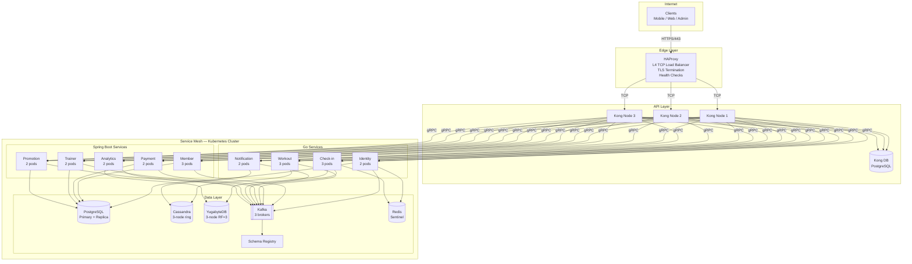

# Infrastructure Architecture

## Network Topology



## HAProxy → Kong — Why This Order

```
HAProxy (L4 — outermost):
  ├── TLS termination (offloads SSL from Kong)
  ├── TCP-level load balancing across Kong nodes
  ├── Health checks on Kong instances
  ├── Connection draining during Kong upgrades
  └── DDoS mitigation (connection limits, SYN flood protection)

Kong (L7 — behind HAProxy):
  ├── HTTP/gRPC routing to backend services
  ├── JWT validation (signature + expiry)
  ├── Rate limiting (per-consumer, per-route)
  ├── Request/response transformation
  ├── Logging and metrics
  └── Plugin ecosystem (CORS, IP restriction, etc.)
```

**HAProxy does NOT understand HTTP semantics** — it distributes raw TCP connections.  
**Kong does NOT handle TLS termination efficiently at scale** — HAProxy is purpose-built for it.  
Together: HAProxy handles connection-level concerns, Kong handles application-level concerns.

---

## HAProxy Configuration

```
# /etc/haproxy/haproxy.cfg

global
    maxconn 50000
    ssl-default-bind-options ssl-min-ver TLSv1.2

defaults
    mode tcp
    timeout connect 5s
    timeout client  30s
    timeout server  30s
    option  tcplog
    retries 3

frontend ft_ssl
    bind *:443 ssl crt /etc/ssl/certs/gym-chain.pem
    default_backend bk_kong

backend bk_kong
    balance roundrobin
    option httpchk GET /status
    server kong1 kong-1:8000 check inter 5s fall 3 rise 2
    server kong2 kong-2:8000 check inter 5s fall 3 rise 2
    server kong3 kong-3:8000 check inter 5s fall 3 rise 2

frontend ft_stats
    bind *:8404
    mode http
    stats enable
    stats uri /stats
    stats refresh 10s
```

---

## Kong Gateway Configuration

### Rate Limiting

```yaml
# Global default
plugins:
  - name: rate-limiting
    config:
      minute: 60
      hour: 2000
      policy: redis
      redis_host: redis.default.svc.cluster.local
      redis_port: 6379
      fault_tolerant: true        # if Redis down, allow requests through
      hide_client_headers: false   # X-RateLimit-* headers visible to client

# Per-route overrides
routes:
  # QR check-in — tight limit per device
  - name: checkin-validate
    paths: ["/api/v1/checkin/validate"]
    plugins:
      - name: rate-limiting
        config:
          second: 5
          minute: 100

  # Auth endpoints — prevent brute force
  - name: auth-login
    paths: ["/api/v1/auth/login"]
    plugins:
      - name: rate-limiting
        config:
          minute: 10
          hour: 50

  # Payment webhooks — higher limit for provider callbacks
  - name: payment-webhooks
    paths: ["/api/v1/payments/webhook"]
    plugins:
      - name: rate-limiting
        config:
          minute: 200
      - name: ip-restriction
        config:
          allow:
            - "113.160.0.0/16"    # Momo IP range (verify from Momo Partner portal docs)
            - "103.200.0.0/16"    # ZaloPay IP range (verify from ZaloPay merchant integration docs)
            - "118.69.0.0/16"     # VNPay IP range (verify from VNPay sandbox/production guides)
            # IP ranges MUST be verified annually from payment providers' merchant portals and updated via CI/CD GitOps.
```

### JWT Plugin

```yaml
plugins:
  - name: jwt
    config:
      key_claim_name: kid
      claims_to_verify:
        - exp
      run_on_preflight: true

# Public routes — no JWT required
routes:
  - name: auth-register
    paths: ["/api/v1/auth/register", "/api/v1/auth/login", "/api/v1/auth/refresh"]
    plugins:
      - name: jwt
        enabled: false

  - name: payment-webhooks
    paths: ["/api/v1/payments/webhook/*"]
    plugins:
      - name: jwt
        enabled: false
```

### Service Routes

```yaml
services:
  - name: ms-gym-identifier
    url: grpc://ms-gym-identifier.default.svc.cluster.local:50051
    routes:
      - paths: ["/api/v1/auth"]

  - name: ms-gym-member
    url: grpc://ms-gym-member.default.svc.cluster.local:50051
    routes:
      - paths: ["/api/v1/members", "/api/v1/memberships", "/api/v1/qr"]

  - name: ms-gym-payment-grpc
    url: grpc://ms-gym-payment.default.svc.cluster.local:50051
    routes:
      - paths: ["/api/v1/payments"]

  - name: ms-gym-payment-rest  # webhooks go directly to the HTTP Spring MVC port
    url: http://ms-gym-payment.default.svc.cluster.local:8080
    routes:
      - paths: ["/api/v1/payments/webhook"]
        strip_path: false
        plugins:
          - name: jwt
            enabled: false

  - name: ms-gym-checkin
    url: grpc://ms-gym-checkin.default.svc.cluster.local:50051
    routes:
      - paths: ["/api/v1/checkin"]
        plugins:
          - name: jwt
            enabled: false  # Door devices authenticate via HMAC/Signature headers in ProcessScan, not member JWTs

  - name: ms-gym-workout
    url: grpc://ms-gym-workout.default.svc.cluster.local:50051
    routes:
      - paths: ["/api/v1/workouts", "/api/v1/templates"]

  - name: ms-gym-trainer
    url: grpc://ms-gym-trainer.default.svc.cluster.local:50051
    routes:
      - paths: ["/api/v1/trainers", "/api/v1/bookings"]

  - name: ms-gym-checkin
    url: grpc://ms-gym-checkin.default.svc.cluster.local:50051
    routes:
      - paths: ["/api/v1/checkin"]

  - name: ms-gym-notification
    url: grpc://ms-gym-notification.default.svc.cluster.local:50051
    routes:
      - paths: ["/api/v1/notifications"]

  - name: ms-gym-analytics
    url: grpc://ms-gym-analytics.default.svc.cluster.local:50051
    routes:
      - paths: ["/api/v1/analytics"]

  - name: ms-gym-promotion
    url: grpc://ms-gym-promotion.default.svc.cluster.local:50051
    routes:
      - paths: ["/api/v1/promotions", "/api/v1/coupons"]
```

---

## Service Mesh & Internal Network Security

To ensure external clients cannot invoke internal-only gRPC endpoints (e.g. `ValidateMembership`, `GetQRSecret`, `ValidateAndReserve`):

1. **Kong Route Exclusions:**
   Kong only exposes endpoints explicitly mapped under `paths`. Package-level or method-level gRPC names (like `/member.v1.MemberService/GetQRSecret`) are not declared in Kong routes and will return a `404 Not Found` if targeted from the outside.

2. **Kubernetes Network Policies:**
   Direct pod-to-pod network policies block access from outside the cluster, and only allow gRPC ingress on port 50051 from the Kong Gateway pods or other specific service pods.

```yaml
# Direct sample network policy in ms-gym-member
apiVersion: networking.k8s.io/v1
kind: NetworkPolicy
metadata:
  name: ms-gym-member-network-policy
  namespace: gym-system
spec:
  podSelector:
    matchLabels:
      app: ms-gym-member
  ingress:
    # Allow gRPC from Kong Gateway
    - from:
        - podSelector:
            matchLabels:
              app: kong-gateway
      ports:
        - protocol: TCP
          port: 50051
    # Allow internal gRPC from ms-gym-checkin and ms-gym-payment
    - from:
        - podSelector:
            matchLabels:
              app: ms-gym-checkin
        - podSelector:
            matchLabels:
              app: ms-gym-payment
      ports:
        - protocol: TCP
          port: 50051
```

---

## Kubernetes Manifests (Representative)

### Namespace

```yaml
apiVersion: v1
kind: Namespace
metadata:
  name: gym-system
```

### Go Service Deployment (Check-in — latency-critical)

```yaml
apiVersion: apps/v1
kind: Deployment
metadata:
  name: ms-gym-checkin
  namespace: gym-system
spec:
  replicas: 3
  selector:
    matchLabels:
      app: ms-gym-checkin
  template:
    metadata:
      labels:
        app: ms-gym-checkin
        stack: go
    spec:
      containers:
        - name: checkin
          image: ghcr.io/gym-chain/ms-gym-checkin:latest
          ports:
            - containerPort: 50051   # gRPC
              name: grpc
            - containerPort: 8080    # gRPC-Gateway (REST)
              name: http
            - containerPort: 9090    # Prometheus metrics
              name: metrics
          env:
            - name: YUGABYTE_HOST
              valueFrom:
                secretKeyRef:
                  name: yugabyte-credentials
                  key: host
            - name: REDIS_HOST
              value: redis.gym-system.svc.cluster.local
            - name: KAFKA_BROKERS
              value: kafka-0.kafka.gym-system.svc.cluster.local:9092
          resources:
            requests:
              cpu: 100m
              memory: 128Mi
            limits:
              cpu: 500m
              memory: 256Mi
          livenessProbe:
            grpc:
              port: 50051
            initialDelaySeconds: 5
            periodSeconds: 10
          readinessProbe:
            grpc:
              port: 50051
            initialDelaySeconds: 3
            periodSeconds: 5
---
apiVersion: v1
kind: Service
metadata:
  name: ms-gym-checkin
  namespace: gym-system
spec:
  selector:
    app: ms-gym-checkin
  ports:
    - name: grpc
      port: 50051
      targetPort: 50051
    - name: http
      port: 8080
      targetPort: 8080
  type: ClusterIP
```

### Spring Boot Deployment (Member Service — heavier)

```yaml
apiVersion: apps/v1
kind: Deployment
metadata:
  name: ms-gym-member
  namespace: gym-system
spec:
  replicas: 3
  selector:
    matchLabels:
      app: ms-gym-member
  template:
    metadata:
      labels:
        app: ms-gym-member
        stack: spring-boot
    spec:
      containers:
        - name: member
          image: ghcr.io/gym-chain/ms-gym-member:latest
          ports:
            - containerPort: 50051
              name: grpc
            - containerPort: 8080
              name: http
            - containerPort: 9090
              name: metrics
          env:
            - name: SPRING_DATASOURCE_URL
              value: jdbc:postgresql://postgres.gym-system.svc.cluster.local:5432/member_db
            - name: SPRING_KAFKA_BOOTSTRAP_SERVERS
              value: kafka-0.kafka.gym-system.svc.cluster.local:9092
            - name: JAVA_OPTS
              value: "-Xms256m -Xmx512m -XX:+UseG1GC"
          resources:
            requests:
              cpu: 250m
              memory: 512Mi
            limits:
              cpu: 1000m
              memory: 1Gi
          livenessProbe:
            grpc:
              port: 50051
            initialDelaySeconds: 30    # Spring Boot needs longer startup
            periodSeconds: 10
          readinessProbe:
            grpc:
              port: 50051
            initialDelaySeconds: 20
            periodSeconds: 5
```

### HorizontalPodAutoscaler

```yaml
apiVersion: autoscaling/v2
kind: HorizontalPodAutoscaler
metadata:
  name: ms-gym-checkin-hpa
  namespace: gym-system
spec:
  scaleTargetRef:
    apiVersion: apps/v1
    kind: Deployment
    name: ms-gym-checkin
  minReplicas: 3
  maxReplicas: 10
  metrics:
    - type: Resource
      resource:
        name: cpu
        target:
          type: Utilization
          averageUtilization: 70
    - type: Resource
      resource:
        name: memory
        target:
          type: Utilization
          averageUtilization: 80
```

---

## CI/CD — GitHub Actions

```yaml
# .github/workflows/service-ci.yml
name: Service CI/CD

on:
  push:
    branches: [main, develop]
    paths:
      - 'services/**'
      - 'gym-proto/**'
  pull_request:
    branches: [main]

jobs:
  detect-changes:
    runs-on: ubuntu-latest
    outputs:
      matrix: ${{ steps.set-matrix.outputs.matrix }}
    steps:
      - uses: actions/checkout@v4
        with:
          fetch-depth: 0

      - id: set-matrix
        run: |
          SERVICES=()
          for dir in services/*/; do
            svc=$(basename "$dir")
            if git diff --name-only HEAD~1 HEAD | grep -q "services/$svc/\|gym-proto/"; then
              SERVICES+=("$svc")
            fi
          done
          echo "matrix=$(jq -cn --args '$ARGS.positional' -- "${SERVICES[@]}")" >> $GITHUB_OUTPUT

  proto-lint:
    runs-on: ubuntu-latest
    steps:
      - uses: actions/checkout@v4
      - uses: bufbuild/buf-setup-action@v1
      - run: buf lint
      - run: buf breaking --against 'https://github.com/pploc/gym-proto.git#branch=develop'

  build-test:
    needs: [detect-changes, proto-lint]
    if: needs.detect-changes.outputs.matrix != '[]'
    strategy:
      matrix:
        service: ${{ fromJson(needs.detect-changes.outputs.matrix) }}
      fail-fast: false
    runs-on: ubuntu-latest

    services:
      postgres:
        image: postgres:16
        env:
          POSTGRES_PASSWORD: test
        ports: ["5432:5432"]
      redis:
        image: redis:7
        ports: ["6379:6379"]

    steps:
      - uses: actions/checkout@v4

      - name: Generate proto code
        uses: bufbuild/buf-setup-action@v1
      - run: buf generate

      # --- Go Services ---
      - name: Setup Go
        if: contains(fromJson('["ms-gym-identifier","ms-gym-workout","ms-gym-checkin","ms-gym-notification"]'), matrix.service)
        uses: actions/setup-go@v5
        with:
          go-version: '1.22'

      - name: Test Go
        if: contains(fromJson('["ms-gym-identifier","ms-gym-workout","ms-gym-checkin","ms-gym-notification"]'), matrix.service)
        run: |
          cd services/${{ matrix.service }}
          go test -race -coverprofile=coverage.out ./...
          go build -o bin/server ./cmd/server

      # --- Java Services ---
      - name: Setup Java
        if: contains(fromJson('["ms-gym-member","ms-gym-payment","ms-gym-trainer","ms-gym-analytics","ms-gym-promotion"]'), matrix.service)
        uses: actions/setup-java@v4
        with:
          distribution: 'temurin'
          java-version: '26'

      - name: Test Java
        if: contains(fromJson('["ms-gym-member","ms-gym-payment","ms-gym-trainer","ms-gym-analytics","ms-gym-promotion"]'), matrix.service)
        run: |
          cd services/${{ matrix.service }}
          ./gradlew test -Dspring.profiles.active=test

      # --- Docker Build & Push ---
      - name: Login to GHCR
        uses: docker/login-action@v3
        with:
          registry: ghcr.io
          username: ${{ github.actor }}
          password: ${{ secrets.GITHUB_TOKEN }}

      - name: Build and Push
        uses: docker/build-push-action@v5
        with:
          context: services/${{ matrix.service }}
          push: ${{ github.ref == 'refs/heads/main' || github.ref == 'refs/heads/develop' }}
          tags: |
            ghcr.io/gym-chain/${{ matrix.service }}:${{ github.sha }}
            ghcr.io/gym-chain/${{ matrix.service }}:latest

  deploy-staging:
    needs: build-test
    if: github.ref == 'refs/heads/develop'
    runs-on: ubuntu-latest
    environment: staging
    steps:
      - uses: actions/checkout@v4
      - name: Deploy to staging K8s
        run: |
          SERVICES=$(echo '${{ needs.detect-changes.outputs.matrix }}' | jq -r '.[]')
          for svc in $SERVICES; do
            kubectl set image deployment/$svc \
              $svc=ghcr.io/gym-chain/$svc:${{ github.sha }} \
              -n gym-system-staging
          done

  deploy-production:
    needs: build-test
    if: github.ref == 'refs/heads/main'
    runs-on: ubuntu-latest
    environment: production
    steps:
      - uses: actions/checkout@v4
      - name: Deploy to production K8s
        run: |
          SERVICES=$(echo '${{ needs.detect-changes.outputs.matrix }}' | jq -r '.[]')
          for svc in $SERVICES; do
            kubectl set image deployment/$svc \
              $svc=ghcr.io/gym-chain/$svc:${{ github.sha }} \
              -n gym-system
            kubectl rollout status deployment/$svc -n gym-system --timeout=300s
          done
```

---

## Monitoring Stack (Recommended)

```
Prometheus   → scrapes /metrics from all services (port 9090)
Grafana      → dashboards for service health, latency, error rates
Jaeger       → distributed tracing (gRPC interceptors propagate trace IDs)
ELK/Loki     → centralized log aggregation
AlertManager → alerts on SLA breaches (p99 latency, error rate, pod restarts)
```
