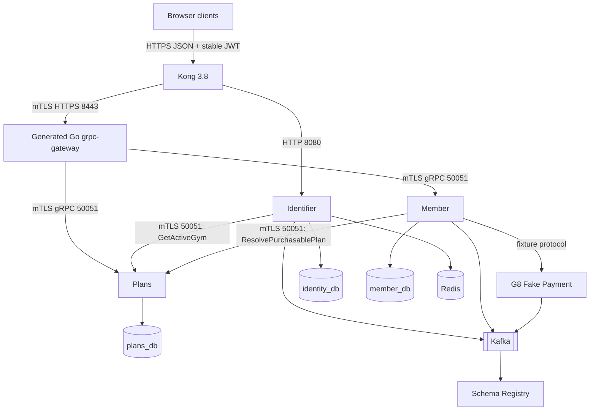

# Infrastructure Architecture

> **Roadmap status:** G8 topology and evidence remain historical. Phase 9 is in progress. Generated Go `grpc-gateway` is selected after Kong 3.8 source-Protobuf parsing failed; completion requires immutable v6.0.1 artifacts, locked clean-source G9, protected CI, sanitized evidence, and clean committed trees.

## Phase 9 topology



Kong is only browser endpoint. It validates stable JWTs, removes client-supplied trusted headers, injects verified identity/role metadata, applies CORS, and selects exact routes. Generated gateway accepts trusted metadata only from Kong SAN, strips arbitrary inbound metadata, and performs generated HTTPS/JSON-to-gRPC binding.

Kong cannot directly reach Member or Plans `50051`. Gateway cannot call workload-only RPCs. There is no Identifier-to-Member runtime edge. Fake Payment remains test infrastructure, not production Payment.

## Database isolation

| Database | Owner | Target tables |
|---|---|---|
| `identity_db` | Identifier | users, refresh tokens, verification tokens |
| `member_db` | Member | members, subscriptions, pending purchases, outbox, processed events |
| `plans_db` | Plans | gym locations, membership plans |

Only Plans owns catalog tables. Member stores opaque IDs and frozen purchased terms. Identifier stores no gym assignment. No cross-service DB FK or join is allowed.

## Kong routes

Identifier remains Kong's native HTTP upstream on `8080`. Member and Plans public unary APIs route to generated gateway over mTLS `8443`.

```yaml
services:
  - name: ms-gym-identifier-http
    url: http://ms-gym-identifier.gym-system.svc.cluster.local:8080
    routes:
      # Generate exact method + regex entries for 12 Identity operations.
      # Never proxy broad /api/v1/auth or /api/v1 paths.
      - name: identifier-register
        methods: [POST]
        paths: ["~/api/v1/auth/register$"]

  - name: ms-gym-api-gateway
    protocol: https
    host: ms-gym-api-gateway.gym-system.svc.cluster.local
    port: 8443
    client_certificate:
      id: ${KONG_CLIENT_CERTIFICATE_ID}
    tls_verify: true
    ca_certificates: [${GATEWAY_CA_ID}]
    routes:
      - name: member-and-plans-public-json
        protocols: [https]
        # Generated exact method + regex allowlist for seven Member and eight Plans operations.
        # Kong does not run grpc-gateway and does not mount Protobuf source.
```

Generate exact method-plus-regex entries for all 12 Identity, seven Member, and eight Plans operations from frozen contract. Broad `/api/v1/auth`, `/api/v1`, and `/api/v1/gyms` prefix routes are forbidden. Member and Plans share `/api/v1/gyms`; membership and catalog paths must select only owning backend. Unknown paths, wrong methods, and cross-backend matches return route-level `404`. Public proxy routes are HTTPS-only; any port-80 route redirects and never proxies Bearer traffic. Internal RPCs and reflection have no Kong route.

Kong 3.8 source-Protobuf `grpc-gateway` parsing failed on `buf/validate/validate.proto:535:9: field name expected`. That parser, local source mounts, descriptor/reflection route discovery, and Kong runtime Protobuf bundles are historical rejected behavior.

## Stable JWT and trusted metadata

Identifier JWT contains token-control fields plus `sub` and `role`; no `gym_id` or `membership_status`.

Kong must:

1. validate signature, issuer, audience, time, JTI, key ID, and revocation;
2. strip client copies of trusted headers on every route;
3. inject only verified user identity and role metadata;
4. stop requiring or injecting `x-gym-id` and `x-membership-status`;
5. let path binding populate Protobuf `gym_id`.

Generated gateway accepts metadata only if Kong's client certificate SAN is valid. It rebuilds only vetted identity/role and tracing metadata for gRPC. Member and Plans accept public metadata only when peer SAN is `ms-gym-api-gateway`. Caller-selected path gym is request context, not trusted claim or authorization proof.

## Workload mTLS matrix

| Caller certificate | Destination | Allowed method | Public HTTP/OpenAPI |
|---|---|---|---|
| `ms-gym-identifier` | Plans | `GetActiveGym` | No |
| `ms-gym-member` | Plans | `ResolvePurchasablePlan` | No |
| `ms-gym-checkin` | Member | `ValidateMembership` | No; deferred caller |
| `ms-gym-notification` | Member | `ListMembersByStatus` | No; deferred caller |
| `ms-gym-api-gateway` | Member | declared public methods only | Yes |
| `ms-gym-api-gateway` | Plans | declared public methods only | Yes |

`GetMembershipStatusByUserId` and Identifier-to-Member mTLS are removed. Workload identity proves calling service, never end-user role.

## NetworkPolicy targets

Policies must separate peers by destination port. Do not union callers into broad rule.

- Kong reaches generated gateway `8443` only.
- Generated gateway reaches Member and Plans `50051` only.
- Kong has no direct Member or Plans `50051` rule.
- Identifier and Member retain only exact Plans workload paths at `50051`.
- Check-in and Notification retain only their future Member workload paths at `50051`.
- Health observers may reach Plans `8080` and metrics `9090` where configured.

Method authorization remains exact SAN enforcement inside gRPC servers. NetworkPolicy alone is insufficient.

## Service configuration

Identifier retains only Plans downstream settings:

```text
Identifier:
  PLANS_GRPC_TARGET
  PLANS_GRPC_DEADLINE
  PLANS_GRPC_CA
  PLANS_GRPC_CERT
  PLANS_GRPC_KEY

Member:
  PLANS_GRPC_TARGET
  PLANS_GRPC_DEADLINE
  PLANS_GRPC_CA
  PLANS_GRPC_CERT
  PLANS_GRPC_KEY
```

Gateway requires Kong client CA, gateway server certificate/key, Member/Plans client certificate/key, and their trusted CAs through secret mounts. Production private keys belong in Kubernetes Secrets or secret manager, never committed configuration.

## Plans deployment

Plans keeps:

- `50051` for business gRPC;
- `8080` for Actuator health/readiness only;
- `9090` for metrics if configured;
- no Kafka, Schema Registry, Redis, Payment, or scheduler settings.

Required negative proof:

```text
Direct Plans :8080/api/v1/gyms returns 404.
Kong HTTPS /api/v1/gyms reaches generated gateway, then Plans gRPC :50051.
Actuator health on :8080 remains available to approved observers.
```

## Generated contract deployment

`gym-proto v6.0.1` is pending. Gnostic `protoc-gen-openapi@v0.7.1` generates individual Identity, Member, and Plans documents. Deterministic collision-rejecting merge emits canonical `openapi/gym-active-api.openapi.yaml` with 12 Identity, seven Member, and eight Plans browser operations. Deferred and workload RPCs remain absent.

Frontend consumes released canonical OpenAPI. Backend/native clients consume Protobuf artifacts. Generated gateway compiles generated route bindings; Kong consumes neither Protobuf source nor OpenAPI at runtime.

Final release lock must pin:

```text
Detached repository SHAs
v6.0.1 Java and Go artifacts plus all asset checksums
Canonical OpenAPI checksum
Generated-gateway source identity and image digest
Kong image digest
Route manifest/template and redacted rendered-config checksums
```

Reject execution when locked generations differ. `run-g9.sh` materializes detached locked sources in temporary workspace; it must never read mutable sibling source trees.

## G9 evidence and CI

Protected authenticated G9 CI uses package/repository read credentials and BuildKit secrets for private dependencies. It runs locked clean-source G9, all 27 route positives/negatives, mTLS/SAN matrix, direct Plans HTTP negative, Actuator positive, Helm/NetworkPolicy checks, safe `500`/`503` error checks, and TypeScript generation from released canonical OpenAPI with `tsc --noEmit`.

Commit only schema-controlled sanitized final evidence. It records SHAs, versions, checksums, certificate public metadata, command labels, exit codes, and CI/release URLs. It must reject private keys, JWTs, authorization values, PII, fixture IDs, raw logs, and raw exception/transport details.

## Deferred check-in infrastructure

Check-in remains catalog-only. Future scan processing uses stable end-user identity and exact Check-in SAN to Member `ValidateMembership(member_id, gym_id)`. Kiosk provisioning still requires separately frozen Check-in-to-Plans contract. No selected-gym JWT or JWT membership state is used.

## CI/CD repository model

- `gym-proto`: Buf checks, Gnostic OpenAPI generation/merge, route checks, and immutable artifact publication;
- `ms-gym-identifier`: Go race tests and secret-safe image build;
- `ms-gym-member`: Gradle checks and secret-safe image build;
- `ms-gym-plans`: Gradle checks, Flyway, Specification tests, image and Helm checks;
- `gym-infra`: lock validation, materialization, authenticated G9, and Helm rendering.

Java service docs retain `./gradlew startEnv` and `./gradlew stopEnv` for local dependencies.
