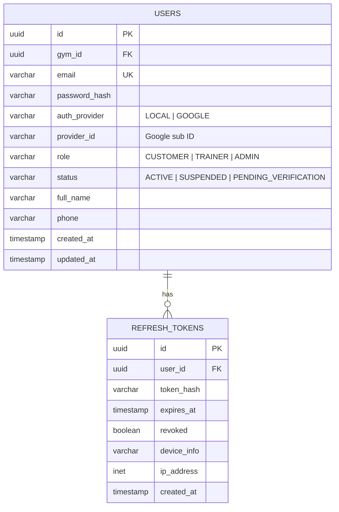
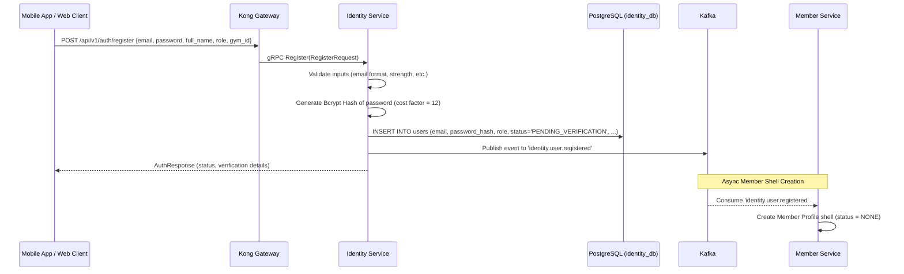
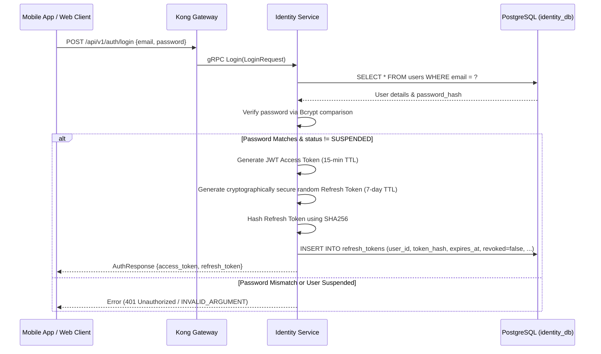
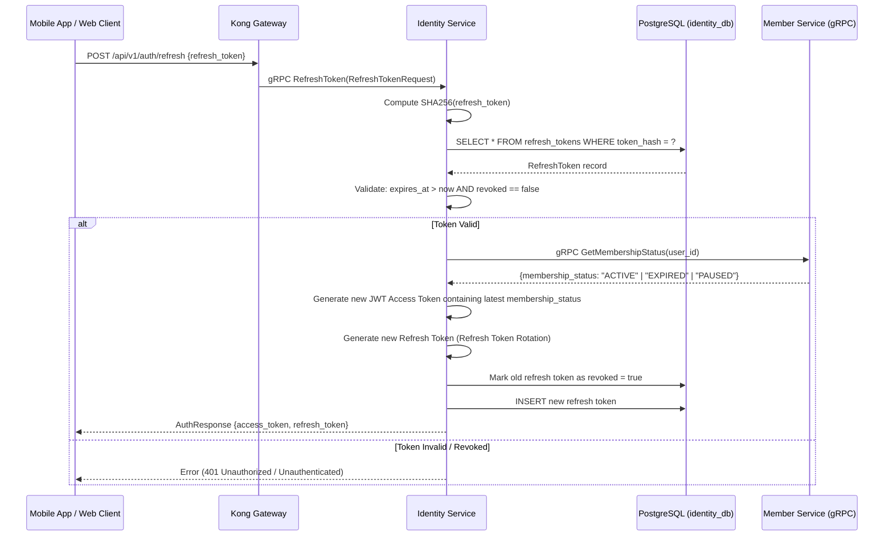
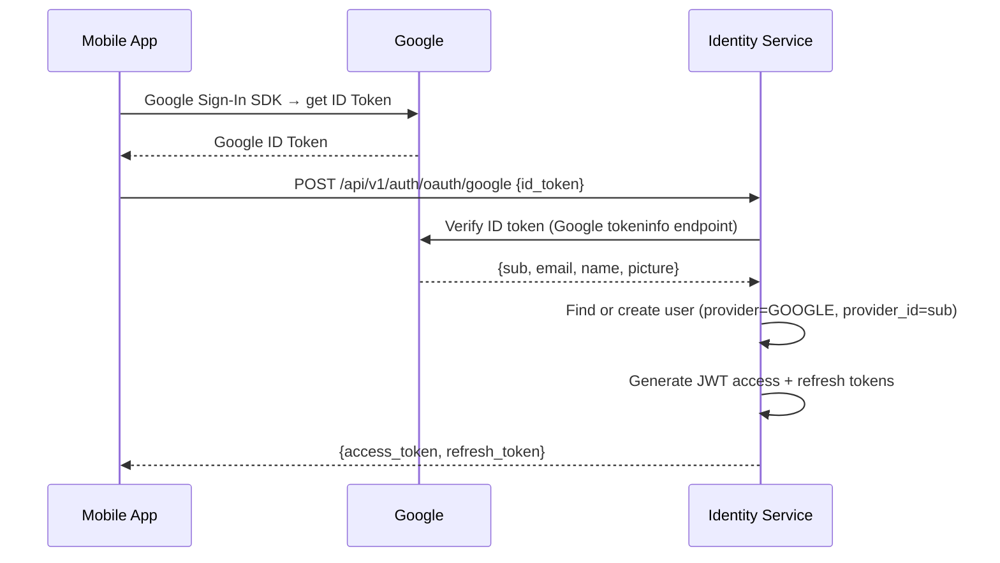

# Identity Service

> **Tech:** Go Gin | **DB:** PostgreSQL | **Port:** 50051 (gRPC) / 8080 (REST)

## Responsibilities

- User registration (email/password + Google OAuth2)
- JWT access token (15 min) + refresh token (7 days)
- Role management: `CUSTOMER`, `TRAINER`, `ADMIN`
- Password reset, email verification
- Token refresh, revocation, and Redis-backed logout blacklisting
- User suspension & cascade dispatching

---

## Data Model



---

## Authentication and Registration Flows

### 1. User Registration Flow



### 2. Normal Login Flow (Email/Password)



### 3. Token Refresh Flow (with Sync Membership Status Check)



---

## JWT Structure

```json
{
  "sub": "550e8400-e29b-41d4-a716-446655440000",
  "role": "CUSTOMER",
  "gym_id": "gym-uuid-here",
  "membership_status": "ACTIVE",
  "exp": 1700000000,
  "iat": 1699999100,
  "kid": "key-id-2024"
}
```

- `membership_status` is cached in the JWT for speed.
- **Force-Refresh Mechanism:** When a customer completes a membership purchase, the Mobile App receives the success screen. The app immediately calls `POST /api/v1/auth/refresh` using its stored refresh token. The Identity Service queries the Member Service via gRPC, fetches the new `ACTIVE` status, generates a new Access Token with `"membership_status": "ACTIVE"`, and returns it. This bypasses the 15-minute caching latency.

---

## Token Blacklisting (Logout)

When a user logs out:
1. Access token is placed in Redis: `blacklist:{access_token_hash}` with TTL = remaining token lifetime.
2. Kong Gateway's custom Redis-lookup plugin checks every incoming request's token hash. If found in Redis, Kong rejects immediately with 401 Unauthorized (stateless validation with stateful revocation fallback).

---

## RBAC Matrix

| Route / RPC | Public | Customer | Trainer | Admin | Description |
|-------------|:---:|:---:|:---:|:---:|-------------|
| `Register` / `Login` | ✓ | | | | Auth endpoints |
| `GetCurrentUser` | | ✓ | ✓ | ✓ | Get logged in profile |
| `LogWorkout` / `GetMyQR` | | ✓ | | | Customer features (active membership checked) |
| `AcceptBooking` / `SetAvailability` | | | ✓ | | Trainer operations |
| `CreateTrainerAccount` | | | | ✓ | Admin registers new staff |
| `SuspendUser` | | | | ✓ | Suspend any account |
| `CreatePromotion` | | | | ✓ | Admin management |

---

## SuspendUser Cascade Flow

When an Admin suspends a user:
1. Identity Service marks user status as `SUSPENDED` in PostgreSQL.
2. Identity Service revokes all active `REFRESH_TOKENS` for that user.
3. Identity Service publishes `identity.user.suspended` event to Kafka.
4. **Member Service** consumes event → Sets member status to `SUSPENDED`, cancels any active subscriptions.
5. **Trainer Service** consumes event:
   - If user was a Trainer → Sets trainer status to `SUSPENDED`, cancels all future bookings, publishes `booking.cancelled` (triggering full refunds via Payment Service).
   - If user was a Customer → Cancels all future bookings for that customer, publishes `booking.cancelled` (refunds triggered).

---

## Google OAuth2 Flow



---

## Kafka Events Published

| Topic | Key | Payload | Consumed By |
|-------|-----|---------|-------------|
| `identity.user.registered` | `user_id` | `{user_id, email, full_name, role, gym_id}` | Member Service (create member profile) |
| `identity.user.role-changed` | `user_id` | `{user_id, old_role, new_role, gym_id}` | — |
| `identity.user.suspended` | `user_id` | `{user_id, role, gym_id}` | Member Service, Trainer Service |

---

## API (gRPC)

```protobuf
service IdentityService {
  // Public
  rpc Register(RegisterRequest) returns (AuthResponse);
  rpc Login(LoginRequest) returns (AuthResponse);
  rpc LoginWithGoogle(GoogleLoginRequest) returns (AuthResponse);
  rpc RefreshToken(RefreshTokenRequest) returns (AuthResponse);
  rpc Logout(LogoutRequest) returns (google.protobuf.Empty);

  // Authenticated
  rpc GetCurrentUser(google.protobuf.Empty) returns (UserResponse);
  rpc ChangePassword(ChangePasswordRequest) returns (google.protobuf.Empty);

  // Admin only
  rpc CreateTrainerAccount(CreateTrainerRequest) returns (UserResponse);
  rpc SuspendUser(SuspendUserRequest) returns (google.protobuf.Empty);
  rpc ListUsers(ListUsersRequest) returns (ListUsersResponse);
}
```

---

## Clean Architecture Layers

```
cmd/server/main.go                    ← bootstrap, wire dependencies
internal/
├── domain/
│   ├── user.go                       ← User entity, Role enum
│   ├── token.go                      ← RefreshToken entity
│   └── errors.go                     ← ErrInvalidCredentials, ErrUserExists
├── usecase/
│   ├── register.go                   ← RegisterUseCase
│   ├── login.go                      ← LoginUseCase
│   ├── refresh_token.go              ← RefreshTokenUseCase
│   └── port/
│       ├── user_repo.go              ← UserRepository interface
│       ├── token_repo.go             ← TokenRepository interface
│       ├── password_hasher.go        ← PasswordHasher interface
│       ├── token_generator.go        ← JWTGenerator interface
│       └── event_publisher.go        ← EventPublisher interface
├── adapter/
│   ├── grpc/
│   │   ├── handler.go                ← implements IdentityServiceServer
│   │   └── mapper.go                 ← proto <-> domain mapping
│   ├── repository/
│   │   ├── postgres_user.go          ← implements UserRepository
│   │   └── redis_token.go            ← implements TokenRepository
│   ├── security/
│   │   ├── bcrypt_hasher.go          ← implements PasswordHasher
│   │   └── jwt_generator.go          ← implements JWTGenerator
│   ├── kafka/
│   │   └── event_publisher.go        ← implements EventPublisher
│   └── oauth/
│       └── google_verifier.go        ← Google ID token verification
└── config/
    └── config.go                     ← env-based config loading
```
