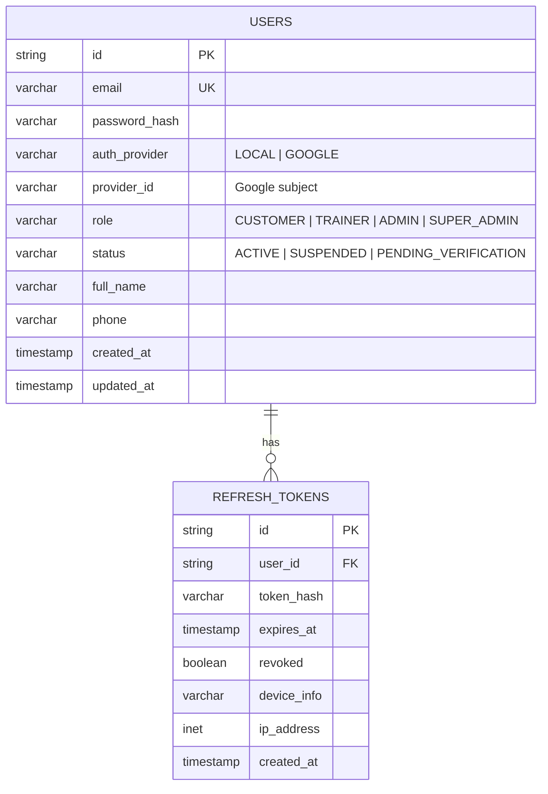
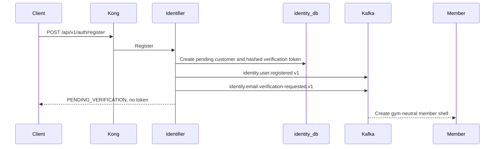

# Identity Service

> **Tech:** Go | **DB:** PostgreSQL `identity_db` | **Ports:** 50051 native gRPC / 8080 HTTP
>
> **Roadmap status:** G8 remains historical. Phase 9 Stage 0 removes selected-gym token issuance and Identifier's Member dependency before Kong/OpenAPI generation.

## Responsibilities

- User registration with email/password or Google OAuth2
- Email verification; password reset remains deferred until contract freeze
- Stable identity JWT access tokens, refresh rotation, logout, and Redis-backed revocation
- Roles: `CUSTOMER`, `TRAINER`, `ADMIN`, `SUPER_ADMIN`
- User suspension and identity events
- Active-gym validation for current `SUPER_ADMIN` trainer-account creation

Identifier owns identity and credentials. It does not own gym locations, membership plans, member profiles, subscriptions, membership state, or staff-to-gym assignment.

## Data Model



There is no `users.gym_id`. Gym selection belongs to frontend URL/request context. Cross-service IDs are opaque strings and never cross-service database foreign keys.

## Registration and Stable Tokens



Registration, verification, login, Google login, and refresh issue the same stable identity token:

```json
{
  "sub": "user-id",
  "iss": "gym-identifier",
  "aud": "gym-api",
  "iat": 1699999100,
  "exp": 1700000000,
  "jti": "access-token-id",
  "kid": "key-id-2026-08",
  "role": "CUSTOMER"
}
```

Tokens contain no `gym_id` and no `membership_status`. Clients query Member for live membership state. Selecting a gym does not call Identifier and does not issue another token.

JWT uses RS256. Kong validates algorithm, signature, issuer, audience, `iat`, `exp`, `jti`, and `kid` before replacing trusted headers with verified identity/role metadata. Current and previous public keys overlap for at least maximum access-token TTL. Production private keys stay in a secret manager.

## Removed Selected-Gym Boundary

Phase 9 Stage 0 removes:

- `SelectGym` RPC and `POST /api/v1/auth/gym`;
- selected-gym signing branch and tests;
- Identifier Member client port/adapter;
- Member target, deadline, client certificate, key, and CA configuration;
- startup and shutdown wiring;
- Identifier-to-Member NetworkPolicy and mTLS permission.

After its only caller disappears, Member `GetMembershipStatusByUserId` and its top-level messages are removed in the coordinated contract break. Protobuf cannot reserve RPC or top-level message names, so contract checks prevent their reuse; field numbers/names are reserved only inside retained messages where fields are removed. No compatibility forwarding is needed because there is no production client or customer data.

## Trainer Administration Boundary

Identifier currently validates `CreateTrainerAccount.gym_id` through Plans `GetActiveGym` over Identifier mTLS. Therefore Identifier's Plans client remains after customer `SelectGym` removal.

No authoritative staff-to-gym assignment model exists and Identifier does not persist gym assignment. During G9, `CreateTrainerAccount` is `SUPER_ADMIN`-only. Restoring gym-scoped `ADMIN` creation requires a separate staff-assignment owner, persistence, revocation, read contract, and tests.

Trainer profile creation remains deferred to Trainer service.

## Logout and Suspension

Logout hashes access token and stores `blacklist:{token_hash}` in Redis until expiration. Refresh tokens are revoked in PostgreSQL.

Suspension:

1. marks user `SUSPENDED`;
2. revokes active refresh tokens;
3. publishes `identity.user.suspended.v1`;
4. lets downstream owners apply state changes idempotently.

## Kafka Events

Identity events remain gym-neutral. Prior `gym_id` fields remain reserved.

| Topic | Key | Payload |
|---|---|---|
| `identity.user.registered.v1` | `user_id` | `{user_id, email, full_name, role, auth_provider, timestamp}` |
| `identity.user.role-changed.v1` | `user_id` | `{user_id, old_role, new_role, timestamp}` |
| `identity.user.suspended.v1` | `user_id` | `{user_id, role, timestamp}` |
| `identity.email.verification-requested.v1` | `user_id` | `{user_id, email, full_name, verification_url, expires_at, timestamp}` |

`verification_url` contains secret token material. Restrict topic ACLs and never log it.

## API

```protobuf
service IdentityService {
  // Public
  rpc Register(RegisterRequest) returns (RegisterResponse);
  rpc Login(LoginRequest) returns (LoginResponse);
  rpc LoginWithGoogle(LoginWithGoogleRequest) returns (LoginWithGoogleResponse);
  rpc RefreshToken(RefreshTokenRequest) returns (RefreshTokenResponse);
  rpc VerifyEmail(VerifyEmailRequest) returns (VerifyEmailResponse);
  rpc ResendEmailVerification(ResendEmailVerificationRequest)
      returns (ResendEmailVerificationResponse);

  // Authenticated
  rpc Logout(LogoutRequest) returns (LogoutResponse);
  rpc GetCurrentUser(GetCurrentUserRequest) returns (GetCurrentUserResponse);
  rpc ChangePassword(ChangePasswordRequest) returns (ChangePasswordResponse);

  // SUPER_ADMIN during G9
  rpc CreateTrainerAccount(CreateTrainerAccountRequest) returns (CreateTrainerAccountResponse);
  rpc SuspendUser(SuspendUserRequest) returns (SuspendUserResponse);
  rpc ListUsers(ListUsersRequest) returns (ListUsersResponse);
}
```

`SelectGym` is absent. Closed enums use full Protobuf names on wire; domain/JWT/DB retain short names.

## Authorization Summary

| Operation | Customer | Trainer | Admin | Super admin |
|---|:---:|:---:|:---:|:---:|
| Login, refresh, verification | Public | Public | Public | Public |
| Logout, current user, change password | Yes | Yes | Yes | Yes |
| Select gym | Client state; no Identifier RPC | Client state | Client state | Client state |
| Create trainer account | No | No | No | Yes |
| Suspend/list users | No | No | No | Yes |

## Target Internal Structure

```text
cmd/server/main.go
internal/
├── domain/
├── usecase/
│   └── port/
│       ├── user_repository.go
│       ├── token_repository.go
│       ├── plans_client.go
│       └── event_publisher.go
├── adapter/
│   ├── grpc/
│   ├── repository/
│   ├── security/
│   ├── kafka/
│   └── plans/        # GetActiveGym for trainer validation
└── config/
```

There is no Member adapter or selected-gym use case after Stage 0.
