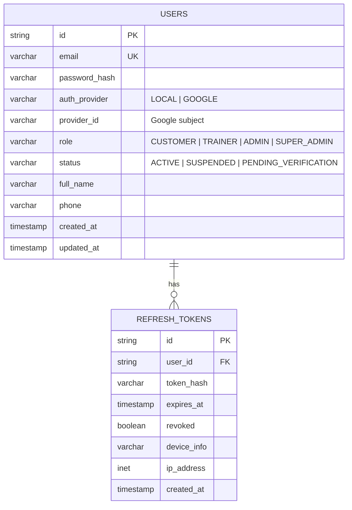
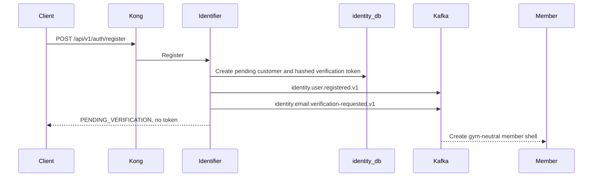
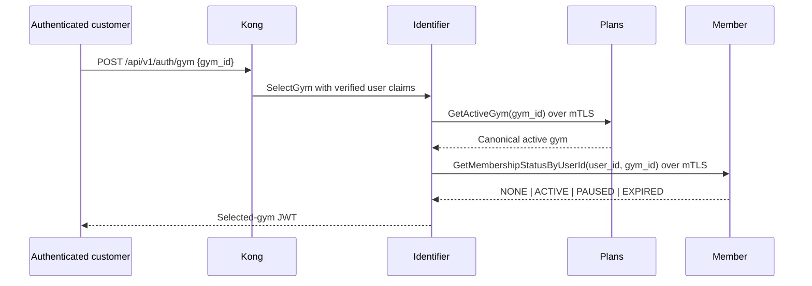

# Identity Service

> **Tech:** Go | **DB:** PostgreSQL `identity_db` | **Ports:** 50051 native gRPC / 8080 HTTP
>
> **Roadmap status:** G8 complete. Independent `PlansClient` (`GetActiveGym`) and `MemberClient` (membership only); `SelectGym` is Plans-first then Member, fail-closed. Historical G5 evidence records the earlier Member-only gym-validation path. G8 evidence: `docs/evidence/foundation-first/g8/local-2026-08-09/`.

## Responsibilities

- User registration with email/password or Google OAuth2
- Email verification; password reset remains deferred until its API contract is frozen
- JWT access tokens, refresh-token rotation, logout, and Redis-backed revocation
- Roles: `CUSTOMER`, `TRAINER`, `ADMIN`, `SUPER_ADMIN`
- User suspension and identity events
- Selected-gym token issuance after authoritative downstream checks

Identifier owns identity and credentials. It does not own gym locations, membership plans, member profiles, or subscriptions.

## Data Model



There is no `users.gym_id` foreign key. Gym selection is request/token context. Any `gym_id`, `member_id`, or `plan_id` crossing a service boundary is an opaque string, never a cross-service database FK.

## Registration and Gym-Neutral Tokens

Public registration always creates a `CUSTOMER` in `PENDING_VERIFICATION`. Elevated roles require protected administration or controlled out-of-band provisioning.



Local verification tokens are generated with cryptographically secure randomness, stored only as SHA-256 hashes, expire after the configured TTL, and are single use. Google accounts begin active after Google token verification.

Login, Google login, email verification, and refresh issue gym-neutral access tokens:

- no `gym_id` claim;
- `membership_status=NONE`;
- 15-minute access-token TTL;
- rotating opaque refresh token stored as a hash.

## Pending Selected-Gym Flow

`POST /api/v1/auth/gym` is the only membership-aware issuance path.



Identifier calls Plans first, then Member. A missing or closed gym, membership lookup failure, authorization failure, timeout, or TLS failure prevents token issuance. Identifier never guesses a membership state.

Plans and Member use independent targets, deadlines, CA bundles, client certificates, clients, and close lifecycles. Workload identity comes from verified mTLS. Identifier never forwards or forges `x-user-id`, `x-user-role`, `x-gym-id`, or `x-membership-status` as service credentials.

The selected-gym token includes the selected gym and Member's returned status. Clients call `SelectGym` again after a membership change.

```json
{
  "sub": "user-id",
  "iss": "gym-identifier",
  "aud": "gym-api",
  "iat": 1699999100,
  "exp": 1700000000,
  "jti": "access-token-id",
  "kid": "key-id-2026-08",
  "role": "CUSTOMER",
  "gym_id": "opaque-gym-id",
  "membership_status": "ACTIVE"
}
```

JWT uses RS256. Kong validates algorithm, signature, issuer, audience, `iat`, `exp`, `jti`, and `kid` before replacing trusted headers with validated claims. Current and previous public keys overlap for at least the maximum access-token TTL. Production private keys remain in a secret manager.

## Trainer Administration Boundary

Identifier owns trainer credentials and the `TRAINER` role. In the pending split, `CreateTrainerAccount` validates the requested active gym through Plans `GetActiveGym`, not Member. Creating a trainer profile in the deferred Trainer service is separate work.

## Logout and Suspension

Logout hashes the access token and stores `blacklist:{token_hash}` in Redis until the token expires. Refresh tokens are revoked in PostgreSQL.

Suspension:

1. marks the user `SUSPENDED`;
2. revokes active refresh tokens;
3. publishes `identity.user.suspended.v1`;
4. lets downstream owners apply their own state changes idempotently.

## Kafka Events

Identity event contracts are gym-neutral. Their prior `gym_id` fields are reserved and must not appear in examples or payload construction.

| Topic | Key | Payload |
|---|---|---|
| `identity.user.registered.v1` | `user_id` | `{user_id, email, full_name, role, auth_provider, timestamp}` |
| `identity.user.role-changed.v1` | `user_id` | `{user_id, old_role, new_role, timestamp}` |
| `identity.user.suspended.v1` | `user_id` | `{user_id, role, timestamp}` |
| `identity.email.verification-requested.v1` | `user_id` | `{user_id, email, full_name, verification_url, expires_at, timestamp}` |

`verification_url` contains secret token material. Topic ACLs must restrict it, and consumers must never log it.

## API

```protobuf
service IdentityService {
  // Public
  rpc Register(RegisterRequest) returns (AuthResponse);
  rpc Login(LoginRequest) returns (AuthResponse);
  rpc LoginWithGoogle(GoogleLoginRequest) returns (AuthResponse);
  rpc RefreshToken(RefreshTokenRequest) returns (AuthResponse);
  rpc VerifyEmail(VerifyEmailRequest) returns (AuthResponse);
  rpc ResendEmailVerification(ResendEmailVerificationRequest)
      returns (google.protobuf.Empty);

  // Authenticated
  rpc Logout(LogoutRequest) returns (google.protobuf.Empty);
  rpc GetCurrentUser(google.protobuf.Empty) returns (UserResponse);
  rpc ChangePassword(ChangePasswordRequest) returns (google.protobuf.Empty);
  rpc SelectGym(SelectGymRequest) returns (SelectGymResponse);

  // Admin
  rpc CreateTrainerAccount(CreateTrainerRequest) returns (UserResponse);
  rpc SuspendUser(SuspendUserRequest) returns (google.protobuf.Empty);
  rpc ListUsers(ListUsersRequest) returns (ListUsersResponse);
}
```

Public methods are Register, Login, Google Login, Refresh, VerifyEmail, and ResendEmailVerification. Logout, `SelectGym`, and all administration methods are protected.

## Authorization Summary

| Operation | Customer | Trainer | Admin |
|---|:---:|:---:|:---:|
| Login, refresh, verification | Public | Public | Public |
| Logout, current user, change password | Yes | Yes | Yes |
| Select gym | Yes | No | No |
| Create trainer account | No | No | Yes |
| Suspend/list users | No | No | Yes |

## Target Internal Structure

```text
cmd/server/main.go
internal/
├── domain/
├── usecase/
│   └── port/
│       ├── user_repository.go
│       ├── token_repository.go
│       ├── member_client.go
│       ├── plans_client.go
│       └── event_publisher.go
├── adapter/
│   ├── grpc/
│   ├── repository/
│   ├── security/
│   ├── kafka/
│   ├── member/       # GetMembershipStatusByUserId
│   └── plans/        # GetActiveGym
└── config/
```

Split-client path is implemented and covered by unit tests plus G8 E2E (`run-g8.sh`).
