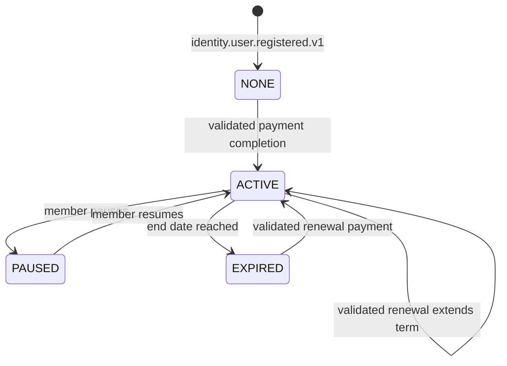
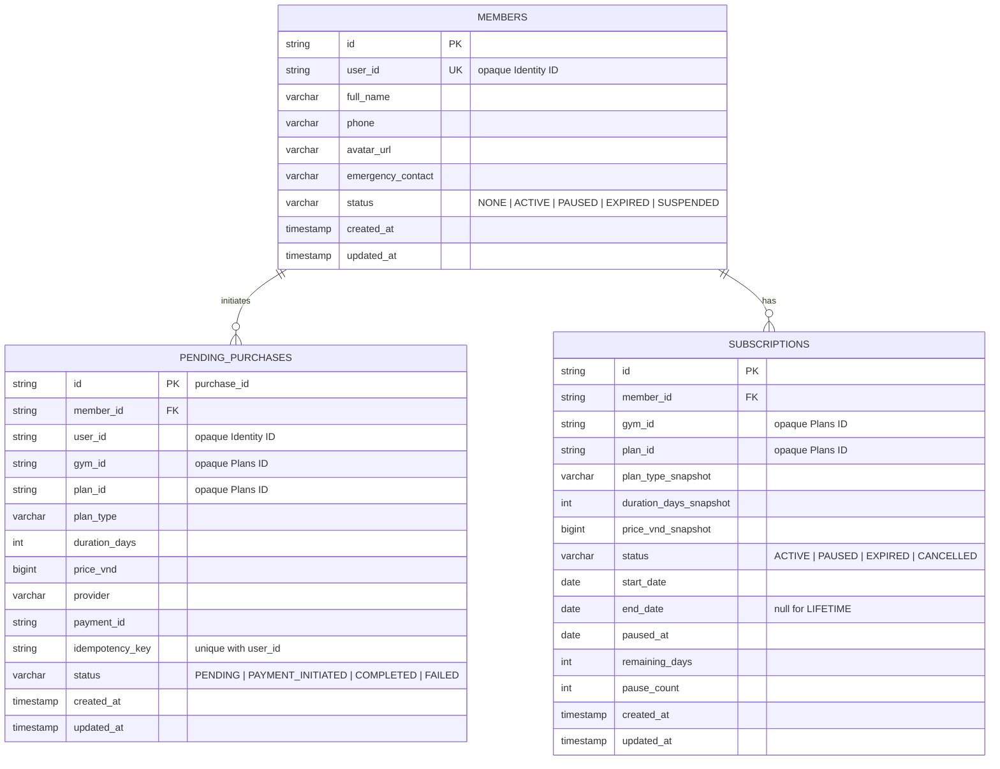

# Member Service

> **Tech:** Java 26 + Spring Boot 4 | **DB:** PostgreSQL `member_db` | **Business port:** 50051 native mTLS gRPC
>
> **Roadmap status:** G9 complete. G10 complete; it changed only the Check-in-only `ValidateMembership` request/response boundary described below. See [`../evidence/foundation-first/g10-final/README.md`](../evidence/foundation-first/g10-final/README.md). Historical G4/G5/G8/G9 evidence remains unchanged.

## Responsibilities

- Member profile shells and profile updates
- Membership lifecycle: `NONE`, `ACTIVE`, `PAUSED`, `EXPIRED`
- Purchase orchestration and Member-owned pending purchases
- Frozen purchased-term snapshots on subscriptions
- Membership lookup and validation
- Membership lifecycle events, outbox, and processed-event idempotency
- Pause, resume, expiry, and renewal behavior

Member does not own gym locations, plan catalog data, plan availability, duration definitions, or VND list price. [Plans](10-ms-gym-plans.md) owns those records. Member stores only opaque `gym_id` and `plan_id` references.

G11 Payment implementation is in progress. G8 fake-payment remains the current producer for historical purchase-correlation, completion-validation, and replay proof until the locked G11 pass switches to the real Payment outbox.

## State Machine



Lifetime subscriptions do not expire and cannot pause. Monthly and yearly lifecycle calculations use stored subscription snapshots, never a live Plans read.

## Purchase Boundary

```mermaid
sequenceDiagram
    participant C as Customer
    participant MB as Member
    participant PL as Plans
    participant DB as member_db
    participant FP as G8 Fake Payment
    participant KF as Kafka

    C->>MB: POST /api/v1/gyms/{gym_id}/memberships/purchase
    MB->>MB: Resolve trusted user from Kong metadata and member ownership
    MB->>MB: Validate request gym_id; reject nonblank discount_code
    MB->>PL: ResolvePurchasablePlan(gym_id, plan_id) over mTLS
    PL-->>MB: plan_id, gym_id, type, duration_days, price_vnd
    MB->>DB: Create or load PENDING purchase by (user_id, idempotency_key)
    Note over MB,DB: Commit before Payment; stable purchase_id
    MB->>FP: InitiatePayment(reference_id=purchase_id)
    FP-->>MB: payment_id, payment_url (same intent on retry)
    MB->>DB: Attach payment_id
    MB-->>C: payment_id, payment_url
    FP->>KF: payment.completed.v1 reference_id=purchase_id
    KF-->>MB: Completion event
    MB->>DB: Claim event + activate in one TX
    MB->>DB: Activate from frozen terms; mark completed
```

Rules:

1. Client selects `gym_id` as explicit path/resource context and supplies `plan_id`, provider, required `idempotency_key`, and optional `discount_code` in the body.
2. Request `gym_id` is intent, not authorization or authoritative catalog data. Member derives user identity from Kong and verifies member ownership.
3. Nonblank discount codes fail until an authoritative discount owner exists.
4. Plans validates `(gym_id, plan_id)` and returns canonical terms; client cannot set type, duration, or price.
5. Member creates or reloads one pending purchase for `(user_id, idempotency_key)` and commits before Payment.
6. Payment `reference_id` is Member's unique `purchase_id`, never the reusable `plan_id`. Same key reuses the same reference.
7. Completion must match purchase ID, payment ID, payment type, user, gym, provider expectations, and `amount_vnd`.
8. Activation and renewal use the frozen record. They never reread Plans.
9. Processed-event claim and domain work share one TX; no claim release on failure.

A Plans outage before purchase initiation fails closed. A Plans outage or catalog edit after initiation does not change completion behavior.

## Data Model



Only Member-local relationships have foreign keys. `user_id`, `gym_id`, and `plan_id` are opaque strings without cross-service FKs. `plan_type_snapshot` is lifecycle vocabulary, not catalog ownership.

## Membership Lifecycle

Pause:

```text
require status == ACTIVE
require plan_type_snapshot != LIFETIME
remaining_days = end_date - today
status = PAUSED
paused_at = today
```

Resume:

```text
require status == PAUSED
end_date = today + remaining_days
status = ACTIVE
paused_at = null
remaining_days = null
```

Scheduled expiry and warning jobs read subscriptions and their snapshots. They never call Plans.

## Kafka Events

### Published

| Topic | Trigger |
|---|---|
| `membership.activated.v1` | Validated purchase completion or renewal |
| `membership.paused.v1` | Successful pause |
| `membership.resumed.v1` | Successful resume |
| `membership.expiring-soon.v1` | Snapshot-backed expiry warning |
| `membership.expired.v1` | Subscription expiry |

### Consumed

| Topic | Action |
|---|---|
| `identity.user.registered.v1` | Create gym-neutral member shell with `NONE` status |
| `identity.user.suspended.v1` | Suspend profile and apply subscription policy idempotently |
| `payment.completed.v1` with `type=PAYMENT_TYPE_MEMBERSHIP` (wire enum; domain still `MEMBERSHIP`) | Resolve `reference_id` as `purchase_id`, validate frozen record, activate idempotently |

## API Target

```protobuf
service MemberService {
  rpc GetMember(GetMemberRequest) returns (GetMemberResponse);
  rpc UpdateProfile(UpdateProfileRequest) returns (UpdateProfileResponse);
  rpc ListMembers(ListMembersRequest) returns (ListMembersResponse);

  rpc PurchaseMembership(PurchaseMembershipRequest) returns (PurchaseMembershipResponse);
  rpc PauseMembership(PauseMembershipRequest) returns (PauseMembershipResponse);
  rpc ResumeMembership(ResumeMembershipRequest) returns (ResumeMembershipResponse);
  rpc GetMembershipStatus(GetMembershipStatusRequest) returns (GetMembershipStatusResponse);

  // Check-in only; verified SAN; no public HTTP mapping.
  rpc ValidateMembership(ValidateMembershipRequest)
      returns (ValidateMembershipResponse);

  // Notification only; verified SAN; gym_ids min 1; no public HTTP mapping.
  rpc ListMembersByStatus(ListMembersByStatusRequest)
      returns (ListMembersByStatusResponse);
}
```

Closed vocabularies on the wire are `common.v1` prefixed enums (`MembershipStatus.MEMBERSHIP_STATUS_ACTIVE`, `PlanType.PLAN_TYPE_MONTHLY`, `PaymentType.PAYMENT_TYPE_MEMBERSHIP`). Domain DTOs keep short names. Membership status is not a JWT claim. No shared `MemberResponse` / `PurchaseResponse` / `MembershipResponse`.

G6 removed `GetPlans` and gym-location management/lookup RPCs from Member. G8 Member code and schema match that boundary.

Phase 9 removes `GetMembershipStatusByUserId` and its top-level messages after deleting Identifier's selected-gym flow. Protobuf cannot reserve RPC or top-level message names, so contract checks prevent their reuse; reserve only removed fields inside retained messages. Delete the handler, mapper, SAN allowlist, and tests.

Every gym-specific public RPC receives validated `gym_id` in its request. Public handlers never call `GrpcSecurityContext.getGymId()`; Kong metadata supplies only verified identity and role.

Purchase uses a nested body so path `gym_id` appears once:

```protobuf
message PurchaseMembershipBody {
  string plan_id = 1;
  string provider = 2;
  string discount_code = 3;
  string idempotency_key = 4;
}

message PurchaseMembershipRequest {
  string gym_id = 1;
  PurchaseMembershipBody purchase = 2;
}
```

Pause, resume, and gym-scoped status requests carry both `gym_id` and `member_id`. `ListMembersRequest.gym_id` remains the explicit list scope. Preserve existing field validation, including required IDs and idempotency-key bounds.

Aggregate member status is derived from all subscriptions (`ACTIVE` > `PAUSED` > `EXPIRED` > `NONE`). Gym-scoped reads use subscription status, not a blind copy from one gym.

## Public Routes and Authorization

Kong exposes public unary RPCs as HTTPS/JSON and transcodes to Member mTLS gRPC `50051`.

| Method | Path | Policy |
|---|---|---|
| `GET` | `/api/v1/members/{member_id}` | customer self; `SUPER_ADMIN` override |
| `PUT` | `/api/v1/members/{member_id}` | customer self; `SUPER_ADMIN` override |
| `GET` | `/api/v1/gyms/{gym_id}/members` | `SUPER_ADMIN` only during G9 |
| `POST` | `/api/v1/gyms/{gym_id}/memberships/purchase` | customer self; body retains plan, provider, discount, idempotency fields |
| `POST` | `/api/v1/gyms/{gym_id}/members/{member_id}/membership:pause` | customer self |
| `POST` | `/api/v1/gyms/{gym_id}/members/{member_id}/membership:resume` | customer self |
| `GET` | `/api/v1/gyms/{gym_id}/members/{member_id}/membership` | customer self; `SUPER_ADMIN` override |

No authoritative `ADMIN`-to-gym assignment exists. Request `gym_id` cannot grant administrative access. Restore gym-scoped `ADMIN` only after a separate assignment owner, persistence model, revocation contract, lookup API, and tests exist.

Member list and status filters continue using Spring Data JPA `Specification` composition through `JpaSpecificationExecutor`; do not add custom persistence queries.

## Workload Security

SAN → method matrix:

| Peer SAN | Allowed method |
|----------|----------------|
| `ms-gym-checkin` | `ValidateMembership` |
| `ms-gym-notification` | `ListMembersByStatus` |
| `ms-gym-api-gateway` | all declared end-user role-restricted methods |

- Member may call only Plans `ResolvePurchasablePlan` using its own certificate and independent client configuration.
- Internal methods have no HTTP mapping or Kong route.
- End-user claim headers are accepted only from Kong SAN; internal certs cannot forge them.
- NetworkPolicy admits gRPC only from generated gateway, Check-in, and Notification on caller-specific rules. Identifier has no Member edge after Phase 9 Stage 0.

## G10 Check-in Boundary

Plans owns location data; Member owns membership decisions. Phase 10 froze the internal Check-in-only contract as:

```protobuf
message ValidateMembershipRequest {
  string user_id = 1;
  string gym_id = 2;
}

message ValidateMembershipResponse {
  string member_id = 1;
  bool valid = 2;
  common.v1.MembershipStatus status = 3;
}
```

The released contract fixes the field numbers above. Check-in derives `user_id` from verified JWT `sub` and `gym_id` from the signed QR. Member resolves canonical `member_id` and live gym-specific membership state. Client input never selects canonical member identity.

Member implements this lookup with existing Spring Data JPA repositories and `Specification` composition, not a custom persistence query. Only `ms-gym-checkin` SAN may call the method; no HTTP mapping, Kong route, OpenAPI operation, or forwarded end-user metadata exists. The logged-in iPad display and active-gym validation belong to Check-in/Plans, not Member.

## Target Structure

```text
src/main/java/com/gym/member/
├── domain/
│   ├── member/
│   ├── subscription/          # Includes purchased snapshots
│   └── purchase/              # Pending-purchase state
├── application/
│   ├── profile/
│   ├── membership/
│   ├── purchase/
│   └── lifecycle/
├── adapter/
│   ├── in/grpc/
│   └── out/
│       ├── persistence/       # Members, subscriptions, purchases, outbox, processed events
│       ├── plans/             # ResolvePurchasablePlan mTLS client
│       ├── payment/
│       └── kafka/
└── config/
```

No target package contains `GymLocation`, catalog `MembershipPlan`, location management, or a local plan repository.
