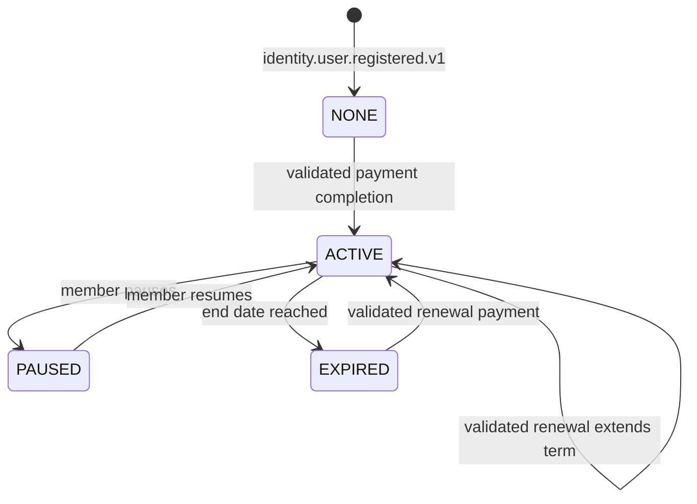
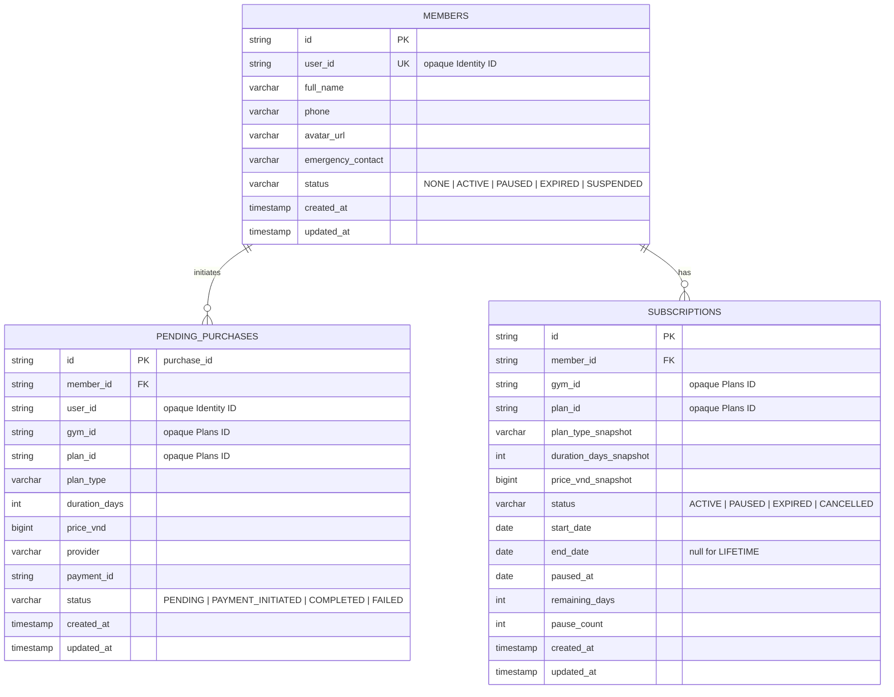

# Member Service

> **Tech:** Java 26 + Spring Boot 4 | **DB:** PostgreSQL `member_db` | **Ports:** 50051 native gRPC / 8080 HTTP when a service-local gateway exists
>
> **Roadmap status:** G8 complete. No location/catalog ownership; pending purchases + subscription snapshots; Plans `ResolvePurchasablePlan` + fake Payment completion. Historical G4/G5 evidence is pre-split. G8 evidence: `docs/evidence/foundation-first/g8/local-2026-08-09/`.

## Responsibilities

- Member profile shells and profile updates
- Membership lifecycle: `NONE`, `ACTIVE`, `PAUSED`, `EXPIRED`
- Purchase orchestration and Member-owned pending purchases
- Frozen purchased-term snapshots on subscriptions
- Membership lookup and validation
- Membership lifecycle events, outbox, and processed-event idempotency
- Pause, resume, expiry, and renewal behavior

Member does not own gym locations, plan catalog data, plan availability, duration definitions, or VND list price. [Plans](10-ms-gym-plans.md) owns those records. Member stores only opaque `gym_id` and `plan_id` references.

Payment and Check-in remain deferred production services. G8 uses a minimal fake Payment fixture only to prove purchase correlation, completion validation, and replay.

## State Machine



Lifetime subscriptions do not expire and cannot pause. Monthly and yearly lifecycle calculations use stored subscription snapshots, never a live Plans read.

## Purchase Boundary

```mermaid
sequenceDiagram
    participant C as Customer
    participant MB as Member
    participant PL as Plans
    participant DB as member_db
    participant FP as G8 Fake Payment
    participant KF as Kafka

    C->>MB: PurchaseMembership(plan_id, provider, discount_code?)
    MB->>MB: Resolve trusted user, member, selected gym
    MB->>MB: Reject nonblank discount_code
    MB->>PL: ResolvePurchasablePlan(plan_id, selected_gym_id) over mTLS
    PL-->>MB: plan_id, gym_id, type, duration_days, price_vnd
    MB->>DB: Persist PENDING purchase with frozen terms
    MB->>FP: InitiatePayment(reference_id=purchase_id)
    FP-->>MB: payment_id, payment_url
    MB->>DB: Attach payment_id
    MB-->>C: payment_id, payment_url
    FP->>KF: payment.completed.v1 reference_id=purchase_id
    KF-->>MB: Completion event
    MB->>DB: Lock purchase and validate event
    MB->>DB: Activate from frozen terms; mark completed; record event
```

Rules:

1. Client supplies only `plan_id`, provider, and wire-compatible optional `discount_code`.
2. Nonblank discount codes fail until an authoritative discount owner exists.
3. Plans returns canonical gym and plan terms; client cannot set gym, type, duration, or price.
4. Member persists frozen terms before initiating Payment.
5. Payment `reference_id` is Member's unique `purchase_id`, never the reusable `plan_id`.
6. Completion must match purchase ID, payment ID, payment type, user, gym, provider expectations, and `amount_vnd`.
7. Activation and renewal use the frozen record. They never reread Plans.
8. Processed-event and purchase state make completion replay idempotent.

A Plans outage before purchase initiation fails closed. A Plans outage or catalog edit after initiation does not change completion behavior.

## Data Model



Only Member-local relationships have foreign keys. `user_id`, `gym_id`, and `plan_id` are opaque strings without cross-service FKs. `plan_type_snapshot` is lifecycle vocabulary, not catalog ownership.

## Membership Lifecycle

Pause:

```text
require status == ACTIVE
require plan_type_snapshot != LIFETIME
remaining_days = end_date - today
status = PAUSED
paused_at = today
```

Resume:

```text
require status == PAUSED
end_date = today + remaining_days
status = ACTIVE
paused_at = null
remaining_days = null
```

Scheduled expiry and warning jobs read subscriptions and their snapshots. They never call Plans.

## Kafka Events

### Published

| Topic | Trigger |
|---|---|
| `membership.activated.v1` | Validated purchase completion or renewal |
| `membership.paused.v1` | Successful pause |
| `membership.resumed.v1` | Successful resume |
| `membership.expiring-soon.v1` | Snapshot-backed expiry warning |
| `membership.expired.v1` | Subscription expiry |

### Consumed

| Topic | Action |
|---|---|
| `identity.user.registered.v1` | Create gym-neutral member shell with `NONE` status |
| `identity.user.suspended.v1` | Suspend profile and apply subscription policy idempotently |
| `payment.completed.v1` with `type=MEMBERSHIP` | Resolve `reference_id` as `purchase_id`, validate frozen record, activate idempotently |

## API Target

```protobuf
service MemberService {
  rpc GetMember(GetMemberRequest) returns (MemberResponse);
  rpc UpdateProfile(UpdateProfileRequest) returns (MemberResponse);
  rpc ListMembers(ListMembersRequest) returns (ListMembersResponse);

  rpc PurchaseMembership(PurchaseMembershipRequest) returns (PurchaseResponse);
  rpc PauseMembership(PauseMembershipRequest) returns (MembershipResponse);
  rpc ResumeMembership(ResumeMembershipRequest) returns (MembershipResponse);
  rpc GetMembershipStatus(GetMembershipStatusRequest) returns (MembershipResponse);

  // Identifier only; workload mTLS; no HTTP mapping.
  rpc GetMembershipStatusByUserId(GetMembershipStatusByUserIdRequest)
      returns (MembershipResponse);

  // Deferred Check-in policy; no public HTTP mapping.
  rpc ValidateMembership(ValidateMembershipRequest)
      returns (ValidateMembershipResponse);

  rpc ListMembersByStatus(ListMembersByStatusRequest)
      returns (ListMembersByStatusResponse);
}
```

G6 removed `GetPlans` and gym-location management/lookup RPCs from Member. G8 Member code and schema match that boundary.

`GetMembershipStatusByUserId` receives both `user_id` and `gym_id`. It returns `NONE` for a known user without a subscription at that gym. Identifier does not guess after an availability failure.

## Workload Security

- Identifier may call only `GetMembershipStatusByUserId` over a verified mTLS identity.
- Member may call only Plans `ResolvePurchasablePlan` using its own certificate and independent client configuration.
- Future Check-in may call Member `ValidateMembership` only after that service is opened and its workload policy is implemented.
- Internal methods have no HTTP mapping or Kong route.
- Workload metadata is not trusted unless bound to the verified peer certificate.
- End-user trusted headers are never forwarded as workload credentials.

## Deferred Check-in Boundary

Plans owns location data; Member owns membership decisions. Future scan processing may call Member `ValidateMembership(member_id, gym_id)`. Kiosk provisioning must not call Member for location data. Plans V1 has no Check-in-authorized method, so a future Check-in-to-Plans workload contract must be frozen before provisioning implementation begins.

## Target Structure

```text
src/main/java/com/gym/member/
├── domain/
│   ├── member/
│   ├── subscription/          # Includes purchased snapshots
│   └── purchase/              # Pending-purchase state
├── application/
│   ├── profile/
│   ├── membership/
│   ├── purchase/
│   └── lifecycle/
├── adapter/
│   ├── in/grpc/
│   └── out/
│       ├── persistence/       # Members, subscriptions, purchases, outbox, processed events
│       ├── plans/             # ResolvePurchasablePlan mTLS client
│       ├── payment/
│       └── kafka/
└── config/
```

No target package contains `GymLocation`, catalog `MembershipPlan`, location management, or a local plan repository.
