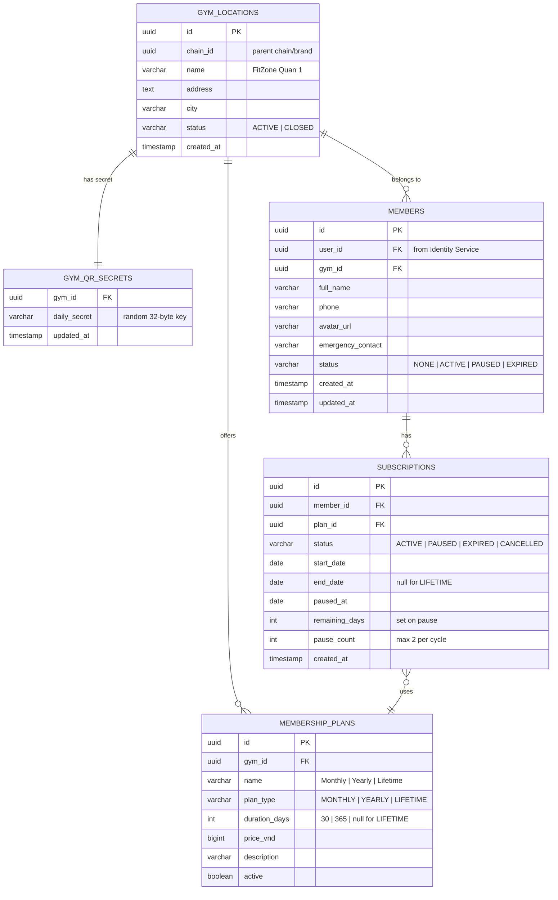

# Member Service

> **Tech:** Java 26 (Spring Boot 4) | **DB:** PostgreSQL | **Port:** 50051 (gRPC) / 8080 (REST)

## Responsibilities

- Membership lifecycle: `NONE → ACTIVE → PAUSED → ACTIVE → EXPIRED`
- Subscription plans: `MONTHLY`, `YEARLY`, `LIFETIME`
- Pause / resume with remaining days calculation (not applicable to LIFETIME)
- Member profile management (name, phone, avatar, emergency contact)
- **Gym location management** — owns `gym_locations` and `gym_qr_secrets` tables
- Gym QR daily token generation — produces token for gym door screens
- Spending history query (delegates to Payment Service)
- Multi-gym: each member belongs to a `gym_id`

---

## State Machine


### Pause / Resume Logic

```
Pause:
  remaining_days = end_date - today
  status = PAUSED
  paused_at = now()

Resume:
  new_end_date = today + remaining_days
  status = ACTIVE
  paused_at = null
  remaining_days = null

Rules:
  - LIFETIME cannot pause. Returns error: CANNOT_PAUSE_LIFETIME (gRPC INVALID_ARGUMENT)
  - Max pause duration: 30 days (configurable per gym)
  - Max pauses per subscription cycle: 2
```

---

## Data Model



---

## Gym QR — Daily Token Generation

The gym door screen displays a QR code containing a daily-rotating token.
The **Member Service** owns the QR secret and generates the daily token.
The **Check-in Service** calls Member Service to validate the token.

```
QR Content (displayed on gym door screen):
  base64(gym_id + ":" + daily_token)

Daily Token:
  daily_token = SHA256(gym_id + today_date + daily_secret)

daily_secret:
  - Per-gym secret stored in gym_qr_secrets table
  - Rotated periodically by admin (invalidates current QR immediately)

Flow:
  1. Scheduled job runs at 00:00 daily
  2. For each ACTIVE gym_location:
     token = SHA256(gym_id + today + daily_secret)
     qr_payload = base64(gym_id + ":" + token)
  3. Gym door device fetches latest QR payload via internal API or push
  4. Device renders QR on screen

Validation (by Check-in Service):
  1. Member scans gym door QR with phone app
  2. App sends qr_payload + JWT to Check-in Service
  3. Check-in Service calls Member Service GetGymDailySecret(gym_id)
  4. Check-in Service recomputes: expected = SHA256(gym_id + today + daily_secret)
  5. Compare expected vs scanned daily_token
```

---

## Kafka Events

### Published

| Topic | Key | Trigger | Payload |
|-------|-----|---------|---------|
| `membership.activated` | `member_id` | Payment completed | `{member_id, user_id, plan_type, start_date, end_date, gym_id, is_renewal, timestamp}` |
| `membership.paused` | `member_id` | Member pauses | `{member_id, paused_at, remaining_days, gym_id}` |
| `membership.resumed` | `member_id` | Member resumes | `{member_id, new_end_date, gym_id}` |
| `membership.expiring-soon` | `member_id` | Scheduled job (7d before) | `{member_id, end_date, plan_type, gym_id}` |
| `membership.expired` | `member_id` | Scheduled job (end_date reached) | `{member_id, expired_at, gym_id}` |

### Consumed

| Topic | Action |
|-------|--------|
| `identity.user.registered` | Create member shell (status=NONE) |
| `identity.user.suspended` | Freeze member profile, cancel active subscription |
| `payment.completed` (type=MEMBERSHIP) | Activate or renew subscription |

---

## Scheduled Jobs

| Job | Schedule | Action |
|-----|----------|--------|
| Gym QR Token Rotation | `0 0 * * *` (midnight) | Generate daily QR tokens for all ACTIVE gym locations |
| Expiry Check | `0 6 * * *` (6 AM) | Find subscriptions where `end_date <= today`, set EXPIRED |
| Expiry Warning | `0 9 * * *` (9 AM) | Find subscriptions where `end_date = today + 7d`, publish `membership.expiring-soon` |

---

## API (gRPC)

```protobuf
service MemberService {
  // Member profile
  rpc GetMember(GetMemberRequest) returns (MemberResponse);
  rpc UpdateProfile(UpdateProfileRequest) returns (MemberResponse);
  rpc ListMembers(ListMembersRequest) returns (ListMembersResponse);  // Admin

  // Membership
  rpc GetPlans(GetPlansRequest) returns (PlansResponse);
  rpc PurchaseMembership(PurchaseMembershipRequest) returns (PurchaseResponse);
  rpc PauseMembership(PauseMembershipRequest) returns (MembershipResponse);
  rpc ResumeMembership(ResumeMembershipRequest) returns (MembershipResponse);
  rpc GetMembershipStatus(GetMembershipStatusRequest) returns (MembershipResponse);

  // Gym Location Management (Admin)
  rpc CreateGymLocation(CreateGymLocationRequest) returns (GymLocationResponse);
  rpc UpdateGymLocation(UpdateGymLocationRequest) returns (GymLocationResponse);
  rpc ListGymLocations(ListGymLocationsRequest) returns (GymLocationsResponse);
  rpc GetGymLocation(GetGymLocationRequest) returns (GymLocationResponse);

  // Internal-Only (blocked at API Gateway from external HTTP routing)
  rpc ValidateMembership(ValidateMembershipRequest) returns (ValidateMembershipResponse);
  rpc GetGymDailySecret(GetGymDailySecretRequest) returns (GymDailySecretResponse);
  rpc ListMembersByStatus(ListMembersByStatusRequest) returns (ListMembersByStatusResponse);
}
```

---

## Internal Route Security

Internal-only gRPC methods (`ValidateMembership`, `GetGymDailySecret`, `ListMembersByStatus`) are blocked from external access:
1. **Kong Routing:** Kong only registers routes for public endpoints. Internal method paths are not mapped.
2. **Network Policies:** K8s network policies restrict gRPC ingress on port 50051 to Kong and authorized service pods only.

---

## Clean Architecture

```
src/main/java/com/gym/member/
├── domain/
│   ├── model/
│   │   ├── Member.java
│   │   ├── Subscription.java
│   │   ├── MembershipPlan.java
│   │   ├── MembershipStatus.java          // enum
│   │   ├── PlanType.java                   // MONTHLY, YEARLY, LIFETIME
│   │   ├── GymLocation.java
│   │   └── GymQRSecret.java
│   ├── exception/
│   │   ├── MemberNotFoundException.java
│   │   ├── CannotPauseLifetimeException.java
│   │   └── MaxPausesExceededException.java
│   └── event/
│       ├── MembershipActivatedEvent.java
│       └── MembershipExpiringSoonEvent.java
├── application/
│   ├── port/
│   │   ├── in/
│   │   │   ├── PurchaseMembershipUseCase.java
│   │   │   ├── PauseMembershipUseCase.java
│   │   │   ├── ResumeMembershipUseCase.java
│   │   │   ├── ManageGymLocationUseCase.java
│   │   │   ├── GenerateGymQRUseCase.java
│   │   │   └── ListMembersByStatusUseCase.java
│   │   └── out/
│   │       ├── MemberRepository.java
│   │       ├── SubscriptionRepository.java
│   │       ├── GymLocationRepository.java
│   │       ├── GymQRSecretRepository.java
│   │       ├── PaymentClient.java
│   │       └── EventPublisher.java
│   ├── service/
│   │   ├── MembershipService.java
│   │   ├── GymLocationService.java
│   │   └── GymQRService.java
│   └── scheduler/
│       ├── GymQRRotationJob.java
│       ├── ExpiryCheckJob.java
│       └── ExpiryWarningJob.java
├── adapter/
│   ├── in/grpc/
│   │   ├── MemberGrpcHandler.java
│   │   └── MemberProtoMapper.java
│   ├── out/persistence/
│   │   ├── MemberJpaEntity.java
│   │   ├── SubscriptionJpaEntity.java
│   │   ├── GymLocationJpaEntity.java
│   │   ├── MemberJpaRepository.java
│   │   └── MemberPersistenceAdapter.java
│   ├── out/grpc/
│   │   └── PaymentGrpcClient.java
│   └── out/kafka/
│       ├── MemberEventPublisher.java
│       └── MemberEventConsumer.java
└── config/
    └── GrpcConfig.java
```
