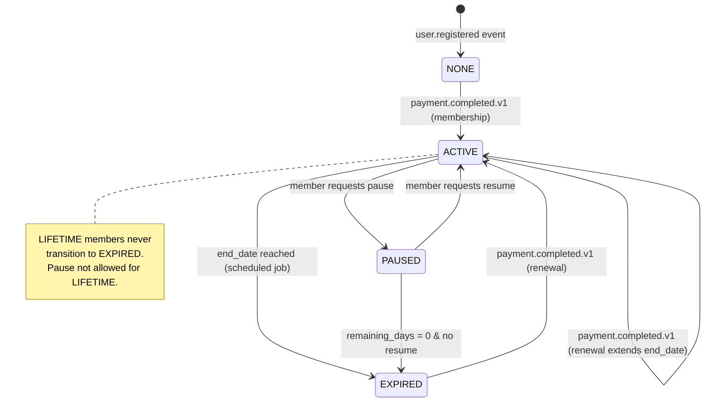
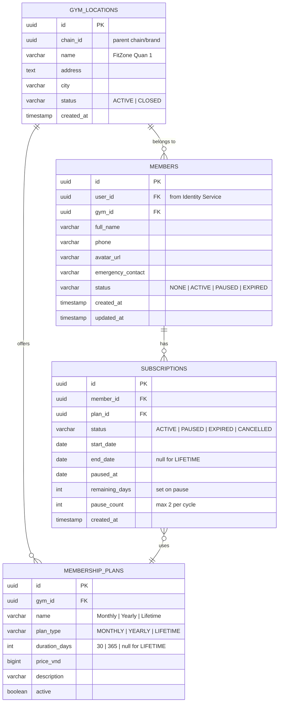

# Member Service

> **Tech:** Java 26 (Spring Boot 4) | **DB:** PostgreSQL | **Port:** 50051 (gRPC) / 8080 (REST)

## Responsibilities

- Membership lifecycle: `NONE → ACTIVE → PAUSED → ACTIVE → EXPIRED`
- Subscription plans: `MONTHLY`, `YEARLY`, `LIFETIME`
- Pause / resume with remaining days calculation (not applicable to LIFETIME)
- Member profile management (name, phone, avatar, emergency contact)
- **Gym location management** — owns the canonical `gym_locations` table
- Gym and membership authorization for Check-in through `GetGymLocation` and `ValidateMembership`
- Check-in owns kiosk credentials, QR root keys, payload issuance, and validation
- Spending history query (delegates to Payment Service)
- Multi-gym: each member belongs to a `gym_id`

---

## State Machine



### Pause / Resume Logic

```
Pause:
  remaining_days = end_date - today
  status = PAUSED
  paused_at = now()

Resume:
  new_end_date = today + remaining_days
  status = ACTIVE
  paused_at = null
  remaining_days = null

Rules:
  - LIFETIME cannot pause. Returns error: CANNOT_PAUSE_LIFETIME (gRPC INVALID_ARGUMENT)
  - Max pause duration: 30 days (configurable per gym)
  - Max pauses per subscription cycle: 2
```

---

## Data Model



---

## Check-in Integration Boundary

Member Service remains the source of truth for gym locations and membership state. The future Check-in Service owns display kiosks, versioned QR root keys, short-lived HMAC payload issuance, and QR validation.

```text
Kiosk provisioning:
  1. An admin calls Check-in RegisterDevice(gym_id, device_name).
  2. Check-in calls Member GetGymLocation(gym_id) over a verified workload channel.
  3. Member returns the canonical location; Check-in requires status ACTIVE.
  4. Check-in provisions its own root key and device credential.

Member scan:
  1. Check-in validates the signed QR locally.
  2. Check-in calls Member ValidateMembership(member_id, gym_id).
  3. Member confirms ACTIVE status and the required gym scope.
```

Member's public contract exposes no QR secret API. Existing Member implementation cleanup is separate work: remove its QR classes and scheduler, and drop `gym_qr_secrets` through a new Flyway migration rather than modifying the deployed initial migration.

---

## Kafka Events

### Published

| Topic | Key | Trigger | Payload |
|-------|-----|---------|---------|
| `membership.activated.v1` | `member_id` | Payment completed | `{member_id, user_id, plan_type, start_date, end_date, gym_id, is_renewal, timestamp}` |
| `membership.paused.v1` | `member_id` | Member pauses | `{member_id, paused_at, remaining_days, gym_id}` |
| `membership.resumed.v1` | `member_id` | Member resumes | `{member_id, new_end_date, gym_id}` |
| `membership.expiring-soon.v1` | `member_id` | Scheduled job (7d before) | `{member_id, end_date, plan_type, gym_id}` |
| `membership.expired.v1` | `member_id` | Scheduled job (end_date reached) | `{member_id, expired_at, gym_id}` |

### Consumed

| Topic | Action |
|-------|--------|
| `identity.user.registered.v1` | Create member shell (status=NONE) |
| `identity.user.suspended.v1` | Freeze member profile, cancel active subscription |
| `payment.completed.v1` (type=MEMBERSHIP) | Activate or renew subscription |

---

## Scheduled Jobs

| Job | Schedule | Action |
|-----|----------|--------|
| Expiry Check | `0 6 * * *` (6 AM) | Find subscriptions where `end_date <= today`, set EXPIRED |
| Expiry Warning | `0 9 * * *` (9 AM) | Find subscriptions where `end_date = today + 7d`, publish `membership.expiring-soon.v1` |

---

## API (gRPC)

```protobuf
service MemberService {
  // Member profile
  rpc GetMember(GetMemberRequest) returns (MemberResponse);
  rpc UpdateProfile(UpdateProfileRequest) returns (MemberResponse);
  rpc ListMembers(ListMembersRequest) returns (ListMembersResponse);  // Admin

  // Membership
  rpc GetPlans(GetPlansRequest) returns (PlansResponse);
  rpc PurchaseMembership(PurchaseMembershipRequest) returns (PurchaseResponse);
  rpc PauseMembership(PauseMembershipRequest) returns (MembershipResponse);
  rpc ResumeMembership(ResumeMembershipRequest) returns (MembershipResponse);
  rpc GetMembershipStatus(GetMembershipStatusRequest) returns (MembershipResponse);

  // Internal: requires verified ms-gym-identifier workload identity; no HTTP mapping.
  rpc GetMembershipStatusByUserId(GetMembershipStatusByUserIdRequest)
      returns (MembershipResponse);

  // Gym Location Management (Admin)
  rpc CreateGymLocation(CreateGymLocationRequest) returns (GymLocationResponse);
  rpc UpdateGymLocation(UpdateGymLocationRequest) returns (GymLocationResponse);
  rpc ListGymLocations(ListGymLocationsRequest) returns (GymLocationsResponse);
  rpc GetGymLocation(GetGymLocationRequest) returns (GymLocationResponse);

  // Internal-Only (blocked at API Gateway from external HTTP routing)
  rpc ValidateMembership(ValidateMembershipRequest) returns (ValidateMembershipResponse);
  rpc ListMembersByStatus(ListMembersByStatusRequest) returns (ListMembersByStatusResponse);
}

message GetMembershipStatusByUserIdRequest {
  string user_id = 1;
}
```

`GetMembershipStatus(member_id)` remains unchanged. The user-ID lookup returns
`NONE` for a known user with no subscription. If Member cannot answer, it returns
an availability failure and Identifier does not guess. `user_id`, `member_id`,
and `gym_id` remain separate opaque identifiers.

---

## Internal Route Security

Internal-only gRPC methods (`GetMembershipStatusByUserId`, `ValidateMembership`,
`ListMembersByStatus`) are blocked from external access:
1. **Kong Routing:** Kong only registers routes for public endpoints. Internal method paths are not mapped in the `*_http.yaml` source of truth.
2. **Verified workload channel:** internal callers use mTLS; the certificate identity/SAN identifies the workload and a caller-supplied role or `x-service-id` header alone establishes no trust. `GetMembershipStatusByUserId` authorizes only the verified `ms-gym-identifier` peer.
3. **Network Policies:** K8s network policies restrict native gRPC ingress on port `50051` to authorized service pods, including the Identifier-to-Member path.

---

## Target Clean Architecture

The current Member repository may still contain QR implementation classes until its separate cleanup is completed; they are not part of the target service contract.

```
src/main/java/com/gym/member/
├── domain/
│   ├── model/
│   │   ├── Member.java
│   │   ├── Subscription.java
│   │   ├── MembershipPlan.java
│   │   ├── MembershipStatus.java          // enum
│   │   ├── PlanType.java                   // MONTHLY, YEARLY, LIFETIME
│   │   └── GymLocation.java
│   ├── exception/
│   │   ├── MemberNotFoundException.java
│   │   ├── CannotPauseLifetimeException.java
│   │   └── MaxPausesExceededException.java
│   └── event/
│       ├── MembershipActivatedEvent.java
│       └── MembershipExpiringSoonEvent.java
├── application/
│   ├── port/
│   │   ├── in/
│   │   │   ├── PurchaseMembershipUseCase.java
│   │   │   ├── PauseMembershipUseCase.java
│   │   │   ├── ResumeMembershipUseCase.java
│   │   │   ├── ManageGymLocationUseCase.java
│   │   │   └── ListMembersByStatusUseCase.java
│   │   └── out/
│   │       ├── MemberRepository.java
│   │       ├── SubscriptionRepository.java
│   │       ├── GymLocationRepository.java
│   │       ├── PaymentClient.java
│   │       └── EventPublisher.java
│   ├── service/
│   │   ├── MembershipService.java
│   │   └── GymLocationService.java
│   └── scheduler/
│       ├── ExpiryCheckJob.java
│       └── ExpiryWarningJob.java
├── adapter/
│   ├── in/grpc/
│   │   ├── MemberGrpcHandler.java
│   │   └── MemberProtoMapper.java
│   ├── out/persistence/
│   │   ├── MemberJpaEntity.java
│   │   ├── SubscriptionJpaEntity.java
│   │   ├── GymLocationJpaEntity.java
│   │   ├── MemberJpaRepository.java
│   │   └── MemberPersistenceAdapter.java
│   ├── out/grpc/
│   │   └── PaymentGrpcClient.java
│   └── out/kafka/
│       ├── MemberEventPublisher.java
│       └── MemberEventConsumer.java
└── config/
    └── GrpcConfig.java
```
