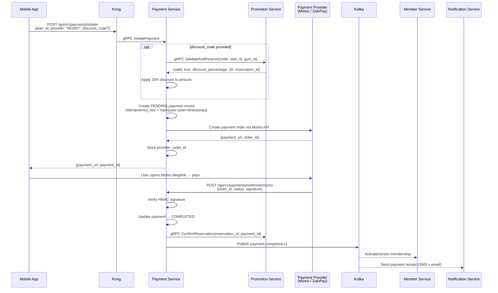
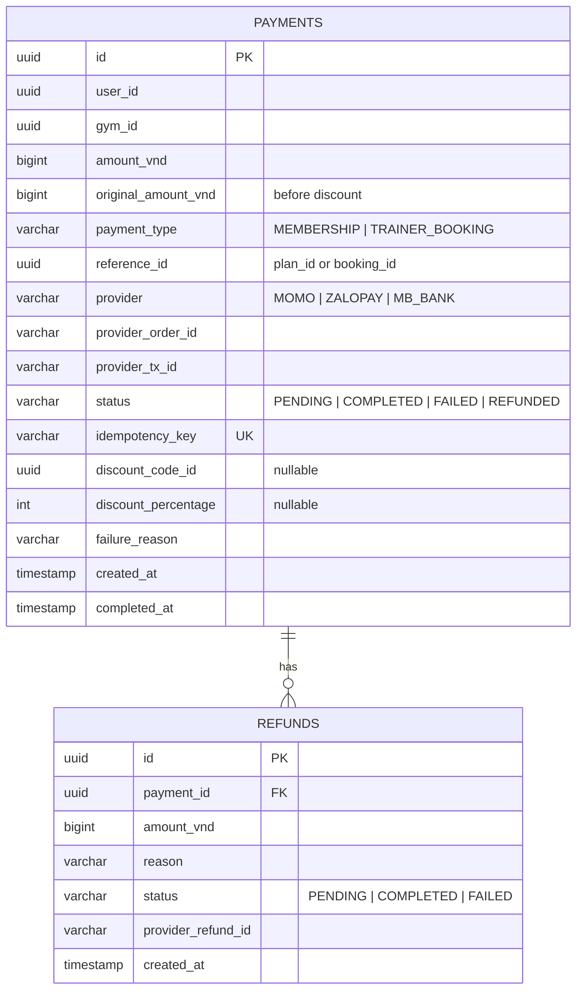

# Payment Service

> **Tech:** Java 26 (Spring Boot 4) | **DB:** PostgreSQL | **Port:** 50051 (gRPC) / 8080 (REST)

## Responsibilities

- Payment orchestration: **Momo**, **ZaloPay**, **VN bank transfer (MB Bank)**
- Idempotent payment processing (idempotency key per request)
- Payment types: `MEMBERSHIP` purchase/renewal, `TRAINER_BOOKING` fee
- Refund handling (membership pause mid-cycle, booking cancellation)
- Transaction history (customer spending, trainer coaching earnings)
- Webhook receivers for payment provider callbacks
- Discount code application (validates with Promotion Service)

---

## Payment Flow



---

## Data Model



---

## Payment Provider Integration

### Momo

```
Endpoint: POST https://payment.momo.vn/v2/gateway/api/create
Headers: Content-Type: application/json

Request:
  partnerCode: "GYM_CHAIN_001"
  requestId: uuid
  amount: 500000
  orderId: payment_id
  orderInfo: "Monthly Membership - FitZone Q1"
  redirectUrl: "gymapp://payment/result"
  ipnUrl: "https://api.gymchain.vn/api/v1/payments/webhook/momo"
  requestType: "captureWallet"
  signature: HMAC_SHA256(raw_data, secret_key)

Webhook callback:
  Verify: HMAC_SHA256 signature with Momo secret
  Match: orderId → payment_id
```

### ZaloPay

```
Endpoint: POST https://sb-openapi.zalopay.vn/v2/create
Request:
  app_id: 12345
  app_user: user_id
  app_trans_id: "{yyMMdd}_{payment_id}"
  amount: 500000
  description: "Monthly Membership"
  callback_url: "https://api.gymchain.vn/api/v1/payments/webhook/zalopay"
  mac: HMAC_SHA256(data, key1)

Webhook:
  Verify: HMAC_SHA256 with key2
```

### MB Bank (VN Bank Transfer via VNPay)

```
Endpoint: POST https://pay.vnpay.vn/vpcpay.html (redirect)
Request:
  vnp_TmnCode: "GYM_CHAIN"
  vnp_Amount: 50000000          # amount x 100 (VNPay convention)
  vnp_OrderInfo: "Monthly Membership"
  vnp_ReturnUrl: "gymapp://payment/result"
  vnp_IpnUrl: "https://api.gymchain.vn/api/v1/payments/webhook/vnpay"
  vnp_SecureHash: HMAC_SHA512(sorted_params, secret_key)

Webhook (IPN callback):
  Verify: HMAC_SHA512 with VNPay secret hash key
  Match: vnp_TxnRef → payment_id
  Check: vnp_ResponseCode == "00" means success
  Respond: {"RspCode": "00", "Message": "Confirm Success"}
```

---

## Idempotency

```
idempotency_key = SHA256(user_id + payment_type + reference_id + date)

On InitiatePayment:
  1. Compute idempotency_key
  2. SELECT * FROM payments WHERE idempotency_key = ?
  3. If exists AND status = COMPLETED → return existing result (no double charge)
  4. If exists AND status = PENDING → return existing payment_url
  5. If exists AND status = FAILED → create new attempt (new payment_id)
  6. If not exists → create new PENDING record
```

---

## Kafka Events

### Published

| Topic | Key | Trigger | Payload |
|-------|-----|---------|---------|
| `payment.completed.v1` | `user_id` | Provider webhook confirms | `{payment_id, user_id, type, reference_id, amount_vnd, gym_id, provider}` |
| `payment.failed` | `user_id` | Provider webhook rejects | `{payment_id, user_id, reason, gym_id, type, reference_id}` |
| `payment.refunded` | `user_id` | Admin triggers refund | `{payment_id, user_id, refund_amount_vnd, gym_id, type, reference_id}` |

### Consumed

| Topic | Action |
|-------|--------|
| `membership.paused.v1` | Calculate prorated refund if applicable (non-LIFETIME, remaining > 50% cycle) |
| `booking.cancelled` | Process full/partial refund based on cancel policy (timing-based) |
| `booking.auto-rejected` | Process automatic 100% refund for unaccepted trainer bookings |
| `trainer.suspended` | Process automatic 100% refund for all future bookings linked to the trainer |

---

## API

### gRPC (internal + gRPC-Gateway for client-facing)

```protobuf
service PaymentService {
  // Customer-facing (exposed via gRPC-Gateway as REST)
  rpc InitiatePayment(InitiatePaymentRequest) returns (InitiatePaymentResponse);
  rpc GetPaymentStatus(GetPaymentStatusRequest) returns (PaymentStatusResponse);
  rpc GetSpendingHistory(GetSpendingHistoryRequest) returns (SpendingHistoryResponse);

  // Admin
  rpc RefundPayment(RefundPaymentRequest) returns (RefundResponse);
  rpc GetRevenueReport(RevenueReportRequest) returns (RevenueReportResponse);

  // Internal (service-to-service only, blocked from Kong external routes)
  rpc GetPaymentsByUser(GetPaymentsByUserRequest) returns (PaymentsResponse);
}
```

### Native REST Endpoints (NOT gRPC-Gateway)

Payment provider webhooks are **plain Spring MVC REST controllers**, not gRPC methods.
Providers send proprietary JSON/form-encoded payloads in their own format — gRPC-Gateway
would reject unknown fields or mismatched structures with 400.

```java
// adapter/in/rest/WebhookController.java — Spring @RestController

@RestController
@RequestMapping("/api/v1/payments/webhook")
public class WebhookController {

    @PostMapping("/momo")       // Momo sends JSON with their own schema
    public ResponseEntity<Map<String, Object>> momoCallback(@RequestBody Map<String, Object> payload) { ... }

    @PostMapping("/zalopay")    // ZaloPay sends JSON with mac field
    public ResponseEntity<Map<String, Object>> zalopayCallback(@RequestBody Map<String, Object> payload) { ... }

    @PostMapping("/vnpay")      // VNPay sends query params (GET or POST)
    public ResponseEntity<Map<String, String>> vnpayCallback(@RequestParam Map<String, String> params) { ... }
}
```

**Why native REST, not gRPC-Gateway:**
- Provider payload schemas change without notice — raw `Map` parsing is resilient
- VNPay sends query parameters, not JSON body — gRPC-Gateway can't handle this
- Webhook signature verification needs raw request bytes — gRPC-Gateway transforms the body
- These endpoints have no JWT (disabled in Kong) — they use HMAC signature verification instead

---

## Orphan Webhook Handling

```
If webhook arrives but no matching payment record exists:

  1. Log full payload to dead_letter_webhooks table:
     dead_letter_webhooks(id, provider, payload_json, received_at, resolved)

  2. Return HTTP 200 to provider (prevent retry storm)

  3. Alert ops team via monitoring (Prometheus counter: payment_webhook_orphan_total)

  4. Possible causes:
     - Provider callback arrived before DB commit (race condition)
     - Record was purged or DB error during creation
     - Replay attack with fabricated order_id

  5. Resolution: Ops reviews dead_letter_webhooks, manually reconciles if legitimate
```

---

## Discount Code Atomicity

```
Problem: ValidateDiscount + pay + RedeemDiscount = 3 separate steps.
  If payment succeeds but RedeemDiscount fails, code reusable beyond limits.

Solution: Reservation pattern

  1. Payment Service calls ValidateAndReserve(code, user_id)
     → Promotion Service atomically validates + increments current_usage
     → Returns reservation_id (TTL 30 min)

  2. If payment completes:
     → Payment Service calls ConfirmReservation(reservation_id)
     → Promotion Service commits the redemption record

  3. If payment fails or times out:
     → Reservation auto-expires (scheduled cleanup decrements current_usage)
     → Or Payment Service calls ReleaseReservation(reservation_id)

This prevents double-use even under concurrent requests.
```

---

## Clean Architecture

```
src/main/java/com/gym/payment/
├── domain/
│   ├── model/
│   │   ├── Payment.java
│   │   ├── Refund.java
│   │   ├── PaymentStatus.java         // PENDING, COMPLETED, FAILED, REFUNDED
│   │   ├── PaymentType.java           // MEMBERSHIP, TRAINER_BOOKING
│   │   └── PaymentProvider.java       // MOMO, ZALOPAY, MB_BANK
│   └── exception/
│       ├── PaymentAlreadyCompletedException.java
│       └── InvalidWebhookSignatureException.java
├── application/
│   ├── port/
│   │   ├── in/
│   │   │   ├── InitiatePaymentUseCase.java
│   │   │   ├── ProcessWebhookUseCase.java
│   │   │   └── RefundPaymentUseCase.java
│   │   └── out/
│   │       ├── PaymentRepository.java
│   │       ├── PaymentProviderGateway.java   // interface for Momo/ZaloPay/MB
│   │       ├── PromotionClient.java
│   │       └── EventPublisher.java
│   └── service/
│       └── PaymentService.java
├── adapter/
│   ├── in/grpc/
│   │   ├── PaymentGrpcHandler.java
│   │   └── PaymentProtoMapper.java
│   ├── in/rest/                             // native REST (NOT gRPC-Gateway)
│   │   └── WebhookController.java           // Momo/ZaloPay/VNPay webhook endpoints
│   ├── out/persistence/
│   │   ├── PaymentJpaEntity.java
│   │   └── PaymentPersistenceAdapter.java
│   ├── out/provider/                       // strategy pattern
│   │   ├── MomoPaymentGateway.java         // implements PaymentProviderGateway
│   │   ├── ZaloPayPaymentGateway.java
│   │   ├── MBBankPaymentGateway.java
│   │   └── PaymentProviderFactory.java     // returns correct gateway by enum
│   ├── out/grpc/
│   │   └── PromotionGrpcClient.java
│   └── out/kafka/
│       ├── PaymentEventPublisher.java
│       └── PaymentEventConsumer.java
└── config/
    ├── PaymentProviderConfig.java
    └── GrpcConfig.java
```
