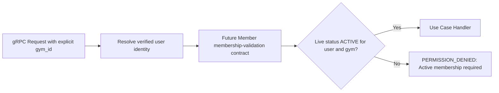

# Workout Service

> **Tech:** Go Gin | **DB:** Apache Cassandra | **Port:** 50051 (gRPC) / 8080 (REST)

## Responsibilities

- Log workouts (exercises, sets, reps, weight, duration, notes)
- Create / manage workout templates (routines, splits)
- Workout history with pagination (time-series query)
- Personal records (PR) tracking per exercise
- **Access gated:** only live `ACTIVE` membership through a future explicit, gym-scoped Member contract; never a JWT status claim

---

## Access Control



Workout is deferred. Before implementation, freeze an exact Workout-to-Member mTLS method and authorization policy. Stable JWT supplies identity/role only. Request `gym_id` is context and must match Member-owned live membership state.

---

## Data Model (Cassandra)

```
-- High-write: every set/rep logged in real-time
-- Partition by (user_id, month) for time-bounded queries
-- Clustering by workout_id DESC for reverse-chrono reads

CREATE TYPE exercise_set (
    set_number    INT,
    reps          INT,
    weight_kg     DECIMAL,
    duration_sec  INT,
    is_warmup     BOOLEAN
);

CREATE TYPE exercise_entry (
    exercise_name TEXT,
    muscle_group  TEXT,
    sets          LIST<FROZEN<exercise_set>>,
    notes         TEXT
);

CREATE TABLE workout_logs (
    user_id       UUID,
    month         TEXT,            -- '2024-12' for partition sizing
    workout_id    TIMEUUID,
    gym_id        UUID,
    template_id   UUID,            -- null if ad-hoc
    exercises     LIST<FROZEN<exercise_entry>>,
    duration_min  INT,
    notes         TEXT,
    logged_at     TIMESTAMP,
    PRIMARY KEY ((user_id, month), workout_id)
) WITH CLUSTERING ORDER BY (workout_id DESC);

-- Templates: user's saved routines
CREATE TABLE workout_templates (
    user_id       UUID,
    template_id   UUID,
    name          TEXT,
    split_tag     TEXT,            -- 'push', 'pull', 'legs', 'upper', 'lower'
    exercises     LIST<FROZEN<exercise_entry>>,
    created_at    TIMESTAMP,
    updated_at    TIMESTAMP,
    PRIMARY KEY (user_id, template_id)
);

-- Personal records per exercise
CREATE TABLE personal_records (
    user_id        UUID,
    exercise_name  TEXT,
    max_weight_kg  DECIMAL,
    max_reps       INT,
    max_volume_kg  DECIMAL,        -- weight * reps (best single set)
    achieved_at    TIMESTAMP,
    workout_id     TIMEUUID,
    PRIMARY KEY (user_id, exercise_name)
);
```

### Why Cassandra Here

| Requirement | Cassandra Fit |
|-------------|---------------|
| Every rep/set logged = very high write throughput | Write-optimized (LSM-tree) |
| Read pattern: "my workouts this month" = single partition | Partition key `(user_id, month)` |
| Append-only (workouts rarely updated/deleted) | Immutable-friendly |
| No cross-user queries needed | No joins required |
| Time-series ordering | Clustering by TIMEUUID DESC |

---

## Kafka Events

### Published

| Topic | Key | Payload | Consumed By |
|-------|-----|---------|-------------|
| `workout.logged` | `user_id` | `{user_id, gym_id, workout_id, exercise_count, duration_min, logged_at}` | Analytics Service |

### Consumed

None — Workout Service is event producer only.

---

## API (gRPC)

```protobuf
service WorkoutService {
  // Workout logging
  rpc LogWorkout(LogWorkoutRequest) returns (LogWorkoutResponse);
  rpc GetWorkout(GetWorkoutRequest) returns (WorkoutResponse);
  rpc GetWorkoutHistory(GetWorkoutHistoryRequest) returns (WorkoutHistoryResponse);
  rpc DeleteWorkout(DeleteWorkoutRequest) returns (google.protobuf.Empty);

  // Templates
  rpc CreateTemplate(CreateTemplateRequest) returns (TemplateResponse);
  rpc UpdateTemplate(UpdateTemplateRequest) returns (TemplateResponse);
  rpc DeleteTemplate(DeleteTemplateRequest) returns (google.protobuf.Empty);
  rpc ListTemplates(ListTemplatesRequest) returns (TemplatesResponse);
  rpc GetTemplate(GetTemplateRequest) returns (TemplateResponse);

  // Personal Records
  rpc GetPersonalRecords(GetPRRequest) returns (PRListResponse);
}

message LogWorkoutRequest {
  string gym_id = 1;
  string template_id = 2;        // optional
  repeated ExerciseEntry exercises = 3;
  int32 duration_minutes = 4;
  string notes = 5;
}

message ExerciseEntry {
  string exercise_name = 1;
  string muscle_group = 2;
  repeated ExerciseSet sets = 3;
  string notes = 4;
}

message ExerciseSet {
  int32 set_number = 1;
  int32 reps = 2;
  double weight_kg = 3;
  int32 duration_seconds = 4;
  bool is_warmup = 5;
}
```

---

## PR Auto-Detection

```
On LogWorkout:
  for each exercise in workout:
    best_set = max(set.weight_kg * set.reps) across all sets
    current_pr = SELECT max_volume_kg FROM personal_records
                 WHERE user_id = ? AND exercise_name = ?
    if best_set > current_pr:
      UPDATE personal_records SET max_volume_kg = best_set, ...
      Mark in response: "New PR! 🏆"
```

---

## Clean Architecture

```
cmd/server/main.go
internal/
├── domain/
│   ├── workout.go           // Workout, ExerciseEntry, ExerciseSet
│   ├── template.go          // WorkoutTemplate
│   ├── personal_record.go   // PersonalRecord
│   └── errors.go
├── usecase/
│   ├── log_workout.go       // LogWorkoutUseCase
│   ├── get_history.go       // GetWorkoutHistoryUseCase
│   ├── manage_template.go   // CRUD template use cases
│   ├── check_pr.go          // PR detection logic
│   └── port/
│       ├── workout_repo.go       // WorkoutRepository interface
│       ├── template_repo.go      // TemplateRepository interface
│       ├── pr_repo.go            // PersonalRecordRepository interface
│       └── event_publisher.go    // EventPublisher interface
├── adapter/
│   ├── grpc/
│   │   ├── handler.go
│   │   ├── mapper.go
│   │   └── auth_interceptor.go   // stable identity only; live membership via Member port
│   ├── repository/
│   │   ├── cassandra_workout.go
│   │   ├── cassandra_template.go
│   │   └── cassandra_pr.go
│   └── kafka/
│       └── event_publisher.go
└── config/
    └── config.go
```
