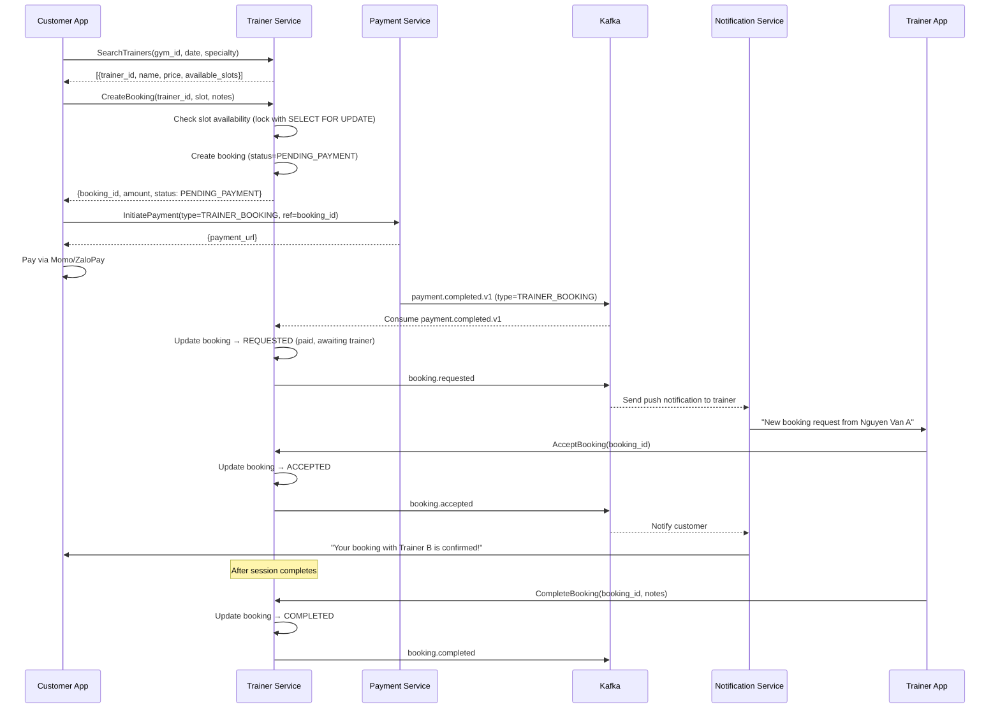
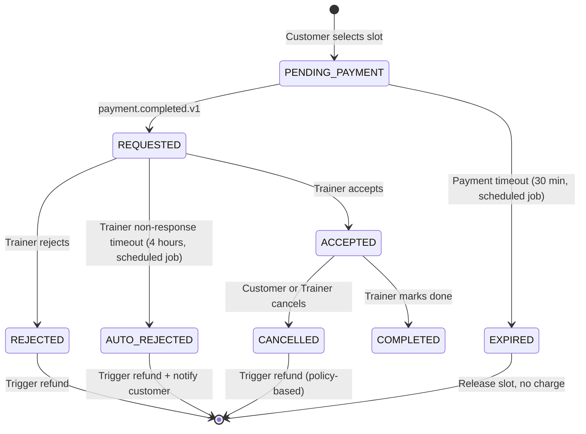
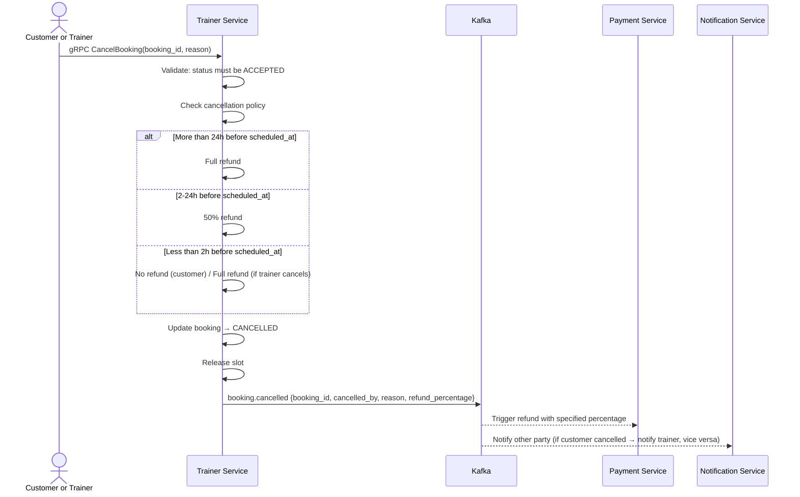
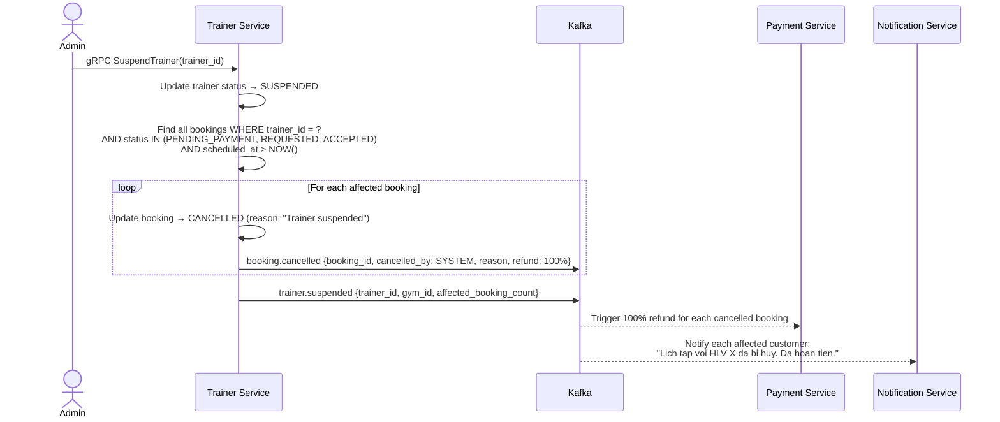
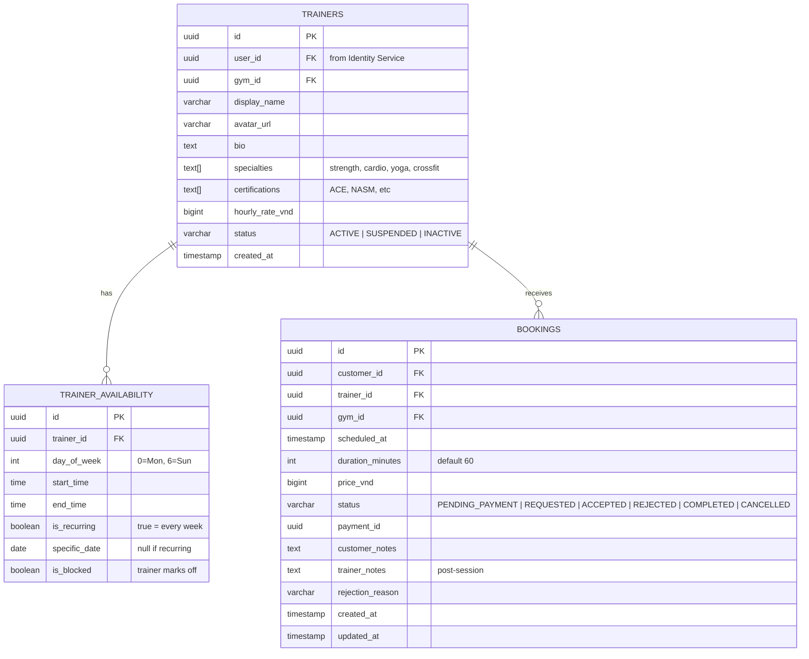

# Trainer Service

> **Tech:** Java 26 (Spring Boot 4) | **DB:** PostgreSQL | **Port:** 50051 (gRPC) / 8080 (REST)

## Responsibilities

- Trainer profile CRUD (admin creates account, trainer updates profile)
- Availability calendar management (trainer sets free slots)
- Booking lifecycle: `REQUESTED → ACCEPTED / REJECTED → COMPLETED / CANCELLED`
- Trainer search with filters (specialty, price range, availability, gym location)
- Coaching history (trainer views past bookings)
- Trainer is **paid by gym** (salary) — no direct customer-to-trainer payment split

---

## Booking Flow



### Booking State Machine



---

## Booking Timeout Enforcement

### Payment Timeout (PENDING_PAYMENT, 30 min)

```
Scheduled Job: BookingPaymentTimeoutJob
  Schedule: every 5 minutes
  Query: SELECT * FROM bookings
         WHERE status = 'PENDING_PAYMENT'
         AND created_at < NOW() - INTERVAL '30 minutes'

  Action per expired booking:
    1. Update status → EXPIRED
    2. Release slot (remove from availability block)
    3. No refund needed (customer never paid)
    4. Publish: booking.expired {booking_id, trainer_id, slot}
```

### Trainer Non-Response Timeout (REQUESTED, 4 hours)

```
Scheduled Job: BookingTrainerTimeoutJob
  Schedule: every 15 minutes
  Query: SELECT * FROM bookings
         WHERE status = 'REQUESTED'
         AND updated_at < NOW() - INTERVAL '4 hours'

  Action per timed-out booking:
    1. Update status → AUTO_REJECTED
    2. Release slot
    3. Publish: booking.auto-rejected {booking_id, customer_id, trainer_id}
       → Notification Service sends: "HLV chua phan hoi. Da hoan tien."
       → Payment Service triggers refund via payment.refunded event
```

---

## Booking Cancellation Policy



### Cancellation Rules

| Who Cancels | Timing | Refund |
|-------------|--------|--------|
| Customer | > 24h before session | 100% |
| Customer | 2-24h before session | 50% |
| Customer | < 2h before session | 0% |
| Trainer | Any time | 100% (gym absorbs cost) |
| System (auto-reject timeout) | N/A | 100% |

---

## Trainer Suspension Cascade



---

## Data Model



---

## Availability Logic

```
Slot = 1 hour block

Available slots for Trainer X on Date Y:
  1. Get recurring availability for day_of_week(Y)
  2. Get specific_date overrides for Y
  3. Subtract blocked slots
  4. Subtract existing ACCEPTED/REQUESTED bookings on Y
  5. Return remaining free slots

Example:
  Recurring: Mon 08:00-17:00 (9 slots)
  Blocked: Mon 12:00-13:00 (lunch)
  Booked: Mon 09:00-10:00, Mon 14:00-15:00
  Available: [08:00, 10:00, 11:00, 13:00, 15:00, 16:00] → 6 slots
```

---

## Kafka Events

### Published

| Topic | Key | Payload |
|-------|-----|---------|
| `booking.requested` | `booking_id` | `{booking_id, customer_id, trainer_id, scheduled_at, gym_id}` |
| `booking.accepted` | `booking_id` | `{booking_id, customer_id, trainer_id, gym_id}` |
| `booking.rejected` | `booking_id` | `{booking_id, customer_id, trainer_id, reason, gym_id}` |
| `booking.completed` | `booking_id` | `{booking_id, trainer_id, customer_id, duration_min, gym_id}` |
| `booking.cancelled` | `booking_id` | `{booking_id, customer_id, trainer_id, cancelled_by, reason, refund_percentage, gym_id}` |
| `booking.expired` | `booking_id` | `{booking_id, trainer_id, slot}` |
| `booking.auto-rejected` | `booking_id` | `{booking_id, customer_id, trainer_id, gym_id}` |
| `trainer.created` | `trainer_id` | `{trainer_id, user_id, gym_id, display_name}` |
| `trainer.suspended` | `trainer_id` | `{trainer_id, gym_id, affected_booking_count}` |

### Consumed

| Topic | Action |
|-------|--------|
| `payment.completed.v1` (type=TRAINER_BOOKING) | Move booking from PENDING_PAYMENT → REQUESTED |
| `payment.refunded` (ref=booking_id) | Move booking to CANCELLED |
| `identity.user.suspended.v1` | If user is Trainer: freeze profile, cancel all future bookings, publish cancellations.<br/>If user is Customer: cancel all future bookings, publish cancellations. |

---

## API (gRPC)

```protobuf
service TrainerService {
  // Public (customer)
  rpc SearchTrainers(SearchTrainersRequest) returns (TrainersResponse);
  rpc GetTrainerProfile(GetTrainerProfileRequest) returns (TrainerResponse);
  rpc GetAvailableSlots(GetSlotsRequest) returns (SlotsResponse);
  rpc CreateBooking(CreateBookingRequest) returns (BookingResponse);
  rpc CancelBooking(CancelBookingRequest) returns (BookingResponse);
  rpc GetMyBookings(GetMyBookingsRequest) returns (BookingsResponse);

  // Trainer
  rpc UpdateMyProfile(UpdateTrainerProfileRequest) returns (TrainerResponse);
  rpc SetAvailability(SetAvailabilityRequest) returns (AvailabilityResponse);
  rpc AcceptBooking(AcceptBookingRequest) returns (BookingResponse);
  rpc RejectBooking(RejectBookingRequest) returns (BookingResponse);
  rpc CompleteBooking(CompleteBookingRequest) returns (BookingResponse);
  rpc GetCoachingHistory(GetCoachingHistoryRequest) returns (BookingsResponse);

  // Admin
  rpc CreateTrainer(CreateTrainerRequest) returns (TrainerResponse);
  rpc SuspendTrainer(SuspendTrainerRequest) returns (SuspendTrainerResponse);  // returns affected_booking_count
  rpc ListTrainers(ListTrainersRequest) returns (TrainersResponse);
}
```

---

## Scheduled Jobs

| Job | Schedule | Action |
|-----|----------|--------|
| BookingPaymentTimeoutJob | Every 5 min | PENDING_PAYMENT > 30 min old → EXPIRED, release slot |
| BookingTrainerTimeoutJob | Every 15 min | REQUESTED > 4 hours old → AUTO_REJECTED, refund, notify |

---

## Clean Architecture

```
src/main/java/com/gym/trainer/
├── domain/
│   ├── model/
│   │   ├── Trainer.java
│   │   ├── TrainerAvailability.java
│   │   ├── Booking.java
│   │   ├── BookingStatus.java
│   │   └── TimeSlot.java
│   └── exception/
│       ├── SlotNotAvailableException.java
│       ├── BookingNotFoundException.java
│       └── UnauthorizedBookingActionException.java
├── application/
│   ├── port/
│   │   ├── in/
│   │   │   ├── SearchTrainersUseCase.java
│   │   │   ├── ManageBookingUseCase.java
│   │   │   ├── ManageAvailabilityUseCase.java
│   │   │   └── GetCoachingHistoryUseCase.java
│   │   └── out/
│   │       ├── TrainerRepository.java
│   │       ├── BookingRepository.java
│   │       ├── AvailabilityRepository.java
│   │       └── EventPublisher.java
│   ├── service/
│   │   ├── TrainerSearchService.java
│   │   ├── BookingService.java
│   │   └── AvailabilityService.java
│   └── scheduler/
│       ├── BookingPaymentTimeoutJob.java
│       └── BookingTrainerTimeoutJob.java
├── adapter/
│   ├── in/grpc/
│   │   ├── TrainerGrpcHandler.java
│   │   └── TrainerProtoMapper.java
│   ├── out/persistence/
│   │   ├── TrainerJpaEntity.java
│   │   ├── BookingJpaEntity.java
│   │   └── TrainerPersistenceAdapter.java
│   └── out/kafka/
│       ├── TrainerEventPublisher.java
│       └── TrainerEventConsumer.java
└── config/
    └── GrpcConfig.java
```
