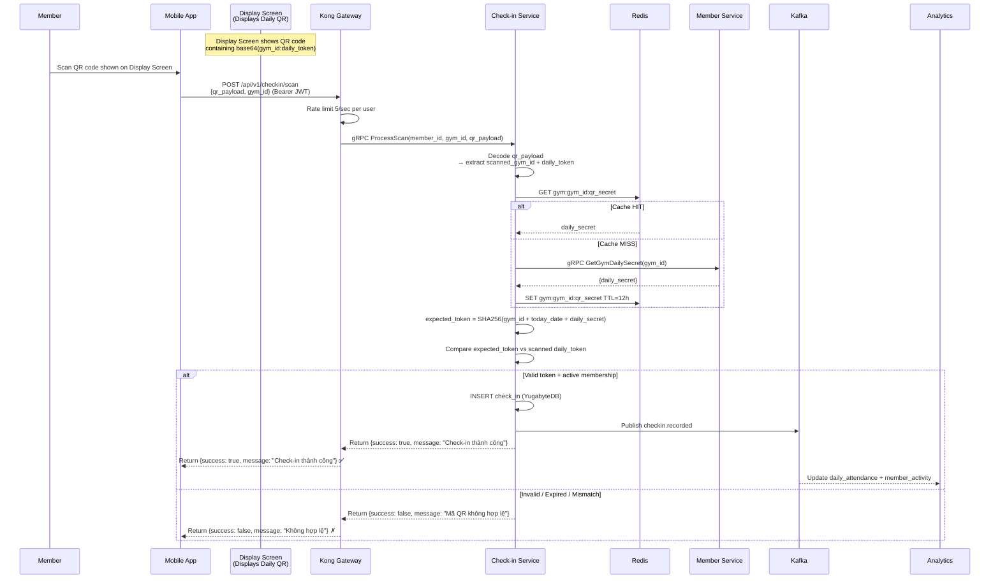

# Check-in Service

> **Tech:** Go Gin | **DB:** YugabyteDB | **Port:** 50051 (gRPC) / 8080 (REST)

## Responsibilities

- Process QR scans sent from members' Mobile Apps
- Validate the gym's daily-rotating QR code scanned by the member
- Verify member's status (ACTIVE) and correct location membership
- Record check-in events and publish `checkin.recorded` events to Kafka
- Return response within **<100ms**

---

## Architecture of Check-in System

Rather than checking a member's phone QR, the check-in system uses a **reversed scanning approach**:

1. **Display Screen:**
   - Every gym entrance has a simple display screen showing a QR code.
   - The QR code contains: `base64(gym_id + ":" + daily_token)`.
   - The token rotates automatically at midnight (`00:00`).

2. **Customer Scanning:**
   - The customer walks up, opens their logged-in Mobile App, and scans the QR code on the display screen.
   - The app makes an authenticated REST API call with their JWT to the backend.

3. **Check-in Processing & Verification:**
   - On successful validation, the Check-in Service records the check-in and returns a success response directly to the app.
   - App displays check-in confirmation (`✓ Check-in thành công`).

---

## QR Validation Flow



---

## QR Payload Structure & Security

```
QR Content (displayed on Door screen):
  base64(gym_id + ":" + daily_token)

Daily Token Generation (by Member Service / Gym controller):
  daily_token = SHA256(gym_id + "2024-12-15" + daily_secret)

Daily Secret:
  - Per-gym secret key generated randomly and rotated occasionally by admins.
  - Used as salt to prevent token spoofing.

Why this is secure:
  - Token rotates daily. An old photo of the screen will not work tomorrow.
  - Prevent remote check-in: Mobile App can compare phone GPS location with the gym's coordinates to ensure customer is actually at the gym.
```

---

## Data Model (YugabyteDB)

```sql
-- YugabyteDB (PostgreSQL-compatible DDL)

CREATE TABLE gym_secrets (
    gym_id          UUID PRIMARY KEY,
    daily_secret    VARCHAR(64) NOT NULL,    -- used for daily token generation
    updated_at      TIMESTAMPTZ NOT NULL DEFAULT NOW()
);

CREATE TABLE check_ins (
    id              UUID DEFAULT gen_random_uuid() PRIMARY KEY,
    member_id       UUID NOT NULL,
    gym_id          UUID NOT NULL,
    checked_in_at   TIMESTAMPTZ NOT NULL DEFAULT NOW(),

    -- Indexes for common queries
    CONSTRAINT idx_checkin_member_date
        UNIQUE (member_id, checked_in_at)
);

-- For analytics: "how many check-ins at location X on date Y"
CREATE INDEX idx_checkin_gym_date
    ON check_ins (gym_id, checked_in_at DESC);

-- For duplicate prevention: one check-in per member per hour
CREATE UNIQUE INDEX idx_checkin_dedup
    ON check_ins (member_id, date_trunc('hour', checked_in_at));
```

---

## Kafka Events

### Published

| Topic | Key | Payload |
|-------|-----|---------|
| `checkin.recorded` | `member_id` | `{member_id, gym_id, device_id, checked_in_at}` |

---

## API (gRPC)

```protobuf
service CheckInService {
  // Mobile app initiates check-in by scanning
  rpc ProcessScan(ProcessScanRequest) returns (ProcessScanResponse);

  // Admin / Analytics
  rpc GetCheckInHistory(GetCheckInHistoryRequest) returns (CheckInHistoryResponse);
  rpc GetDailyCount(GetDailyCountRequest) returns (DailyCountResponse);
}

message ProcessScanRequest {
  string member_id = 1;
  string gym_id = 2;
  string qr_payload = 3;       // base64(gym_id:daily_token)
}

message ProcessScanResponse {
  bool success = 1;
  string message = 2;          // welcome message or error reason (Vietnamese)
}
```

---

## Clean Architecture

```
cmd/server/main.go
internal/
├── domain/
│   ├── checkin.go             // CheckIn entity
│   └── errors.go              // ErrInvalidQR, ErrMembershipExpired
├── usecase/
│   ├── process_scan.go        // ProcessScanUseCase
│   ├── get_history.go
│   └── port/
│       ├── checkin_repo.go         // CheckInRepository interface
│       ├── member_client.go        // MemberClient interface (gRPC to Member Svc)
│       ├── qr_cache.go             // QRCache interface (Redis)
│       └── event_publisher.go
├── adapter/
│   ├── grpc/
│   │   ├── handler.go
│   │   └── mapper.go
│   ├── repository/
│   │   └── yugabyte_checkin.go     // implements CheckInRepository
│   ├── client/
│   │   └── member_grpc_client.go   // implements MemberClient
│   ├── cache/
│   │   └── redis_qr_cache.go      // implements QRCache
│   └── kafka/
│       └── event_publisher.go
└── config/
    └── config.go
```
