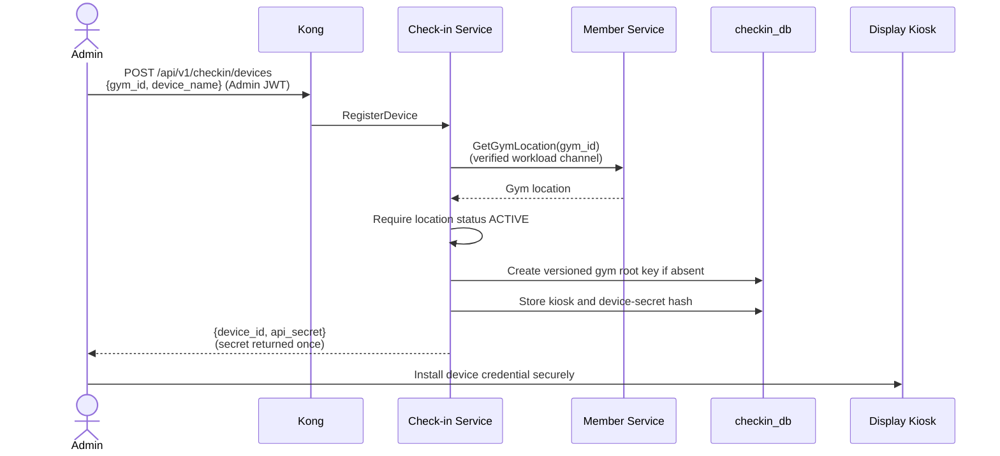
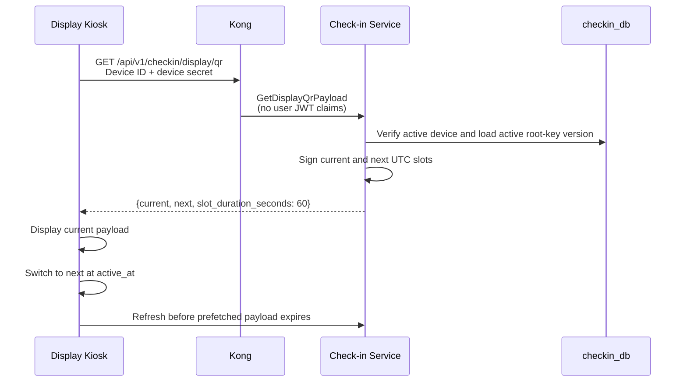
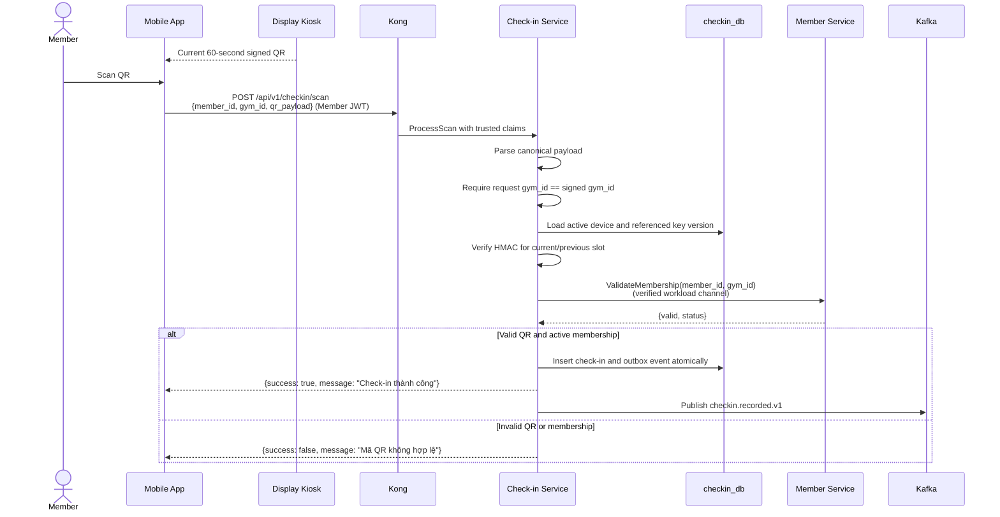

# Check-in Service

> **Tech:** Go Gin | **DB:** YugabyteDB | **Port:** 50051 (internal gRPC) / 8080 (gRPC-Gateway HTTP)

## Responsibilities

- Register and revoke entrance display kiosks
- Own encrypted, versioned per-gym QR root keys
- Issue short-lived signed QR payloads to authenticated kiosks
- Validate QR scans sent by members' Mobile Apps
- Verify active membership and correct gym through Member Service
- Record check-ins and publish `checkin.recorded.v1` events
- Return scan responses within **<100ms**

Member Service remains the source of truth for gym locations and memberships. Check-in owns all QR key material and never retrieves or exposes a raw QR secret through another service.

---

## Architecture of the Check-in System

The entrance uses a **reversed scanning approach**:

1. An admin registers a display kiosk for an active gym.
2. The kiosk authenticates to Check-in and fetches the current and next signed QR payload.
3. The kiosk switches QR codes every 60 seconds.
4. A logged-in member scans the display with the Mobile App.
5. Check-in validates the signed payload locally, calls Member Service to validate membership, and records the check-in.

The display is not a scanner. `device_id` identifies the authenticated display kiosk that issued the signed payload.

---

## Kiosk Provisioning



No gym-location Kafka event is required. Provisioning synchronously verifies the canonical location through Member Service. Registering a device for a missing or closed gym fails.

Device rules:

- Generate a cryptographically random device secret.
- Store only a password hash such as Argon2id; never store plaintext.
- Return the plaintext credential only from successful registration.
- Bind each device to one `gym_id`.
- Support independent revocation without rotating the gym root key.
- Store credentials in Android Keystore, a restricted kiosk-agent credential store, or equivalent—not browser `localStorage`.

---

## Display Refresh Flow



The endpoint returns current and next payloads so a brief network interruption does not blank the screen. If both payloads expire, the kiosk must show an unavailable state and stop displaying an accepted QR. Check-in does not preload hours of tokens.

---

## QR Payload and Signing

Canonical payload:

```text
v1.<gym_id>.<key_version>.<device_id>.<utc_slot>.<mac_base64url>
```

Signing input and MAC:

```text
utc_slot = floor(unix_seconds / 60)
message  = "checkin-qr:v1|<gym_id>|<key_version>|<device_id>|<utc_slot>"
mac      = HMAC-SHA256(root_key, message)
```

Canonicalization rules:

- Use UTC Unix seconds; venue timezone and daylight-saving changes do not affect slots.
- UUIDs use canonical lowercase text.
- `key_version` and `utc_slot` use base-10 integers without leading zeroes.
- MAC uses unpadded base64url.
- Compare MACs in constant time.
- Never include or return the root key in the payload, API response, log, metric, event, or Redis value.

Validation accepts the current slot and immediately previous slot for network and clock-boundary tolerance. It rejects next, older, and malformed slots.

### Root-key lifecycle

- Generate a random 32-byte root key when the first kiosk is provisioned for a verified gym.
- Encrypt root-key material at rest and identify the protecting KMS/key-encryption key.
- Assign monotonically increasing versions.
- Regular rotation creates a new active version and permits a short documented overlap for the retiring version.
- Emergency rotation retires the previous version immediately.
- Rotate root keys periodically and after suspected compromise; 60-second QR rotation does not require changing the root key every minute.

---

## QR Scan Flow



The authenticated identity boundary must resolve the trusted member identity. Client-supplied IDs are never authoritative. `user_id`, `member_id`, and `gym_id` remain separate opaque identifiers.

---

## Data Model (YugabyteDB)

```sql
CREATE TABLE gym_qr_root_keys (
    gym_id                UUID NOT NULL,
    key_version           BIGINT NOT NULL,
    encrypted_key_material BYTEA NOT NULL,
    kms_key_id             VARCHAR(255) NOT NULL,
    status                 VARCHAR(20) NOT NULL, -- ACTIVE | RETIRING | RETIRED
    created_at             TIMESTAMPTZ NOT NULL DEFAULT NOW(),
    activated_at           TIMESTAMPTZ NOT NULL,
    retired_at             TIMESTAMPTZ,
    PRIMARY KEY (gym_id, key_version)
);

CREATE UNIQUE INDEX uq_gym_active_qr_root_key
    ON gym_qr_root_keys (gym_id) WHERE status = 'ACTIVE';

CREATE TABLE kiosk_devices (
    id                    UUID PRIMARY KEY DEFAULT gen_random_uuid(),
    gym_id                UUID NOT NULL,
    device_name           VARCHAR(255) NOT NULL,
    api_secret_hash       VARCHAR(255) NOT NULL,
    status                VARCHAR(20) NOT NULL, -- ACTIVE | REVOKED
    created_at            TIMESTAMPTZ NOT NULL DEFAULT NOW(),
    revoked_at            TIMESTAMPTZ,
    last_authenticated_at TIMESTAMPTZ
);

CREATE TABLE check_ins (
    id            UUID PRIMARY KEY DEFAULT gen_random_uuid(),
    member_id     UUID NOT NULL,
    gym_id        UUID NOT NULL,
    device_id     UUID NOT NULL,
    checked_in_at TIMESTAMPTZ NOT NULL DEFAULT NOW()
);

CREATE INDEX idx_checkin_gym_date
    ON check_ins (gym_id, checked_in_at DESC);
```

Service database boundaries use opaque `gym_id` references; there is no cross-database foreign key to Member's `gym_locations` table.

Redis may cache derived current/next payloads for their short TTL. YugabyteDB plus the configured encryption/KMS boundary remains the durable authority for root keys and devices.

---

## API and Authentication

| RPC | HTTP | Authentication | Purpose |
|---|---|---|---|
| `ProcessScan` | `POST /api/v1/checkin/scan` | Member JWT | Validate QR and record check-in |
| `GetCheckInHistory` | `GET /api/v1/checkin/history/{member_id}` | Member/Admin JWT with scope enforcement | Query history |
| `GetDailyCount` | `GET /api/v1/checkin/daily-count` | Admin JWT | Query gym attendance |
| `RegisterDevice` | `POST /api/v1/checkin/devices` | Admin JWT | Verify gym and provision kiosk |
| `GetDisplayQrPayload` | `GET /api/v1/checkin/display/qr` | Device credential only | Fetch current and next payload |
| `RevokeDevice` | `DELETE /api/v1/checkin/devices/{device_id}` | Admin JWT | Revoke one kiosk |
| `RotateGymQrRootKey` | `POST /api/v1/checkin/gyms/{gym_id}/qr-root-key:rotate` | Admin JWT | Regular or emergency key rotation |

Kong strips client-supplied trusted user headers before injecting validated JWT claims. The display route receives no user claims and is authenticated inside Check-in. Internal calls to Member use verified workload identity such as mTLS; `CHECKIN_SERVICE` is not a public user role.

---

## Kafka Events

### Published

| Topic | Key | Payload |
|---|---|---|
| `checkin.recorded.v1` | `member_id` | `{member_id, gym_id, device_id, checked_in_at}` |

`device_id` is the display kiosk ID extracted from the verified signed payload. No gym-location, kiosk, or QR-key lifecycle Kafka events are introduced; admin provisioning and lifecycle RPCs own those workflows.

---

## Clean Architecture Target

```text
cmd/server/main.go
internal/
├── domain/
│   ├── checkin.go
│   ├── kiosk_device.go
│   ├── qr_root_key.go
│   └── errors.go
├── usecase/
│   ├── process_scan.go
│   ├── register_device.go
│   ├── get_display_qr_payload.go
│   ├── revoke_device.go
│   ├── rotate_qr_root_key.go
│   └── port/
│       ├── checkin_repo.go
│       ├── device_repo.go
│       ├── root_key_repo.go
│       ├── member_client.go
│       └── event_publisher.go
├── adapter/
│   ├── grpc/
│   ├── repository/
│   ├── client/member_grpc_client.go
│   └── kafka/event_publisher.go
└── config/
```

The implementation should use a transactional outbox or equivalent atomic record/event mechanism for `checkin.recorded.v1`.

---

## Required Implementation Tests

- Deterministic HMAC test vectors and canonical payload encoding
- Current and previous slots accepted; next, old, and malformed slots rejected
- Wrong gym, device, key version, or MAC rejected
- Constant-time MAC comparison
- Device secret returned once, stored hashed, gym-bound, and revocable
- Display endpoint returns current and next payload without exposing root material
- Missing/closed gym rejected during provisioning
- Customer JWT cannot authenticate as a kiosk; device credentials cannot invoke user/admin routes
- Inactive or wrong-gym membership rejected
- Regular rotation overlap and emergency immediate retirement
- Expired prefetched payload and Redis-outage behavior
- Check-in record and outbox event committed atomically
