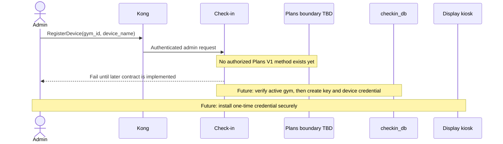
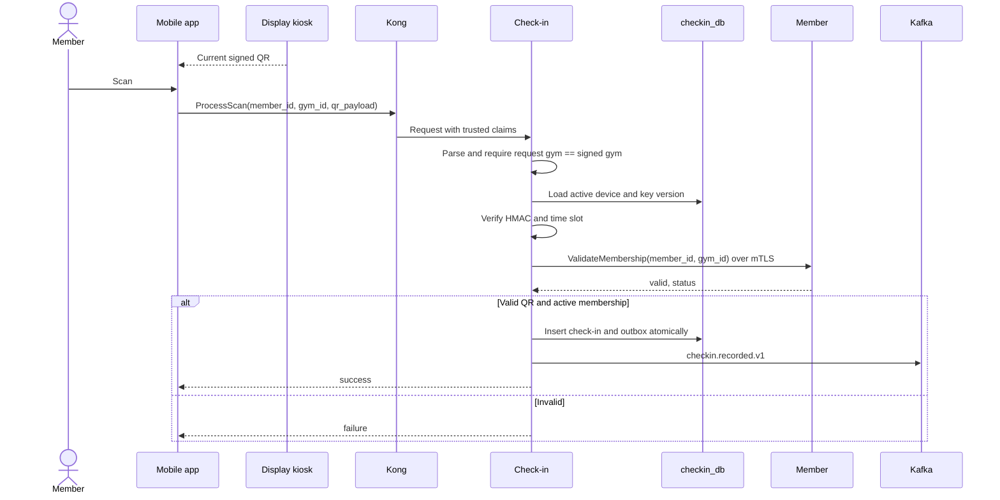

# Check-in Service

> **Catalog design:** Go | YugabyteDB `checkin_db` | 50051 native gRPC / 8080 HTTP
>
> **Status:** Check-in remains deferred through G8. This file defines a future boundary, not active implementation. Plans owns canonical locations; Member owns membership decisions. Plans V1 does not authorize Check-in, so kiosk provisioning requires a separately frozen workload contract.

## Future Responsibilities

- Register and revoke entrance display kiosks
- Own encrypted, versioned per-gym QR root keys
- Issue short-lived signed QR payloads to authenticated kiosks
- Validate member scans locally
- Ask Member for membership validity
- Record check-ins and publish `checkin.recorded.v1`
- Target scan response latency below 100 ms

Check-in owns kiosk credentials, QR root keys, signed payloads, and check-in records. It owns no location or membership data.

## Boundary Freeze Required Before Implementation

The G6 Plans contract authorizes only:

- Identifier to Plans `GetActiveGym`;
- Member to Plans `ResolvePurchasablePlan`.

Check-in must not reuse either method or identity. Before kiosk provisioning is implemented, a later contract must define a Check-in-authorized Plans lookup, its exact semantics, and its mTLS allowlist. No current Plans V1 method is available to Check-in.

Future scan processing calls Member `ValidateMembership(member_id, gym_id)` over direct mTLS. Member allows only peer SAN `ms-gym-checkin` on that exact method (`INTERNAL_WORKLOAD`). No `x-user-*` headers and no Kong route. Plans need not participate in each scan because the signed payload is bound to a previously provisioned gym.

## Reversed QR Design

1. An admin provisions a display kiosk for a verified active gym after the future Plans boundary exists.
2. The kiosk authenticates to Check-in and fetches current and next signed payloads.
3. It switches payloads every 60 seconds.
4. A logged-in member scans the display.
5. Check-in validates the payload locally, calls Member for membership validity, and records the check-in.

`device_id` identifies the authenticated display that issued the payload; the display is not a scanner.

## Deferred Provisioning Flow



No gym-location Kafka event is introduced. Provisioning will use an explicit synchronous Plans contract rather than a stale Member location call.

Device rules:

- Generate a cryptographically random device secret.
- Store only an established password hash such as Argon2id.
- Return plaintext once after successful registration.
- Bind each device to one opaque `gym_id`.
- Support independent revocation.
- Store credentials in Android Keystore or an equivalent restricted credential store, never browser `localStorage`.

## QR Payload

```text
v1.<gym_id>.<key_version>.<device_id>.<utc_slot>.<mac_base64url>
```

```text
utc_slot = floor(unix_seconds / 60)
message  = "checkin-qr:v1|<gym_id>|<key_version>|<device_id>|<utc_slot>"
mac      = HMAC-SHA256(root_key, message)
```

Rules:

- Use UTC Unix seconds.
- IDs use canonical text representation.
- Integers use base 10 without leading zeroes.
- MAC uses unpadded base64url and constant-time comparison.
- Accept current and immediately previous slot only.
- Never expose root-key material in payloads, APIs, logs, metrics, events, or Redis.

Root keys are random 32-byte values, encrypted at rest, versioned, rotated, and retired. Emergency rotation invalidates the previous key immediately.

## Future Scan Flow



Trusted authentication must resolve the authoritative member identity. Client-supplied `member_id` is never sufficient by itself.

## Future Data Model

```sql
CREATE TABLE gym_qr_root_keys (
    gym_id                 VARCHAR(255) NOT NULL,
    key_version            BIGINT NOT NULL,
    encrypted_key_material BYTEA NOT NULL,
    kms_key_id              VARCHAR(255) NOT NULL,
    status                  VARCHAR(20) NOT NULL,
    activated_at            TIMESTAMPTZ NOT NULL,
    retired_at              TIMESTAMPTZ,
    PRIMARY KEY (gym_id, key_version)
);

CREATE TABLE kiosk_devices (
    id                    UUID PRIMARY KEY DEFAULT gen_random_uuid(),
    gym_id                VARCHAR(255) NOT NULL,
    device_name           VARCHAR(255) NOT NULL,
    api_secret_hash       VARCHAR(255) NOT NULL,
    status                VARCHAR(20) NOT NULL,
    created_at            TIMESTAMPTZ NOT NULL DEFAULT NOW(),
    revoked_at            TIMESTAMPTZ
);

CREATE TABLE check_ins (
    id            UUID PRIMARY KEY DEFAULT gen_random_uuid(),
    member_id     VARCHAR(255) NOT NULL,
    gym_id        VARCHAR(255) NOT NULL,
    device_id     UUID NOT NULL,
    checked_in_at TIMESTAMPTZ NOT NULL DEFAULT NOW()
);
```

`gym_id` and `member_id` are opaque cross-service strings. Check-in has no FK to Plans locations or Member profiles. Local device and key relationships remain Check-in-owned.

Redis may cache only short-lived derived current/next payloads. YugabyteDB and the configured KMS boundary remain durable authorities for devices and root keys.

## Future API and Authentication

| RPC | HTTP | Authentication | Status |
|---|---|---|---|
| `ProcessScan` | `POST /api/v1/checkin/scan` | Member JWT | Deferred |
| `GetCheckInHistory` | `GET /api/v1/checkin/history/{member_id}` | Scoped Member/Admin JWT | Deferred |
| `GetDailyCount` | `GET /api/v1/checkin/daily-count` | Admin JWT | Deferred |
| `RegisterDevice` | `POST /api/v1/checkin/devices` | Admin JWT | Blocked on future Plans contract |
| `GetDisplayQrPayload` | `GET /api/v1/checkin/display/qr` | Device credential | Deferred |
| `RevokeDevice` | `DELETE /api/v1/checkin/devices/{device_id}` | Admin JWT | Deferred |
| `RotateGymQrRootKey` | `POST /api/v1/checkin/gyms/{gym_id}/qr-root-key:rotate` | Admin JWT | Blocked on future Plans contract |

Kong strips client-supplied trusted user headers before injecting validated claims. Display routes receive no user claims and authenticate inside Check-in. Outbound Member calls use Check-in client certificate SAN `ms-gym-checkin` only; Member does not accept a `CHECKIN_SERVICE` role claim.

## Future Kafka Event

| Topic | Key | Payload |
|---|---|---|
| `checkin.recorded.v1` | `member_id` | `{member_id, gym_id, device_id, checked_in_at}` |

No location, kiosk, or QR-key lifecycle topic is needed. Plans V1 itself has no Kafka participation.

## Target Structure

```text
cmd/server/main.go
internal/
├── domain/
├── usecase/
│   └── port/
│       ├── checkin_repository.go
│       ├── device_repository.go
│       ├── root_key_repository.go
│       ├── member_client.go
│       ├── location_client.go   # Only after later Plans contract exists
│       └── event_publisher.go
├── adapter/
│   ├── grpc/
│   ├── repository/
│   ├── member/
│   ├── location/                # Deferred with contract
│   └── kafka/
└── config/
```

No Check-in implementation work is part of G6–G8.
