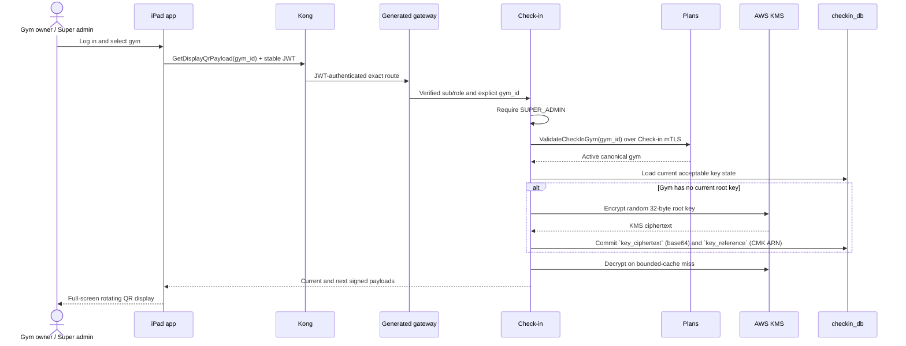

# Check-in Service

> **Target:** Go | YugabyteDB `checkin_db` | `50051` native mTLS gRPC | `8080` health/readiness
>
> **Roadmap status:** G10 complete on 2026-08-23. Locked clean-source E2E, protected CI, sanitized evidence, and owner acceptance are recorded in [`../evidence/foundation-first/g10-final/README.md`](../evidence/foundation-first/g10-final/README.md). [Phase 10](../plans/foundation-first/10-ms-gym-checkin.md) remains the execution record. G0–G9 evidence remains historical and unchanged.

## Responsibilities

- Generate and protect versioned per-gym QR root keys.
- Issue short-lived signed QR payloads to a logged-in gym owner's iPad app.
- Validate member scans against signed gym/key/slot state.
- Ask Member for live membership validity using verified user identity.
- Record check-ins idempotently and publish `checkin.recorded.v1` through a transactional outbox.
- Provide self-history, `SUPER_ADMIN` member-history, and UTC daily gym counts.
- Target scan p95 below 100 ms in the locked G10 fixture without claiming a production SLO.

Check-in owns QR keys, signed payloads, records, and its event. It owns no kiosk/display-device registration, installation credential, or device revocation lifecycle. Plans remains canonical location owner. Member remains canonical member and membership owner. Check-in stores only opaque cross-service identifiers and has no cross-service database foreign key.

## Selected Boundaries

### Stable user identity and live membership

Customer requests use verified stable JWT claims:

```text
sub, role, iss, aud, iat, exp, jti, kid
```

JWT `sub` is authoritative `user_id`. JWT contains no `gym_id` or `membership_status`. `ProcessScanRequest` must not accept a client-authoritative `member_id`; Stage 0 removes and reserves that field. Check-in calls the exact Member workload boundary:

```text
ValidateMembership(user_id, signed_gym_id)
  -> member_id, valid, status
```

Member resolves and returns canonical opaque `member_id`. Only Check-in SAN may call the method. It has no HTTP annotation, Kong route, OpenAPI operation, or forwarded end-user headers.

Self-history also derives `user_id` from verified `sub`. A separate `SUPER_ADMIN` method may select canonical `member_id`; a customer can never choose another member identity.

### Plans validation

Display retrieval and root-key administration call a dedicated internal Plans method such as:

```text
ValidateCheckInGym(gym_id) -> gym_id, status
```

Stage 0 freezes the final name and fields. Only Check-in SAN may call it. Do not broaden or reuse Identifier's `GetActiveGym` permission. Plans is not called for every scan because the QR binds the scan to a previously validated active gym.

### Scan idempotency

`ProcessScanRequest` requires a bounded `idempotency_key`. Unique scope is `(user_id, idempotency_key)`:

- an exact canonical replay returns the original successful result;
- the same key with a different request fingerprint returns conflict;
- distinct keys may create distinct check-ins, including during one QR slot.

No speculative time-window or QR-slot duplicate rule is planned.

## Public Topology and Authentication

```text
Mobile app or iPad display app
  -> Kong HTTPS exact route
  -> mTLS generated Go grpc-gateway :8443
  -> mTLS Check-in gRPC :50051
```

Kong remains the only public endpoint. Check-in `8080` uses standard `net/http` for `/healthz` and `/readyz` only; no native business HTTP or Gin dependency is planned.

| Capability | HTTP exposure | Authentication | Authorization |
|---|---|---|---|
| Process scan | Generated gateway | Stable JWT | `CUSTOMER`; identity from verified `sub` |
| Self-history | Generated gateway | Stable JWT | `CUSTOMER`; identity from verified `sub` |
| Member-history | Generated gateway | Stable JWT | `SUPER_ADMIN` |
| Daily gym count | Generated gateway | Stable JWT | `SUPER_ADMIN` |
| Get display QR | Generated gateway | Stable JWT | `SUPER_ADMIN`; explicit active `gym_id` |
| Rotate gym root key | Generated gateway | Stable JWT | `SUPER_ADMIN` |
| Member validation | No HTTP | Workload mTLS | Check-in SAN only |
| Plans gym validation | No HTTP | Workload mTLS | Check-in SAN only |

No authoritative owner/admin-to-gym assignment exists. G10 therefore permits only `SUPER_ADMIN` to request display payloads or administer gym QR keys. The selected `gym_id` is resource context, not authorization proof. Add gym-owner scoping only after a separate owner, persistence, revocation, lookup, and test boundary exists.

### Logged-in iPad display

The gym owner logs in through Identifier in a simple iPad app, selects an active gym, and opens the display view. Kong validates the stable JWT. Generated gateway forwards only verified user, role, and tracing metadata. Check-in requires `SUPER_ADMIN`, validates the requested `gym_id` through Plans, and returns current/next payloads.

The app stores login and refresh tokens through iOS Keychain or equivalent platform-secure storage, never browser `localStorage`. G10 does not add device enrollment, a device secret, HTTP Basic, a `device_id`, an Argon2id credential hash, or independent display revocation.

## QR Root-Key Protection

Use the official AWS SDK for Go v2 KMS client:

1. Generate each per-gym 32-byte root key with `crypto/rand`.
2. Encrypt and decrypt root keys with AWS KMS.
3. Store base64 KMS ciphertext only in `key_ciphertext` and the resolved CMK ARN only in `key_reference` in YugabyteDB.
4. In production, use AWS SDK default credentials through EKS workload identity; never configure static AWS credentials.
5. Limit IAM to `kms:Encrypt`, `kms:Decrypt`, and `kms:DescribeKey` on the CMK.
6. Set `KMS_ENDPOINT_URL` only for local LocalStack; production uses no endpoint override.
7. On normal rotation, accept the prior key for exactly 120 seconds.
8. On emergency rotation, retire the prior key immediately.
9. Check key status in YugabyteDB on every display and scan request.
10. Cache decrypted key material only in-process and no longer than its acceptance deadline.
11. On KMS outage, mark readiness false, block key mutations and cache misses, and never accept retired or unknown keys.

Redis is not part of G10. Add it only after measurement proves a need that a bounded in-process cache cannot meet.

## QR Payload

```text
v1.<gym_id>.<key_version>.<utc_slot>.<mac_base64url>
```

```text
utc_slot = floor(unix_seconds / 60)
message  = "checkin-qr:v1|<gym_id>|<key_version>|<utc_slot>"
mac      = HMAC-SHA256(root_key, message)
```

Rules:

- Use UTC Unix seconds.
- Require exact component count and bounded canonical fields.
- IDs use canonical text representation.
- Integers use decimal without leading zeroes.
- MAC uses unpadded base64url and constant-time comparison.
- Accept current and immediately previous slot only.
- Return current and next payloads to a logged-in `SUPER_ADMIN` iPad app.
- Never expose root-key material in payloads, APIs, logs, metrics, events, or evidence.

## Display Flow



No gym-location or display-device event is introduced. Plans remains synchronous authority for active gym validation.

## Scan Flow

```mermaid
sequenceDiagram
    actor M as Member
    participant APP as Mobile app
    participant IP as iPad display
    participant K as Kong
    participant GW as Generated gateway
    participant CS as Check-in
    participant DB as checkin_db
    participant KMS as AWS KMS
    participant MB as Member
    participant KF as Kafka

    IP-->>APP: Current signed QR
    M->>APP: Scan
    APP->>K: ProcessScan(gym_id, qr_payload, idempotency_key) + JWT
    K->>GW: Verified stable user/role metadata
    GW->>CS: Generated gRPC binding
    CS->>CS: Derive user_id from sub; canonicalize request
    CS->>DB: Resolve idempotency result or conflict
    CS->>CS: Parse signed gym/key/slot
    CS->>DB: Load acceptable key state
    CS->>KMS: Decrypt on bounded-cache miss
    CS->>CS: Verify HMAC, slot, and request/signed gym consistency
    CS->>MB: ValidateMembership(user_id, signed_gym_id) over mTLS
    MB-->>CS: canonical member_id, valid, live status
    alt Active membership
        CS->>DB: Insert record, idempotency result, and outbox atomically
        CS-->>APP: Stored success
        CS->>KF: Relay checkin.recorded.v1 at least once
    else Invalid membership or QR
        CS-->>APP: Safe categorized failure
    end
```

Plans does not participate in the scan path. Any dependency outage fails closed where authoritative data or key material is unavailable.

## Data Model

```text
gym_qr_root_keys
  gym_id, key_version, key_ciphertext, key_reference,
  status, activated_at, acceptance_deadline, retired_at

check_ins
  checkin_id, user_id, member_id, gym_id,
  idempotency_key, request_fingerprint, checked_in_at

outbox_events
  event_id, aggregate/key data, concrete type, framed payload metadata,
  delivery state, attempt data, created_at
```

Required invariants:

- primary key `(gym_id, key_version)` for root-key versions;
- one current key state per gym as frozen by Stage 0;
- unique `(user_id, idempotency_key)` with stored canonical fingerprint/result;
- check-in row and outbox event in one Yugabyte transaction;
- safe concurrent outbox claims and retry state;
- only local foreign keys;
- `user_id`, `member_id`, and `gym_id` remain opaque strings.

Append-only migrations run explicitly, not as hidden pod-startup behavior.

## Kafka Event

| Topic | Key | Concrete value | Subject |
|---|---|---|---|
| `checkin.recorded.v1` | canonical `member_id` | `events.v1.CheckInRecordedEvent` | `checkin.recorded.v1-value` |

The final event contains canonical member/gym identity and typed check-in time; it has no display-device identity. Use generated Protobuf with Confluent framing, `TopicNameStrategy`, canonical headers, and `auto.register.schemas=false`. Relay is at least once. Failure after configured retries preserves original key, framed value, and headers in `checkin.recorded.v1.DLQ`.

No location, display-device, or QR-key lifecycle event is planned. Notification and Analytics consumers remain deferred.

## Target Structure

```text
ms-gym-checkin/
├── cmd/server/
├── internal/
│   ├── config/
│   ├── domain/
│   ├── usecase/
│   │   └── port/
│   └── adapter/
│       ├── grpc/
│       ├── yugabyte/
│       ├── member/
│       ├── plans/
│       ├── kms/
│       └── kafka/
├── migrations/
├── test/integration/
├── .github/workflows/
├── Dockerfile
├── docker-compose.yml
├── Makefile
├── README.md
├── go.mod
└── go.sum
```

Use `common-go` for the established interceptor, errors, observability, Kafka, retry, and DLQ behavior. Use standard-library HMAC, encoding, randomness, constant-time comparison, SQL, and health HTTP where they fit. Add no display-device lifecycle, generic repository, shared crypto framework, parallel gateway, or handwritten REST DTOs.

## Completion Rule

This document describes the in-progress G10 boundary; Stage 2 implementation does not make G10 complete. Mark Check-in complete only after all [Phase 10](../plans/foundation-first/10-ms-gym-checkin.md) stages pass with immutable dependencies, locked detached-source local proof, protected CI, sanitized evidence, and clean pinned trees. Record accountable-owner acceptance separately from technical status.
