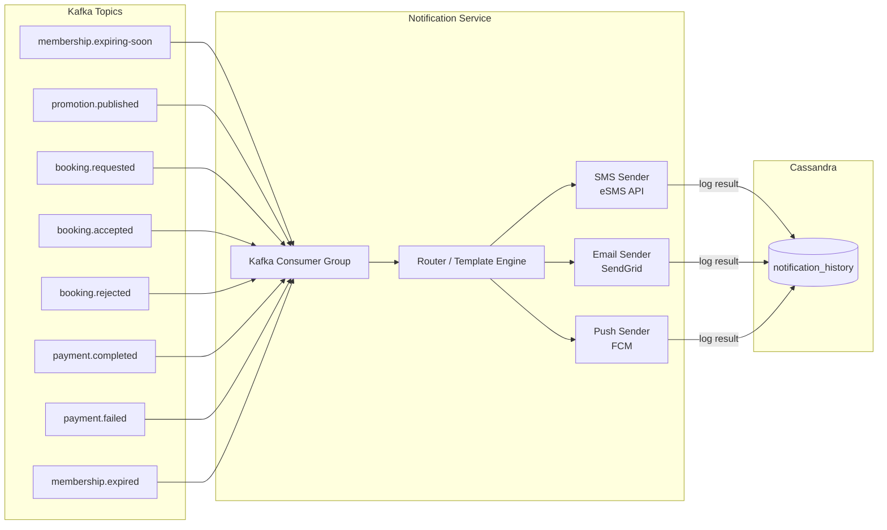
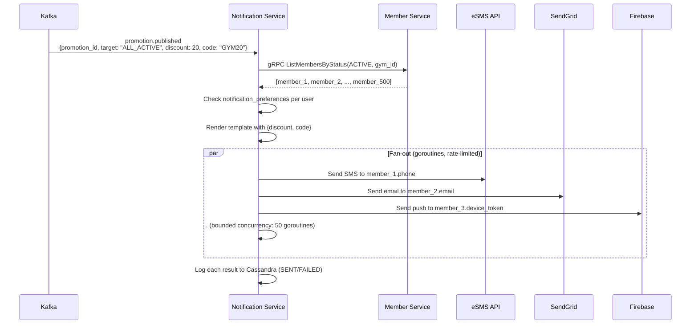

# Notification Service

> **Tech:** Go Gin | **DB:** Apache Cassandra | **Port:** 50051 (gRPC) / 8080 (REST)

## Responsibilities

- Send **SMS** (eSMS / Twilio — Vietnamese provider preferred)
- Send **Email** (SendGrid or AWS SES)
- Send **Push notifications** (Firebase Cloud Messaging for mobile)
- Notification preferences per user (opt-in/out per channel)
- Notification history (append-only, queryable by user)
- **Pure consumer** — triggered entirely by Kafka events, no sync gRPC calls from other services

---

## Event-Driven Architecture



---

## Notification Rules

| Kafka Event | Recipient | Channels | Template |
|-------------|-----------|----------|----------|
| `membership.expiring-soon` | Customer | SMS + Email + Push | "Thẻ tập của bạn sẽ hết hạn vào {date}. Gia hạn ngay!" |
| `membership.expired` | Customer | SMS + Push | "Thẻ tập đã hết hạn. Gia hạn để tiếp tục tập luyện." |
| `promotion.published` | Eligible customers | SMS + Email | "Ưu đãi {discount}%! Dùng mã {code}. Hết hạn {date}." |
| `booking.requested` | Trainer | Push | "Yêu cầu đặt lịch mới từ {customer_name} vào {time}." |
| `booking.accepted` | Customer | Push + SMS | "Lịch tập với HLV {trainer_name} đã được xác nhận!" |
| `booking.rejected` | Customer | Push | "HLV {trainer_name} không thể nhận lịch. Đã hoàn tiền." |
| `payment.completed` | Customer | Email | Payment receipt with details |
| `payment.failed` | Customer | Push + SMS | "Thanh toán thất bại. Vui lòng thử lại." |

---

## Data Model (Cassandra)

```
-- Notification history per user (append-only, reverse-chrono)
CREATE TABLE notifications_by_user (
    user_id      UUID,
    sent_at      TIMESTAMP,
    notification_id UUID,
    channel      TEXT,           -- SMS, EMAIL, PUSH
    event_type   TEXT,           -- EXPIRY_WARNING, DISCOUNT, BOOKING_UPDATE, PAYMENT
    title        TEXT,
    body         TEXT,
    status       TEXT,           -- QUEUED, SENT, DELIVERED, FAILED
    provider_msg_id TEXT,        -- eSMS/SendGrid/FCM message ID
    error_detail TEXT,           -- null if success
    PRIMARY KEY ((user_id), sent_at, notification_id)
) WITH CLUSTERING ORDER BY (sent_at DESC, notification_id ASC);

-- User notification preferences
CREATE TABLE notification_preferences (
    user_id     UUID,
    channel     TEXT,           -- SMS, EMAIL, PUSH
    enabled     BOOLEAN,
    PRIMARY KEY (user_id, channel)
);

-- FCM device tokens (user can have multiple devices)
CREATE TABLE device_tokens (
    user_id     UUID,
    device_id   TEXT,
    fcm_token   TEXT,
    platform    TEXT,           -- ANDROID, IOS
    updated_at  TIMESTAMP,
    PRIMARY KEY (user_id, device_id)
);
```

### Why Cassandra Here

| Requirement | Cassandra Fit |
|-------------|---------------|
| High fan-out: one promotion → thousands of notifications | Write-optimized, handles burst writes |
| Append-only history (never updated after creation) | Immutable data model, no UPDATE needed |
| Read pattern: "my notifications" = single partition | Partition by user_id |
| No cross-user queries on notification data | No joins needed |
| SMS/email delivery status = eventual (callback updates) | Cassandra handles eventual consistency naturally |

---

## Fan-Out Pattern for Promotions



**Rate limiting:** Go worker pool with bounded concurrency (50 goroutines).  
Prevents overwhelming external APIs. Failed sends are retried 3x with exponential backoff.

---

## Kafka Consumer Config

```
Consumer Group: ms-gym-notification-group
Auto Offset Reset: earliest
Enable Auto Commit: false (manual commit after processing)
Max Poll Records: 50

Topics subscribed:
  - membership.activated
  - membership.paused
  - membership.resumed
  - membership.expiring-soon
  - membership.expired
  - promotion.published
  - booking.requested
  - booking.accepted
  - booking.rejected
  - booking.cancelled
  - booking.auto-rejected
  - payment.completed
  - payment.failed
  - payment.refunded
  - trainer.suspended
  - analytics.member-at-risk
```

---

## API (gRPC)

```protobuf
service NotificationService {
  // Customer: view notification history
  rpc GetMyNotifications(GetNotificationsRequest) returns (NotificationsResponse);
  rpc MarkAsRead(MarkAsReadRequest) returns (google.protobuf.Empty);

  // Customer: preferences
  rpc GetPreferences(google.protobuf.Empty) returns (PreferencesResponse);
  rpc UpdatePreferences(UpdatePreferencesRequest) returns (PreferencesResponse);

  // Mobile: register device token for push
  rpc RegisterDevice(RegisterDeviceRequest) returns (google.protobuf.Empty);
  rpc UnregisterDevice(UnregisterDeviceRequest) returns (google.protobuf.Empty);

  // Admin: send manual notification
  rpc SendBulkNotification(BulkNotificationRequest) returns (BulkNotificationResponse);
}
```

---

## Clean Architecture

```
cmd/server/main.go
internal/
├── domain/
│   ├── notification.go         // Notification entity
│   ├── preference.go           // NotificationPreference
│   ├── device_token.go         // DeviceToken
│   ├── channel.go              // SMS, EMAIL, PUSH enum
│   └── template.go             // NotificationTemplate
├── usecase/
│   ├── process_event.go        // ProcessEventUseCase (Kafka → route → send)
│   ├── get_notifications.go
│   ├── manage_preferences.go
│   └── port/
│       ├── notification_repo.go     // NotificationRepository
│       ├── preference_repo.go       // PreferenceRepository
│       ├── device_repo.go           // DeviceTokenRepository
│       ├── sms_sender.go            // SMSSender interface
│       ├── email_sender.go          // EmailSender interface
│       ├── push_sender.go           // PushSender interface
│       └── member_client.go         // MemberClient (for fan-out lookups)
├── adapter/
│   ├── grpc/
│   │   ├── handler.go
│   │   └── mapper.go
│   ├── repository/
│   │   ├── cassandra_notification.go
│   │   ├── cassandra_preference.go
│   │   └── cassandra_device_token.go
│   ├── sender/
│   │   ├── esms_sender.go           // implements SMSSender
│   │   ├── sendgrid_sender.go       // implements EmailSender
│   │   └── fcm_sender.go            // implements PushSender
│   ├── client/
│   │   └── member_grpc_client.go
│   └── kafka/
│       └── event_consumer.go        // Kafka consumer → ProcessEventUseCase
└── config/
    └── config.go
```
