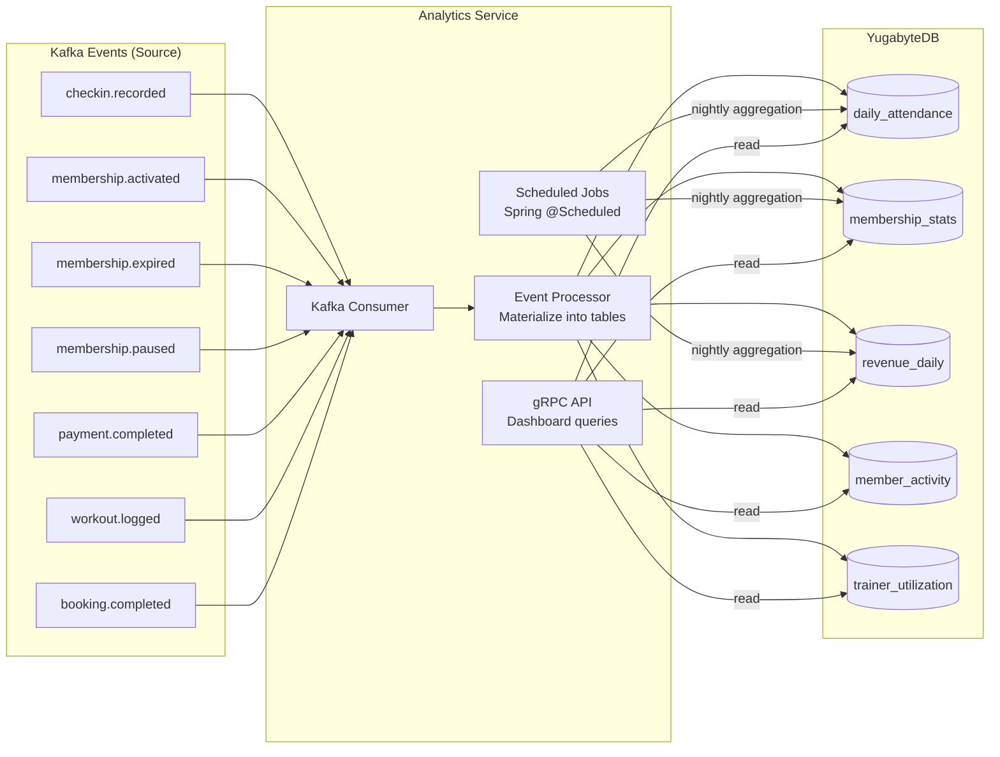

# Analytics Service

> **Tech:** Java 26 (Spring Boot 4) | **DB:** YugabyteDB | **Port:** 50051 (gRPC) / 8080 (REST)

## Responsibilities

- Consume events from all services → materialize into analytics tables
- Daily / weekly / monthly gym attendance aggregation
- Trend analysis: up/down compared to previous period
- Active-but-inactive detection: has membership, no check-in >14 days
- Revenue reports by location, plan type, period
- Trainer utilization rates
- Dashboard API for admin frontend

---

## Data Pipeline



---

## Data Model (YugabyteDB)

```sql
-- Daily attendance per gym location
CREATE TABLE daily_attendance (
    gym_id          UUID,
    date            DATE,
    total_checkins  INT DEFAULT 0,
    unique_members  INT DEFAULT 0,
    peak_hour       INT,              -- hour with most check-ins (0-23)
    PRIMARY KEY (gym_id, date)
);

-- Membership statistics per gym per day
CREATE TABLE membership_stats (
    gym_id          UUID,
    date            DATE,
    active_count    INT DEFAULT 0,
    paused_count    INT DEFAULT 0,
    expired_count   INT DEFAULT 0,
    new_count       INT DEFAULT 0,    -- new activations today
    churned_count   INT DEFAULT 0,    -- expired today
    PRIMARY KEY (gym_id, date)
);

-- Revenue aggregation
CREATE TABLE revenue_daily (
    gym_id              UUID,
    date                DATE,
    membership_revenue  BIGINT DEFAULT 0,   -- VND
    trainer_revenue     BIGINT DEFAULT 0,   -- from booking fees
    total_revenue       BIGINT DEFAULT 0,
    transaction_count   INT DEFAULT 0,
    PRIMARY KEY (gym_id, date)
);

-- Member activity tracking (for inactive detection)
CREATE TABLE member_activity (
    member_id           UUID PRIMARY KEY,
    gym_id              UUID,
    membership_status   VARCHAR,
    last_checkin_at     TIMESTAMPTZ,
    last_workout_at     TIMESTAMPTZ,
    total_checkins      INT DEFAULT 0,
    total_workouts      INT DEFAULT 0,
    inactive_days       INT DEFAULT 0,      -- recalculated nightly
    risk_level          VARCHAR             -- ACTIVE, AT_RISK, INACTIVE, GHOST
);

-- Trainer utilization
CREATE TABLE trainer_utilization (
    trainer_id      UUID,
    gym_id          UUID,
    month           VARCHAR,            -- '2024-12'
    total_bookings  INT DEFAULT 0,
    completed       INT DEFAULT 0,
    cancelled       INT DEFAULT 0,
    total_hours     DECIMAL DEFAULT 0,
    utilization_pct DECIMAL DEFAULT 0,  -- completed / available_hours * 100
    PRIMARY KEY (trainer_id, month)
);
```

### Why YugabyteDB Here

| Requirement | YugabyteDB Fit |
|-------------|----------------|
| Complex aggregations (SUM, COUNT, GROUP BY, window functions) | Full PostgreSQL SQL support |
| Cross-gym rollups for chain-level dashboard | Distributed SQL handles large aggregation |
| Growing data over time (years of history) | Horizontal scaling |
| Concurrent reads from dashboard + writes from event consumers | Distributed architecture handles mixed workload |

---

## Dashboard Queries (Examples)

```sql
-- Weekly attendance trend for a gym
SELECT date, total_checkins, unique_members,
       LAG(total_checkins, 7) OVER (ORDER BY date) AS prev_week_checkins,
       ROUND(
         (total_checkins - LAG(total_checkins, 7) OVER (ORDER BY date))::DECIMAL
         / NULLIF(LAG(total_checkins, 7) OVER (ORDER BY date), 0) * 100, 1
       ) AS trend_pct
FROM daily_attendance
WHERE gym_id = ? AND date >= CURRENT_DATE - INTERVAL '30 days'
ORDER BY date;

-- Active members who haven't shown up in 14+ days
SELECT member_id, membership_status, last_checkin_at, inactive_days
FROM member_activity
WHERE gym_id = ? AND membership_status = 'ACTIVE' AND inactive_days >= 14
ORDER BY inactive_days DESC;

-- Monthly revenue comparison
SELECT
    TO_CHAR(date, 'YYYY-MM') AS month,
    SUM(total_revenue) AS total,
    SUM(membership_revenue) AS membership,
    SUM(trainer_revenue) AS trainer
FROM revenue_daily
WHERE gym_id = ? AND date >= CURRENT_DATE - INTERVAL '12 months'
GROUP BY TO_CHAR(date, 'YYYY-MM')
ORDER BY month;
```

---

## Inactive Member Risk Levels

```
Nightly job recalculates:

  inactive_days = CURRENT_DATE - last_checkin_at::DATE

  Risk Levels:
    ACTIVE:    inactive_days < 7
    AT_RISK:   inactive_days >= 7 AND < 14
    INACTIVE:  inactive_days >= 14 AND < 30
    GHOST:     inactive_days >= 30

  AT_RISK triggers:
    → Publish analytics.member-at-risk (Notification Service can send nudge)

  GHOST percentage = count(GHOST) / count(ACTIVE + AT_RISK + INACTIVE + GHOST) * 100
```

---

## Scheduled Jobs

| Job | Schedule | Action |
|-----|----------|--------|
| Attendance Aggregation | `0 1 * * *` (1 AM) | Aggregate yesterday's check-ins → daily_attendance |
| Membership Stats | `0 2 * * *` (2 AM) | Count status distribution → membership_stats |
| Revenue Aggregation | `0 3 * * *` (3 AM) | Sum payments → revenue_daily |
| Inactive Detection | `0 4 * * *` (4 AM) | Recalculate inactive_days, assign risk_level |
| Trainer Utilization | `0 5 1 * *` (5 AM, 1st of month) | Monthly trainer utilization recalc |

---

## Kafka Events Consumed

| Topic | Action |
|-------|--------|
| `checkin.recorded` | Upsert member_activity.last_checkin_at, increment total_checkins, upsert daily_attendance |
| `membership.activated` | Update member_activity.membership_status, increment membership_stats.new_count |
| `membership.expired` | Update member_activity, increment churned_count |
| `membership.paused` | Update member_activity.membership_status |
| `payment.completed` | Increment revenue_daily by amount and type |
| `workout.logged` | Update member_activity.last_workout_at, increment total_workouts |
| `booking.completed` | Increment trainer_utilization.completed and total_hours |
| `booking.cancelled` | Increment trainer_utilization.cancelled |
| `booking.accepted` | Track booking acceptance rates and response times |
| `booking.rejected` | Track booking rejection rates |

---

## API (gRPC)

```protobuf
service AnalyticsService {
  // Attendance
  rpc GetDailyAttendance(AttendanceRequest) returns (AttendanceResponse);
  rpc GetAttendanceTrend(TrendRequest) returns (TrendResponse);

  // Membership
  rpc GetMembershipStats(MembershipStatsRequest) returns (MembershipStatsResponse);
  rpc GetInactiveMembers(InactiveMembersRequest) returns (InactiveMembersResponse);

  // Revenue
  rpc GetRevenueReport(RevenueRequest) returns (RevenueResponse);
  rpc GetRevenueComparison(RevenueComparisonRequest) returns (RevenueComparisonResponse);

  // Trainer
  rpc GetTrainerUtilization(TrainerUtilizationRequest) returns (TrainerUtilizationResponse);

  // Dashboard summary
  rpc GetDashboardSummary(DashboardRequest) returns (DashboardSummaryResponse);
}

message DashboardSummaryResponse {
  int32 today_checkins = 1;
  int32 active_members = 2;
  int64 month_revenue_vnd = 3;
  double attendance_trend_pct = 4;   // vs last week
  int32 at_risk_members = 5;
  int32 ghost_members = 6;
}
```

---

## Clean Architecture

```
src/main/java/com/gym/analytics/
├── domain/
│   ├── model/
│   │   ├── DailyAttendance.java
│   │   ├── MembershipStats.java
│   │   ├── RevenueSummary.java
│   │   ├── MemberActivity.java
│   │   ├── RiskLevel.java             // ACTIVE, AT_RISK, INACTIVE, GHOST
│   │   └── TrainerUtilization.java
│   └── event/
│       └── MemberAtRiskEvent.java
├── application/
│   ├── port/
│   │   ├── in/
│   │   │   ├── GetAttendanceUseCase.java
│   │   │   ├── GetRevenueUseCase.java
│   │   │   ├── GetInactiveMembersUseCase.java
│   │   │   └── GetDashboardUseCase.java
│   │   └── out/
│   │       ├── AttendanceRepository.java
│   │       ├── MembershipStatsRepository.java
│   │       ├── RevenueRepository.java
│   │       ├── MemberActivityRepository.java
│   │       └── TrainerUtilizationRepository.java
│   ├── service/
│   │   ├── AttendanceService.java
│   │   ├── RevenueService.java
│   │   └── InactiveDetectionService.java
│   └── scheduler/
│       ├── AttendanceAggregationJob.java
│       ├── MembershipStatsJob.java
│       ├── RevenueAggregationJob.java
│       ├── InactiveDetectionJob.java
│       └── TrainerUtilizationJob.java
├── adapter/
│   ├── in/grpc/
│   │   ├── AnalyticsGrpcHandler.java
│   │   └── AnalyticsProtoMapper.java
│   ├── out/persistence/
│   │   ├── AttendanceYugabyteEntity.java
│   │   ├── MemberActivityYugabyteEntity.java
│   │   └── AnalyticsPersistenceAdapter.java
│   └── out/kafka/
│       └── AnalyticsEventConsumer.java
└── config/
    └── YugabyteConfig.java
```
