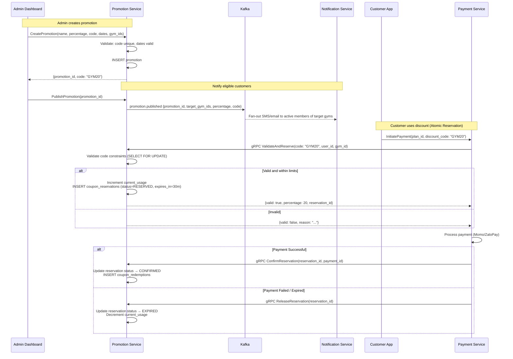
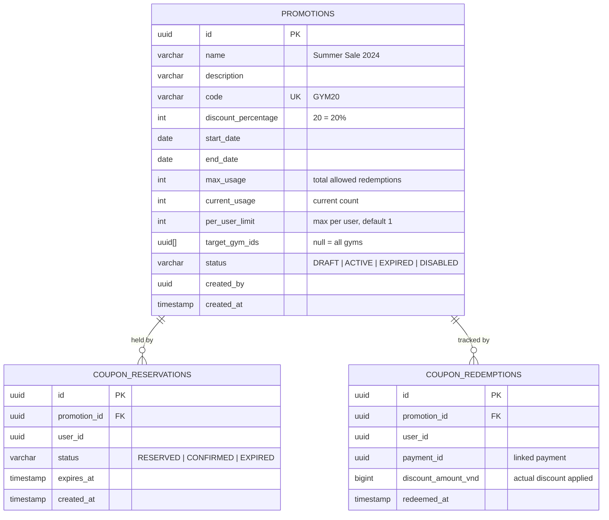

# Promotion Service

> **Tech:** Java 26 (Spring Boot 4) | **DB:** PostgreSQL | **Port:** 50051 (gRPC) / 8080 (REST)

## Responsibilities

- Admin creates promotions with discount codes
- Discount type: **percentage only** (e.g., 20% off)
- Coupon code validation and reservations (called by Payment Service)
- Usage tracking: max uses, per-user limits
- Campaign scheduling (start/end dates)
- Multi-gym: promotions can be gym-specific or chain-wide

---

## Discount Flow (Atomic Reservation)



---

## Data Model



---

## Validation & Reservation Rules

```
ValidateAndReserve(code, user_id, gym_id):

  1. Find promotion by code (using SELECT FOR UPDATE to handle concurrency)
     → NOT FOUND: return {valid: false, reason: "Mã không tồn tại"}

  2. Check status == ACTIVE
     → DRAFT/DISABLED: return {valid: false, reason: "Mã chưa kích hoạt"}

  3. Check today BETWEEN start_date AND end_date
     → Outside range: return {valid: false, reason: "Mã đã hết hạn"}

  4. Check (current_usage + reserved_usage) < max_usage
     → Exceeded: return {valid: false, reason: "Mã đã hết lượt sử dụng"}

  5. Check user redemptions + active reservations < per_user_limit
     → Exceeded: return {valid: false, reason: "Bạn đã sử dụng hoặc đang đặt chỗ mã này"}

  6. Check gym_id in target_gym_ids (or target_gym_ids is null = all gyms)
     → Not in list: return {valid: false, reason: "Mã không áp dụng tại cơ sở này"}

  7. Create reservation:
     → INSERT INTO coupon_reservations(promotion_id, user_id, status, expires_at)
     → Increment promotion.current_usage
     → return {valid: true, percentage: discount_percentage, reservation_id}
```

---

## Kafka Events

### Published

| Topic | Key | Payload |
|-------|-----|---------|
| `promotion.published` | `promotion_id` | `{promotion_id, code, percentage, target_gym_ids, start_date, end_date}` |

### Consumed

None — Called synchronously by Payment Service via gRPC to ensure immediate slot locking.

---

## API (gRPC)

```protobuf
service PromotionService {
  // Admin
  rpc CreatePromotion(CreatePromotionRequest) returns (PromotionResponse);
  rpc UpdatePromotion(UpdatePromotionRequest) returns (PromotionResponse);
  rpc DisablePromotion(DisablePromotionRequest) returns (PromotionResponse);
  rpc PublishPromotion(PublishPromotionRequest) returns (google.protobuf.Empty);
  rpc ListPromotions(ListPromotionsRequest) returns (PromotionsResponse);
  rpc GetPromotionStats(GetPromotionStatsRequest) returns (PromotionStatsResponse);

  // Internal (called by Payment Service)
  rpc ValidateAndReserve(ValidateAndReserveRequest) returns (ValidateAndReserveResponse);
  rpc ConfirmReservation(ConfirmReservationRequest) returns (google.protobuf.Empty);
  rpc ReleaseReservation(ReleaseReservationRequest) returns (google.protobuf.Empty);

  // Customer
  rpc CheckDiscountCode(CheckDiscountCodeRequest) returns (DiscountInfoResponse);
}
```

---

## Internal Route Security

Internal gRPC methods (`ValidateAndReserve`, `ConfirmReservation`, `ReleaseReservation`) are blocked from external access:
1. **Kong Gateway configuration:** No external Kong routes map to these gRPC package/method pathways.
2. **gRPC Interceptor Authorization:** Checks metadata headers. Rejects requests lacking a verified internal service-mesh token signature (mTLS/SPIFFE-based routing or shared network policy).

---

## Clean Architecture

```
src/main/java/com/gym/promotion/
├── domain/
│   ├── model/
│   │   ├── Promotion.java
│   │   ├── CouponReservation.java
│   │   ├── CouponRedemption.java
│   │   └── PromotionStatus.java      // DRAFT, ACTIVE, EXPIRED, DISABLED
│   └── exception/
│       ├── CodeAlreadyExistsException.java
│       ├── PromotionExpiredException.java
│       └── MaxUsageExceededException.java
├── application/
│   ├── port/
│   │   ├── in/
│   │   │   ├── CreatePromotionUseCase.java
│   │   │   ├── ValidateAndReserveUseCase.java
│   │   │   ├── ConfirmReservationUseCase.java
│   │   │   └── ReleaseReservationUseCase.java
│   │   └── out/
│   │       ├── PromotionRepository.java
│   │       ├── ReservationRepository.java
│   │       ├── RedemptionRepository.java
│   │       └── EventPublisher.java
│   └── service/
│       ├── PromotionService.java
│       └── DiscountOrchestrationService.java
├── adapter/
│   ├── in/grpc/
│   │   ├── PromotionGrpcHandler.java
│   │   └── PromotionProtoMapper.java
│   ├── out/persistence/
│   │   ├── PromotionJpaEntity.java
│   │   ├── ReservationJpaEntity.java
│   │   ├── RedemptionJpaEntity.java
│   │   └── PromotionPersistenceAdapter.java
│   └── out/kafka/
│       └── PromotionEventPublisher.java
└── config/
    └── GrpcConfig.java
```
