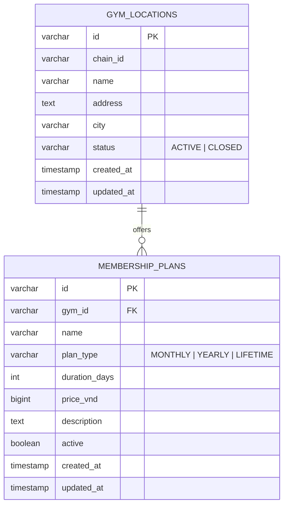

# Plans Service

> **Tech:** Java 26 (Spring Boot 4) | **DB:** PostgreSQL `plans_db` | **Ports:** 50051 gRPC / 8080 HTTP | **Deps:** `common-java:2.1.0`, `gym-proto-java:4.0.0`

## Responsibilities

- Own canonical gym locations and status.
- Own gym-specific membership-plan catalog.
- Own plan type, duration, availability, and VND list price.
- Validate active gyms for Identifier over workload mTLS.
- Resolve trusted purchasable terms for Member over workload mTLS.

Plans V1 has no Kafka, outbox, cache, scheduler, Payment integration, discount calculation, or hard delete.

## Data model



The plan-to-gym foreign key is local to `plans_db`. Identifier and Member store gym and plan IDs as opaque strings without cross-service foreign keys.

## Invariants

- Gym status is `ACTIVE` or `CLOSED`.
- Plan type is `MONTHLY`, `YEARLY`, or `LIFETIME`.
- `price_vnd >= 0`; V1 currency is VND only.
- Monthly and yearly plans require positive duration.
- Lifetime plans have no duration.
- Closed gyms and inactive plans cannot be purchased.
- Catalog edits affect future purchases only; Member owns purchased snapshots.

## API

```protobuf
service PlansService {
  rpc CreateGymLocation(CreateGymLocationRequest) returns (CreateGymLocationResponse);
  rpc UpdateGymLocation(UpdateGymLocationRequest) returns (UpdateGymLocationResponse);
  rpc GetGymLocation(GetGymLocationRequest) returns (GetGymLocationResponse);
  rpc ListGymLocations(ListGymLocationsRequest) returns (ListGymLocationsResponse);

  rpc CreateMembershipPlan(CreateMembershipPlanRequest) returns (CreateMembershipPlanResponse);
  rpc UpdateMembershipPlan(UpdateMembershipPlanRequest) returns (UpdateMembershipPlanResponse);
  rpc GetMembershipPlan(GetMembershipPlanRequest) returns (GetMembershipPlanResponse);
  rpc ListMembershipPlans(ListMembershipPlansRequest) returns (ListMembershipPlansResponse);

  // Workload-only; no HTTP mapping.
  rpc GetActiveGym(GetActiveGymRequest) returns (GetActiveGymResponse);
  rpc ResolvePurchasablePlan(ResolvePurchasablePlanRequest)
      returns (ResolvePurchasablePlanResponse);
}
```

HTTP JSON (common-java `JsonFormat`) uses full enum names, for example `planType: "PLAN_TYPE_MONTHLY"` and `status: "GYM_LOCATION_STATUS_CLOSED"`. Domain/DB keep short names (`MONTHLY`, `CLOSED`). No shared `GymLocationResponse` / `MembershipPlanResponse` / `ResolvedPlanResponse`.

### HTTP routes

Public HTTP is in-process Spring MVC on `8080`. Request and response bodies are generated `plans.v1` protobuf messages, bound as camelCase JSON (`chainId`, `priceVnd`) through `common-java` `ProtobufJsonHttpMessageConverter` auto-config. There is no Go grpc-gateway sidecar and no handwritten HTTP DTO package.

| Method | Path | Access |
|---|---|---|
| `POST` | `/api/v1/gyms` | `SUPER_ADMIN` |
| `PUT` | `/api/v1/gyms/{id}` | selected-gym `ADMIN`, `SUPER_ADMIN` |
| `GET` | `/api/v1/gyms` | authenticated |
| `GET` | `/api/v1/gyms/{id}` | authenticated |
| `POST` | `/api/v1/gyms/{gym_id}/plans` | selected-gym `ADMIN`, `SUPER_ADMIN` |
| `PUT` | `/api/v1/plans/{id}` | plan-gym `ADMIN`, `SUPER_ADMIN` |
| `GET` | `/api/v1/gyms/{gym_id}/plans` | authenticated |
| `GET` | `/api/v1/plans/{id}` | authenticated |

`GetActiveGym` and `ResolvePurchasablePlan` are absent from HTTP and Kong routing.

## Workload calls

### Identifier

`SelectGym` calls `GetActiveGym(gym_id)`. Only verified `ms-gym-identifier` identity may call it. Missing, closed, or unavailable gyms prevent selected-gym token issuance.

### Member

Before payment initiation, Member calls `ResolvePurchasablePlan(plan_id, gym_id)`. Only verified `ms-gym-member` identity may call it. The response supplies canonical `plan_id`, `gym_id`, `plan_type`, `duration_days`, and `price_vnd` for Member's pending-purchase snapshot.

Workload calls trust certificate identity, not `x-user-id`, `x-user-role`, `x-gym-id`, or `x-membership-status` metadata.

## Authorization

- Authenticated users may read gyms and plan catalog.
- `SUPER_ADMIN` may create gyms and manage any gym or plan.
- `ADMIN` may update only selected gym and plans belonging to it.
- No method is public by omission.
- Kong strips spoofed trusted headers before forwarding public HTTP requests.
- Native gRPC requires mTLS and explicit method policy.

## Persistence

Repositories use Spring Data JPA and `JpaSpecificationExecutor`.

Specifications compose only current filters:

- locations: chain, city, status;
- plans: gym, type, active.

Use standard repository ID lookup/write methods. Add no custom JPQL or native filtering queries.

## Errors

- invalid request or invariant: `INVALID_ARGUMENT`;
- missing gym/plan: `NOT_FOUND`;
- closed gym, inactive plan, or gym mismatch: `FAILED_PRECONDITION`;
- missing authentication: `UNAUTHENTICATED`;
- role, scope, or workload denial: `PERMISSION_DENIED`;
- dependency/database outage: `UNAVAILABLE`.

Stable `x-error-code` identifies the domain condition. Internal failures are redacted.

## Deployment

- `plans_db` is isolated from Identifier and Member databases.
- Kong reaches Plans Spring HTTP `8080` only (same JVM as gRPC; not a separate gateway process).
- Identifier and Member reach Plans gRPC `50051` through caller-specific NetworkPolicy and mTLS.
- Plans has no Kafka or Schema Registry environment variables.
- CI reuses `pploc/gym-infra` `java-ci.yml` (`./gradlew build`) and `docker-build.yml` for image push.
- Pin `com.gym:common-java:2.1.0` and `com.gym.proto:gym-proto-java:4.0.0` from GitHub Packages; no `mavenLocal()` (local composite/includeBuild only for pre-publish staging).

## Tests

Use `given_when_then` naming. Cover CRUD, filters, constraints, auth scope, inactive/mismatch failures, mTLS caller matrix, route exposure, empty-DB migration, image health, and Helm rendering.
