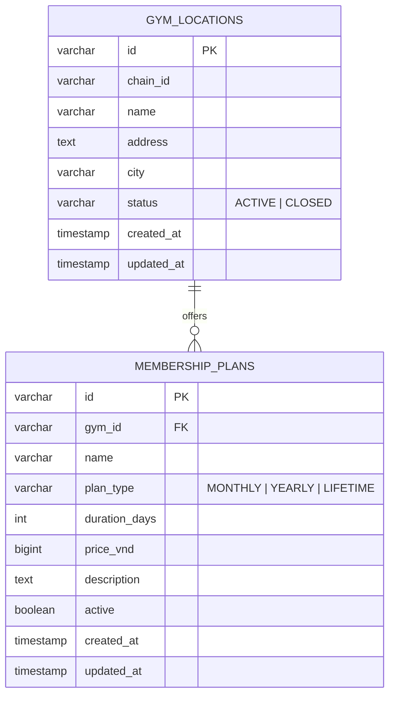

# Plans Service

> **Tech:** Java 26 (Spring Boot 4) | **DB:** PostgreSQL `plans_db` | **Ports:** 50051 business gRPC / 8080 Actuator-only after G9 | **Deps:** `common-java:2.1.1`, target G9 `gym-proto-java` release

## Responsibilities

- Own canonical gym locations and status.
- Own gym-specific membership-plan catalog.
- Own plan type, duration, availability, and VND list price.
- Validate active gyms for Identifier trainer administration over workload mTLS.
- Resolve trusted purchasable terms for Member over workload mTLS.

Plans V1 has no Kafka, outbox, cache, scheduler, Payment integration, discount calculation, or hard delete.

## Data Model



Plan-to-gym FK is local to `plans_db`. Identifier and Member store opaque IDs without cross-service FKs.

## Invariants

- Gym status is `ACTIVE` or `CLOSED`.
- Plan type is `MONTHLY`, `YEARLY`, or `LIFETIME`.
- `price_vnd >= 0`; V1 currency is VND only.
- Monthly and yearly plans require positive duration.
- Lifetime plans have no duration.
- Closed gyms and inactive plans cannot be purchased.
- A plan must belong to requested gym.
- Catalog edits affect future purchases only; Member owns purchased snapshots.

## API

```protobuf
service PlansService {
  rpc CreateGymLocation(CreateGymLocationRequest) returns (CreateGymLocationResponse);
  rpc UpdateGymLocation(UpdateGymLocationRequest) returns (UpdateGymLocationResponse);
  rpc GetGymLocation(GetGymLocationRequest) returns (GetGymLocationResponse);
  rpc ListGymLocations(ListGymLocationsRequest) returns (ListGymLocationsResponse);

  rpc CreateMembershipPlan(CreateMembershipPlanRequest) returns (CreateMembershipPlanResponse);
  rpc UpdateMembershipPlan(UpdateMembershipPlanRequest) returns (UpdateMembershipPlanResponse);
  rpc GetMembershipPlan(GetMembershipPlanRequest) returns (GetMembershipPlanResponse);
  rpc ListMembershipPlans(ListMembershipPlansRequest) returns (ListMembershipPlansResponse);

  // Workload-only; no HTTP annotation, Kong route, or OpenAPI operation.
  rpc GetActiveGym(GetActiveGymRequest) returns (GetActiveGymResponse);
  rpc ResolvePurchasablePlan(ResolvePurchasablePlanRequest)
      returns (ResolvePurchasablePlanResponse);
}
```

Protobuf JSON uses lowerCamelCase fields and full enum names, such as `planType: "PLAN_TYPE_MONTHLY"`. Domain/DB use short names.

## Public HTTPS/JSON

Kong routes HTTPS/JSON to generated Go `grpc-gateway` over mTLS. Gateway transcodes to Plans mTLS gRPC `50051` with identity `ms-gym-api-gateway`. Kong cannot directly reach Plans `50051`. Plans has no native Spring MVC business endpoint after G9.

| Method | Path | Access |
|---|---|---|
| `POST` | `/api/v1/gyms` | `SUPER_ADMIN` |
| `PUT` | `/api/v1/gyms/{id}` | `SUPER_ADMIN` |
| `GET` | `/api/v1/gyms` | authenticated |
| `GET` | `/api/v1/gyms/{id}` | authenticated |
| `POST` | `/api/v1/gyms/{gym_id}/plans` | `SUPER_ADMIN` |
| `PUT` | `/api/v1/plans/{id}` | `SUPER_ADMIN` |
| `GET` | `/api/v1/gyms/{gym_id}/plans` | authenticated |
| `GET` | `/api/v1/plans/{id}` | authenticated |

`GetActiveGym` and `ResolvePurchasablePlan` remain absent from HTTP annotations, Kong, and OpenAPI 3.0.

No authoritative `ADMIN`-to-gym assignment exists. Request/path gym context is not authorization. Restore gym-scoped `ADMIN` mutations only after a separate assignment model is implemented and evidenced.

## Workload Calls

### Identifier

`CreateTrainerAccount` calls `GetActiveGym(gym_id)`. Only verified `ms-gym-identifier` identity may call this exact method. Customer gym selection does not use Identifier or this RPC.

### Member

Before Payment initiation, Member calls `ResolvePurchasablePlan(gym_id, plan_id)`. Only verified `ms-gym-member` identity may call it. Plans proves:

- requested gym exists and is active;
- requested plan exists and is active;
- plan belongs to requested gym;
- returned type, duration, and `price_vnd` are canonical.

Member stores returned terms in its pending-purchase snapshot.

Workload calls trust certificate identity, not `x-user-*`, `x-gym-id`, or `x-membership-status` metadata.

## Public Trust

- Authenticated users may browse gyms and plans.
- `SUPER_ADMIN` manages gyms and plans during G9.
- Public gRPC methods accept end-user metadata only when peer SAN is `ms-gym-api-gateway`.
- Kong strips client-forged trusted headers and injects verified identity/role metadata; generated gateway accepts them only from Kong SAN and forwards vetted metadata.
- Kong, native direct clients, and workload certificates cannot call public methods with forged user metadata.
- No method is public by omission.

## Persistence

Repositories use Spring Data JPA and `JpaSpecificationExecutor`.

Specifications compose current filters:

- locations: chain, city, status;
- plans: gym, type, active.

Use standard repository ID lookup/write methods. Add no custom JPQL or native filtering queries.

## Errors

- invalid request or invariant: `INVALID_ARGUMENT`;
- missing gym/plan: `NOT_FOUND`;
- closed gym, inactive plan, or gym mismatch: `FAILED_PRECONDITION`;
- missing authentication: `UNAUTHENTICATED`;
- role, scope, or workload denial: `PERMISSION_DENIED`;
- dependency/database outage: `UNAVAILABLE`.

Stable `x-error-code` identifies domain condition. Internal failures are redacted. Kong 3.8 translation must be observed and documented before publishing frontend error behavior.

## Generated Contracts

- Protobuf is source for messages, validation, and `google.api.http` annotations.
- Gnostic `protoc-gen-openapi@v0.7.1` generates service OpenAPI documents; deterministic collision-rejecting merge produces canonical OpenAPI 3.0.
- Browser REST clients generate from released canonical OpenAPI 3.0.
- Backend and native gRPC clients generate from Protobuf.
- Generated gateway compiles route bindings; Kong does not mount or parse Protobuf source at runtime.

## Deployment

- `plans_db` is isolated from Identifier and Member databases.
- Generated gateway reaches Plans gRPC `50051` with `ms-gym-api-gateway` identity, CA validation, and server SAN verification.
- Kong reaches only generated gateway `8443`; it has no direct Plans `50051` or `8080` business route.
- `8080` retains Actuator health/readiness only.
- Identifier and Member reach only their exact Plans workload methods on `50051`.
- Port-specific NetworkPolicies separate Kong, gateway, workloads, and health/metrics callers.
- Plans has no Kafka or Schema Registry settings.
- Production private keys come from Secrets/secret manager and are never committed.
- Align Plans to exact G9 `gym-proto-java` release before deployment.

## Local Environment

```bash
./gradlew startEnv
./gradlew test
./gradlew stopEnv
```

`startEnv` and `stopEnv` wrap local Docker Compose dependencies and remain documented after MVC removal.

## Tests

Use `given_when_then` naming. Cover CRUD, Specifications, constraints, authenticated reads, `SUPER_ADMIN` mutations, denied `ADMIN` request-only scope, Kong SAN, exact Identifier/Member workload matrix, inactive/mismatch failures, OpenAPI operation set, direct `8080 /api/**` negative behavior, Actuator health, image health, and Helm rendering.
